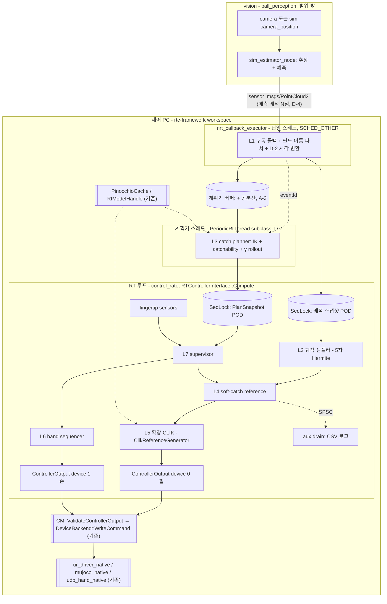

# CATCHING_MASTER — 제어 PC 포구(catching) 알고리즘 구현 마스터 문서

- 문서 버전: v0.5 (2026-09-19)
- 대상 독자: 구현자(Claude Code 포함), 이론 검토자(Junho)
- 구현 대상: **기존 `rtc-framework` workspace** (신규 workspace·신규 패키지 아님, D-1)
- 문서 세트: [IMPLEMENTATION_PLAN.md](IMPLEMENTATION_PLAN.md)(결정·단계의 SSoT) + 본 마스터 + `WORKSPACE_ANALYSIS.md`(단계 W 기록) + `L0_core.md` … `L8_bringup.md` + 같은 폴더의 참조 구현·테스트(`README.md` 참조)
- 상태 표기: `[확정]` 사용자 결정, `[확정 D-x]` plan 결정 로그의 결정, `[권장]` 설계 권장안, `[TBD-xx]` 미확정(추측 금지, §9 참조), `[논문 외 유도]` 원문에 없는 본 문서의 유도

### 0.1 개정 이력

| 버전 | 일자 | 내용 |
|---|---|---|
| v0.1 | 2026-09-17 | 초안 |
| v0.2 | 2026-09-18 | `_REVIEW_catching_2026-09-18.md` 반영. 주요 변경: 포구 오차 예산 식 교체(L3 §4.6), 접근축 오차를 회전벡터 기반으로 교체(L4 §4.5, L3 §4.2, L5 §4.2), 속도 포화 시 반환 가속도 수정(L4 §5.1), `COMMITTED` 이후 γ 하향 경로 신설(L3 §4.7, L4 §5.1, L7 §4.6), 충격량 예산 절 신설(L7 §4.7), impact 계열 문헌 추가(§8), 구현 순서에서 `T_close` 식별 선행(§4), Jacobian 규약 명시(§3), 참조 구현 1벌로 통합 |
| v0.3 | 2026-09-18 | 구현 대상을 기존 `rtc-framework` workspace로 확정. 입력 계약을 자체 정의 `catching_msgs/BallState`에서 **vision 노드의 `sensor_msgs/PointCloud2`**로 교체(§5). 제어 PC는 궤적을 재전파하지 않고 vision 예측을 그대로 신뢰 — L2가 전파기에서 **궤적 샘플러**로 축소(L2 전면 개정). kinematics·dynamics·QP·과제 클래스·joint command backend는 **기존 구현 재사용**으로 확정(§1.2, L5). 단계 W(`WORKSPACE_ANALYSIS.md`) 신설 — L0 포함 모든 구현의 선행 단계 |
| v0.4 | 2026-09-19 | 에이전트 4개(정합성·수식 재유도·v0.3 잔재·데이터 흐름/RT) 교차 검증 반영. **기능 결함 5건 수정**: `derateGamma` 수락 기준을 목표 γ_f 로(L4 §5.2.1), retreat 끌개를 $p_c$ 로(L4 §5.3), `track_epoch` 를 스냅샷 필드로(L2 §5.1), 시간축 단일 원점·두 축 규약(§3, L2 §4.4), 재무장 리셋 목록(L7 §4.8). **근거 수정**: γ 하향 점프가 시간에 단조가 아님(L4 §5.2.1, L7 §4.6). **신설**: 예측 일관성 감시 $\bar\nu$(L1 §4.5), QP 반복 상한·`QP_FAILED`(L5 §4.3, L7 §4.2), 상태 전이 행렬 완전성(L7 §4.1). 테스트 커버리지 보강(보간 속도 경로, `tRest` 4분기, 안정 경계 ±0.2%, γ 하향 3분기) |
| v0.5 | 2026-09-19 | **단계 W 를 코드 대조로 종결**(기록: `WORKSPACE_ANALYSIS.md`, 요약: plan §2). 결정의 SSoT 를 [IMPLEMENTATION_PLAN.md](IMPLEMENTATION_PLAN.md)(D-1~D-24, P-1~P-3, A-1~A-7, C-1~C-4, D-7a~d)로 옮기고 설계 문서 전체를 그에 맞춤(S0.3). 주요 변경: ros2_control·`update()` 전제 → `RTControllerInterface::Compute` → `ControllerOutput` → `DeviceBackend`(§1.2, §2). L5 "얇은 어댑터" → `rtc::tsid::ClikReferenceGenerator` 확장(D-5·D-6). 코드 배치(D-1, §4). 시간 규약을 절대 steady ns + `BallTime`/`NowReal`/`NowLead` 로(D-2, §3), sim 은 wall clock + RTF 게이트(D-3). vision 입력을 ball_perception 실제 레이아웃으로(D-4, §5). γ derate 를 v1 에서 제외(D-8), η_v 교차제약(D-9). 손 명령 포트 추상화 삭제 — 손 device slot 직접 기록(D-11). 계획기 스레드를 MPC 스레드와 같은 `rtc::PeriodicRtThread` 방식으로(D-7). 관절 가속 한계를 토크에서 도출(D-16). catch frame 을 YAML 로(D-17). 투척 목표를 manipulability 기반 catchability 로(D-18). 이름이 둘인 같은 값 5쌍을 단일 키로(§6). L0·L2·L3·L4 §5 코드 복사본 삭제 → 헤더가 SSoT |

[R3] 식 대조는 v0.2에서 완료했다(L4 §4.1). v0.1이 "T-RO 본문 대조 미완"으로 남겨 둔 항목이다.

**v0.5 주의.** 단계 W 가 끝났으므로 상세 구현은 **[IMPLEMENTATION_PLAN.md](IMPLEMENTATION_PLAN.md) 의 결정과 단계(S0~S10)를 따른다.** 설계 문서와 plan 이 충돌하면 plan 이 우선한다. 같은 폴더의 참조 헤더·테스트는 v0.4 검증 산출물이며, 알려진 결함(`README.md`)은 S1 이식 시 고친다.

---

## 1. 목적과 범위

비행하는 공을 로봇 손으로 받는 기능 중 **제어 PC 쪽 전체**를 기존 `rtc-framework` workspace 위에 구현한다. vision 노드가 발행하는 **예측 궤적**(`sensor_msgs/PointCloud2`)을 입력으로 받아, 포구점 계획 → 기준 궤적 생성 → 관절 명령 → 손 폐쇄 → 접촉 후 감속까지 수행한다.

범위 밖: 카메라 처리와 공 상태 추정·예측(vision 노드 소관), PTP 설정 절차(인프라 문서 소관), 그리고 **이미 workspace에 있는 기능 전부**(§1.2).

### 1.1 상세 구현 착수 조건 `[확정]`

**단계 W 는 완료됐다** (코드 대조, 2026-09-19). 확인 방법·결과는 `WORKSPACE_ANALYSIS.md` 기록 칸에, 요약은 plan §2 에 있다. 각 layer 문서 §2 의 "코드 확인 게이트" 는 W 로 닫혔고, 남은 미확정은 §9 표에 있다.

상세 구현은 plan §4 의 단계(S0~S10)와 단계별 `[SPRINT]` 기준을 따른다. 우선 확인 두 가지였던 명령 자리(W4-1)와 vision 레이아웃(W5-2)은 각각 `ControllerOutput` device slot(§1.2)과 D-4(§5)로 닫혔다.

### 1.2 기존 구현 재사용 `[확정]`

다음은 **이미 workspace에 있고, 새로 만들지 않는다.** 단 CLIK 는 그대로 쓰지 않고 **확장**한다(D-5·D-6).

| 대상 | 내용 (W 결과) | 근거 |
|---|---|---|
| vision 예측 | ball_perception(형제 저장소, 사용자 개발)의 `sim_estimator_node` 가 예측 궤적 `PointCloud2` 를 발행. 제어 PC는 **재전파하지 않고 그대로 신뢰**한다 | W5, D-4 |
| kinematics / dynamics | `PinocchioModelBuilder` 1개를 CM 이 공유하고, Data 는 컨트롤러별 `PinocchioCache`(Jacobian `LOCAL_WORLD_ALIGNED` 고정) 또는 스레드별 `RtModelHandle`(LOCAL/LWA/WORLD, heap-free). P1b 폐쇄 체인은 sidecar closure YAML, 손바닥 frame 은 루프 상류. offset frame 추가 기능은 없어 새로 넣는다(D-10·D-17) | W3 |
| CLIK | `rtc::tsid::ClikReferenceGenerator`(ProxQP dense box-QP, pose 목표, LWA 6행, 위치∩속도 box, `max_iter` 20 고정). **옵션(기본 off)으로 확장**: twist feedforward, LOCAL 접근축 2행, 가속 box, status 노출, `max_iter` 설정, q_c 평가 모드. off 시 기존 출력 bit-identical | W3-6~8, D-5·D-6 |
| IK | 독립 IK 없음 → `rtc::compliance::DifferentialIk`(σ_min 적응 λ, heap-free) 재사용 | D-7d |
| SE(3)/SO(3) 헬퍼 | `rtc_math` se3 `log3`/`exp3`/`Jlog3`, `rtc_tsid` se3_error `ComputeTaskPoseError`(LWA BodyLog6) | W3-9 |
| 명령 경로 | 컨트롤러가 `ControllerOutput.devices[]`(팔 device 0, 손 device 1 관례)를 채우면 CM 이 `ValidateControllerOutput` → 실패·E-STOP 시 `BuildHoldOutput` → `DeviceBackend::WriteCommand`(RT 스레드 inline). backend: `ur_driver_native`·`mujoco_native`·`udp_hand_native`. **명령은 position**(`CommandType` kPosition) | W4 |
| RT 원시형 | `rtc::SeqLock`, `rtc::SpscQueue`, `rtc::PeriodicRtThread`, eventfd, lifecycle 훅, 할당 게이트(`ScopedAllocGate`·`ScopedNoMalloc`) | W2 |
| sim | `rtc_mujoco_sim`: lock-step, 공 발사·리셋 서비스, ground truth·카메라 위치 토픽, 항력·Magnus 자체 구현 | W6 |

**제어기가 하는 일은 연산 결과를 `ControllerOutput` 의 device slot 에 싣는 것까지다.** 드라이버 파라미터, 명령 경로, 안전 정지는 backend·CM 소관이며 본 구현은 감시만 한다. W 에서 없음이 확인된 것: UR 지연 보상, speed scaling 노출, `ApplySafetyLayer` production 호출, 스트리밍 목표를 받는 컨트롤러.

**새로 만드는 것 (D-1, 새 패키지 없음).**

- rtc_controllers 의 `catching` 하위 디렉토리 (namespace `rtc::catching`): 궤적 타입·샘플러(L2), 시간 타입, soft-catch 기준 생성기(L4), 도달 가능성·계획기 탐색 코어·catchability 판정(L3), L7 순수 조각, 파라미터 검증(L0)
- `rtc_math` se3: 접근축 정렬 오차·각속도·Jacobian (S2.1)
- `rtc_tsid`: CLIK 확장 (S2.2)
- `rtc_urdf_bridge` 모델 빌더: YAML 선언 추가 frame (S2.3a)
- `rtc_mujoco_sim`: 발사 srv(D-14, `rtc_msgs` 에 추가), 접촉 truth, clock 위상 진단 (S3, plan §5) — per-step `(sim_time, steady_now)` lane
- `integrated_bringup`: 포구 컨트롤러 바인딩, `PointCloud2` 파서·구독, 계획기 스레드 소유, 손 시퀀서 배선, YAML·launch (S5~S7)

### 1.3 대상 시스템 `[확정]`

| 구분 | 구성 | 용도 | 비고 |
|---|---|---|---|
| 주 타깃 | `ur5e_p1b` = UR5e + 자체 개발 4-finger 핸드 P1b (cross 4-bar 폐쇄 체인) | 실기 + MuJoCo | MuJoCo 모델 있음(폐쇄 체인 `<equality><connect>` 5개). P1b MJCF 는 형제 저장소 hand-description 에 있다 |
| 시뮬레이션 전용 | `iiwa7_leap` = KUKA iiwa7 + LEAP Hand | MuJoCo | 실기 구동 계획 없음. projectile 설정은 S3.2 에서 추가 |

- 최우선 순위: **MuJoCo 시뮬레이션에서의 알고리즘 검증** `[확정]`
- 제어 주기: `control_rate` YAML (default 500 Hz, 범위 100–5000 Hz — SSoT 는 [invariants.md](../../agent_docs/invariants.md) §RT Path). 틱 간격 $h$ 는 `ControllerState::dt` 로 읽고 500 Hz 를 가정하지 않는다
- 관절 명령: **전부 position** `[확정]`. 팔은 `ControllerOutput` device 0 에 $q_c$ 를 싣는다(§1.2). 실기 UR 은 vendor `forward_position_controller` 토픽 경유이며 지연 보상이 없다
- 손 명령: `ControllerOutput` 의 **손 device slot**(device 1)에 직접 기록한다 `[확정 D-11]`. P1b 실기는 `udp_hand_native` → `/p1b/joint_command` → 별도 프로세스 `udp_hand_node`(250 Hz, 팔 RT 루프 밖). 명령 `header.stamp` 는 쓰이지 않고, 실기 손은 feedforward 를 무시한다(= position only)
- 실기 접촉 신호: **지문(fingertip) 센서만** `[확정]` (UR5e 툴 플랜지 F/T는 사용하지 않음). 실기 `HandSensorState` 는 finger-on-object 부호·250 Hz, sim `WrenchStamped` 도 같은 finger-on-object 부호다 (커밋 0fcc1d23 부터 — `rtc_msgs` FingertipSensor 주석의 반대 부호 서술은 stale). S7.3 에서 재확인
- 코드 기반: **기존 `rtc-framework` workspace + `rtc_tsid` CLIK 확장** `[확정 D-1, D-5]`
- 입력: vision 노드의 **`sensor_msgs/PointCloud2` 예측 궤적** `[확정 D-4]` (§5). 제어 PC는 궤적을 재전파하지 않는다
- Pinocchio: **4.0** `[확정]`
- P1b 사양(작성 시점 기준 사용자 진술): thumb 4, index 3, middle 2, ring 1 = 10 actuated DoF, 관절 모터 1.5 Nm·12.46 rad/s. 구현 시 URDF/MJCF와 대조할 것(L6 게이트, S4.1). **대조 결과 (W, L6 G6-3):** 설정·모델값(YAML `max_torque` = URDF effort = MJCF forcerange)은 **3.0 N·m** 로 일치한다 — 위 1.5 N·m 는 작성 시점 사용자 진술이며, 이를 그대로 운용 한계로 쓸 수 있는지(nominal·continuous·peak·설정값 중 어느 것)는 **D-12 미결정** (plan §7.3)

### 1.4 시뮬레이션 검증의 한계 `[권장]`

`iiwa7_leap`와 `ur5e_p1b`는 팔 자유도(7 대 6), 명령 경로(실기 UR 드라이버 추종 지연 유무), 손(포켓 형상, 폐쇄 지연, 센서 배치·부호)이 다르다. 각 검증 항목에 다음 태그를 붙인다.

- `[SIM-ANY]` 어느 시뮬레이션 모델로도 유효 (로직, 수치 정합)
- `[SIM-P1B]` `ur5e_p1b` MuJoCo 모델 필요 (도달 가능성, 6-DoF 여유, 손 타이밍)
- `[HW-P1B]` 실기 필요 (팔 추종 지연 $T_{arm}$, 실측 `T_close,tot`, 센서 잡음, 시계 동기)

---

## 2. 시스템 구조



이중 테두리 상자는 **workspace에 이미 있는 것**이다(§1.2). 나머지가 이번에 만드는 부분이고, L5 는 기존 CLIK 을 옵션으로 확장한 것을 쓴다(D-5·D-6). 계획기 스레드는 nrt_callback executor 에 올리지 않는다 — 단일 스레드라 계획 계산이 궤적 수신·lifecycle 서비스를 막는다(D-7).

### 2.1 실행 영역 원칙 `[권장]`

1. 토픽 도착은 제어 명령을 트리거하지 않는다. RT 루프는 시간 구동이며 최신 스냅샷만 읽는다. 토픽 도착이 깨우는 것은 계획기 스레드뿐이다(eventfd, D-7c).
2. non-RT → RT 공유 상태는 단일 writer `rtc::SeqLock` 으로만 전달한다. payload 는 trivially copyable 이어야 하므로 `Eigen::Vector3d` 대신 `std::array` 기반 POD 를 쓴다(plan §6).
3. RT → non-RT 기록은 고정 크기 레코드의 `rtc::SpscQueue` 로만 전달하고 aux 타이머가 drain 한다.
4. RT 경로 금지 패턴은 RTC 프레임워크 규칙 RT-1~10(RT-7 은퇴)을 그대로 따른다: 동적 할당, 예외(`throw`/`catch` 모두), blocking I/O, mutex, tf2 조회 금지. 계획기 스레드도 스케줄링 클래스와 무관하게 이 규칙으로 작성한다(D-7a, plan §7.2).
5. 시간 기준 `[확정 D-2]`: 내부 시각은 **절대 steady ns** 로 통일한다. nrt 수신 시 한 번 `t_ref_steady = recv_steady − (recv_wall − stamp)` 로 변환하고, 이후 `header.stamp` 는 쓰지 않는다. `use_sim_time` 은 쓰지 않는다 — sim 도 wall clock 이며 시행별 clock 위상 오차 게이트(δ_max·pause, plan §5)로 무효 시행을 거른다(D-3, 검증 후 재검토). stale 판정은 `now_steady − recv_steady` 로만 한다(repo 시계 규칙).

---

## 3. 표기와 규약

| 항목 | 규약 |
|---|---|
| 단위 | SI (m, s, rad, N). 각도 YAML 입력은 rad (deg 입력 금지) |
| 좌표계 | `W` world(공 추정·계획·기준 생성 전부), `B` robot base(CLIK `base_frame`), `C` catch frame(손), `S_i` 지문 센서 i |
| 공 상태 | vision이 준 샘플 $(p,v,a)$ + 점별 지평 `horizon_ns`, 공분산 $\Sigma_{6\times6}$(NaN = 모름). 제어 PC는 이 사이를 보간만 한다 (§5, L2). 공분산은 계획기 버퍼에만 둔다 `[확정 A-3]` |
| 공 모델 | $\dot p=v,\ \dot v=g-k\Vert v\Vert v$ — **시뮬레이션 fixture 전용**(L0 §1, S1.6). 실시간 경로에서는 쓰지 않는다 |
| 접근축 | $\hat z_C$ = catch frame 의 **+z** = 손바닥 바깥 방향 법선 (규약). 목표 $a_d=-\hat v(t_c)$ `[확정 D-17]` — catch frame 의 부모·offset·자세는 YAML, 값은 provisional (§6, plan §10) |
| 접근축 오차 | 회전벡터 $e_a=\theta\,\hat u$, $\hat u=\dfrac{z\times a_d}{\Vert z\times a_d\Vert}$, $\theta=\mathrm{atan2}(\Vert z\times a_d\Vert,\ z^\top a_d)$. $\exp([e_a]_\times)z=a_d$ (L4 §4.5). 구현 위치는 `rtc_math` se3 (D-1, S2.1) |
| 회전 | Hamilton quaternion, 회전행렬 $R_{WC}$ (C → W). $\mathrm{Log}:SO(3)\to\mathbb R^3$ |
| 각속도 | 기본 표현은 world $\omega^W$, $\dot R_{WC}=[\omega^W]_\times R_{WC}$. LOCAL은 $\omega^L=R_{WC}^\top\omega^W$ |
| Jacobian | **과제별로 다르므로 항상 명시한다.** 병진: `LOCAL_WORLD_ALIGNED` ($J_p$). 각속도: L3 §4.2·L5 §4.2 접근축 2행은 `LOCAL` ($J_\omega^L$), L4 §4.5의 $J_a$ 유도는 `WORLD` ($J_\omega^W$). `PinocchioCache` 는 LWA 고정이므로 LOCAL 각속도 행은 LWA 각속도 행을 $R_{WC}^\top$ 로 회전해 얻는다(계획기 스레드의 `RtModelHandle` 은 LOCAL 을 직접 줄 수 있다). 코드에서는 `LOCAL`/`WORLD` 각속도를 서로 다른 타입으로 구분할 것 `[권장]` |
| softness | $\gamma\in[0,1]$, 0 = 정지 포구, 1 = 완전 추종 |
| 시간 표현 | `[확정 D-2]` 내부 시각은 **절대 steady ns**. 궤적 원점은 수신 시 1회 변환한 $t_{ref}$ (§2.1 원칙 5). 상대시각은 수치 코어 경계에서만 만든다. `PlanSnapshot` 의 시각도 절대 steady 다 |
| 시간 타입 | `[확정 D-2]` `BallTime`(공의 물리 시각), `NowReal`(매 tick steady 실측 now — tick 수 × dt 로 계산하지 않는다), `NowLead` $=$ now $+T_{arm}$. 비교는 타입별 오버로드로만 한다. 판정별 비교 대상은 plan §3 표가 SSoT: 궤적 샘플링·γ 프로파일·기준 생성·`CLOSING→DECEL`·지평 끝 경고는 `NowLead`, `APPROACH→COMMITTED`·손 Preshape/Close·접촉 판정 창은 `NowReal`, 메시지 나이는 `now_steady − recv_steady`. **$T_{arm}\ne0$ fixture 필수** |
| 시간 | $t_c$ 포구 시각, $t_{cmd}$ 손 폐쇄 명령 시각 — 둘 다 공의 물리 시각(`BallTime`) 단일 정의이고, 비교하는 '지금' 만 판정별로 다르다 |
| 지연 | $T_{arm}$ 팔 추종 지연(= 선행 보상량), $T_{close,tot}$ 손 명령 → 폐쇄 종단 간 시간(D-11: $T_{link}$ 를 따로 재지 않는다), $T_{tick}=h/2$ 틱 양자화 예산 ($h$ = `ControllerState::dt`) |
| 가속도 기호 | $a$ 공 가속도(vision), $a_{\max}$ TCP 가속 한계(L4), $\bar a$ 관절 가속 한계(L3 §4.3) $=\ddot q_{\max}$(L5) — 토크 한계에서 도출(D-16), $a_{dec}$ 감속(L7). **$a_{dec}\le a_{\max}$** 여야 한다(L7 §4.3) |
| 속력 기호 | $v_{\max}$ TCP 속도 한계, $v_{dir,\max}$ 방향 달성 속력(L3 §4.5, 투영 $\hat v^\top J_p\dot q$), $\Vert v\Vert_{\max}$ **받을 수 있는 최대 공 속력**(L3 §4.5) — 셋을 혼동하지 말 것 |

---

## 4. Layer 구성

layer 는 설계 문서의 단위이고, 구현 순서·게이트는 plan §4 의 단계(S0~S10)가 정한다. 코드 위치는 D-1 로 확정됐다 — 새 패키지를 만들지 않는다.

| Layer | 코드 위치 (D-1) | 단계 | 단위 기능 |
|---|---|---|---|
| **W** | — | 완료 (S0.2 기록) | `rtc-framework` workspace 종합 분석 (`WORKSPACE_ANALYSIS.md`) |
| L0 | rtc_controllers `catching` (공용 타입·파라미터 검증), 공 동역학은 테스트 fixture 전용 위치 | S1.1·S1.6·S1.7 | 공용 타입, 파라미터 검증(활성 구성 키만 TBD 검사, 교차제약) |
| L1 | `integrated_bringup` 바인딩 (구독·필드 이름 파서·D-2 변환), 궤적 타입은 `catching` 공용 | S1.2·S5.2 | `PointCloud2` 수신·파싱·검증, 스냅샷 브리지, stale 판정 |
| L2 | rtc_controllers `catching` | S1.2·S1.3 | 궤적 샘플러 (5차 Hermite, 시각 정렬, 지평 감시), 시간 타입 |
| L3 | 탐색 코어는 `catching`, 스레드 소유는 `integrated_bringup` | S1.5·S1.9·S3.5a/b·S6 | 포구점·시각·γ 결정, catchability(D-18), 계획기 스레드(D-7) |
| L4 | `catching` (DS), 접근축 정렬은 `rtc_math` se3 | S1.4·S2.1 | soft-catch DS, 접근축 정렬, 복귀 |
| L5 | `rtc_tsid` CLIK 확장 + 포구 컨트롤러(`catching` + `integrated_bringup`), catch frame 은 `rtc_urdf_bridge` | S2.2·S2.3a/b·S2.5·S5.3 | 확장 CLIK 과제 구성, 가속 한계(D-16), device 0 에 $q_c$ |
| L6 | `catching` (시퀀서), 손 프로파일 YAML 은 `integrated_bringup` | S4·S7.1 | 손 시퀀서 → 손 device slot, `T_close,tot` 식별 |
| L7 | `catching` (순수 조각), FSM 배선은 포구 컨트롤러 | S1.8·S7.2~S7.4·S9 | 상태 머신, 접촉 판정, 감속, abort, E-STOP·fault(D-13) |
| L8 | `integrated_bringup` (YAML·launch·로깅), `rtc_mujoco_sim` (발사·truth) | S3·S5·S8·S10 | 컨트롤러 통합, 시나리오 테스트, 지표 |

v0.4 대비 변경: 가칭 `catching_*` 패키지를 폐기하고 D-1 위치로, L5 를 CLIK 확장으로, L6 의 명령 포트 추상화 삭제(D-11).

L3는 γ rollout에 L4의 기준 생성기를 **같은 코드로** 호출한다(참조 구현 1벌, §10).

**순서는 plan §4 가 SSoT 다**: S0 → (S1 ∥ S2 ∥ S3) → S4 → S5 → S6 → S7 → S8 → S9 → S10. 손 타이밍 go/no-go(S4)가 컨트롤러 골격(S5)보다 앞선다 — 이유는 §4.1.

### 4.1 `T_close,tot` 선행 측정 `[권장]` → S4

γ 창이 비는 조건(L3 §4.5)은 다음과 같다.

$$\Vert v(t_c)\Vert>\min(v_{dir,\max},v_{\max})+\frac{d_{eff}}{T_{close,tot}}$$

우변이 **받을 수 있는 최대 공 속력**이다. 참조 구현(`test_l3`)으로 확인한 값: $v_{dir,\max}=1.5$ m/s, $d_{eff}=4$ cm, $T_{close,tot}=60$ ms이면 상한이 2.17 m/s다. **실측 (S4.5·S4.2, LEAP)**: $d_{eff}=8.0$ cm, $T_{close,tot}=105$ ms 로 상한 **2.26 m/s** — 예시와 같은 자리이고 S0.7 가정값 8.4 m/s 의 1/3.7 이다 (L6 §4.5). P1b 는 $d_{eff}\ge9.5$ cm, $T_{close,tot}=282$ ms 로 공식값 **1.84 m/s** 이지만 fly-in sim 에서 실제로 받은 속력은 그보다 훨씬 낮다 (0.5 m/s 부터 거의 0 — L6 §4.5). 6 m/s를 받으려면 $T_{close,tot}\le d_{eff}/(\Vert v\Vert-v_{dir,\max})=8.9$ ms가 필요하다. [R1]의 DLR-Hand-II가 5 ms 급이었다는 점을 생각하면 자명한 요구가 아니다.

즉 `TBD-HAND-01`($T_{close}$) 하나가 목표 투척 속도(D-18 catchability 지도와 함께), `reference.a_max`, γ 격자, rollout 창 길이를 전부 결정한다. 이 값을 모른 채 L3–L5를 튜닝하면 재작업이 확정이다. 그래서 plan 은 이를 **S4.4 go/no-go** 로 두었다: 손 device slot step 으로 sim $T_{close}$ 분포를 재고(S4.2), 실기 $T_{close,tot}$ 는 S10 에서 재고(S4.3 에서 이월, 2026-09-20), S3.5a kinematic catchability 지도가 정한 목표 속도 범위와 대조해 확정 또는 하향한다(S4.4). D-16 의 보수적 가속 box 도 이 판정에 함께 들어간다. 실기 값이 나오면 `planner.*`와 `reference.*`를 재산정한다(L3 게이트 G3-F).

### 4.2 브랜치 전략 `[확정]`

- 기준 브랜치: `main` (TBD-GIT-01 닫힘). 작업 브랜치는 repo 관례 `type/kebab-slug` 로 `main` 에서 분기한다 (설계 문서는 P-2 에 따라 `docs/dynamic-catching-plan`).
- 병합 조건: 해당 단계의 plan §4 게이트 + 관련 layer 문서 §9 게이트 통과 + 리뷰(AGENTS.md §5.5 트리거 — `rtc_tsid`·`rtc_urdf_bridge` 일반화는 code review, E-STOP 경로는 security review). 게이트 결과는 plan §4 표와 Epic #537 코멘트에 기록한다.
- 커밋은 Conventional Commits `type(scope): subject`, scope 는 변경 패키지(예: `rtc_tsid`, `integrated_bringup`) 또는 설계 문서면 `dynamic_catching`.
- 게이트 공통 항목(모든 RT 코드, 계획기 스레드 포함): RT 경로 할당 0(`ScopedAllocGate`·`ScopedNoMalloc`), `noexcept` 경계 유지, RT 경로에 `throw`/`catch` 없음(RT-2), 고정 QP 차원 + **반복 상한 `max_iter`(S2.2 에서 설정 가능) 및 미수렴 시 실패 경로 확인**(`ClikReferenceGenerator` 실패 시 q_ref = q_meas·v = 0·false, L5 §4.3), 기존 테스트 assertion 무수정, 컴파일 경고 0(`-Wall -Wextra`).
- `noexcept` 경계는 선언만으로 보증되지 않는다. RT 경로는 예외를 잡는 대신 **던지지 않는 코드로만** 구성한다(오류 코드·`std::optional`). 필요하면 **비RT 테스트 빌드에서만** 하위 루틴에 던지는 스텁을 주입해 그 예외가 RT 경계에 닿지 않는 구조(설정·검증 단계에서 처리)인지 확인한다.

### 4.3 Layer 문서 공통 목차

1. 범위 / 비범위
2. 코드 확인 게이트 (W 로 닫힘 — 결과와 남은 확인 항목)
3. 참고자료 (본 문서 §8의 [Rn] 인용)
4. 수학적 이론 (표기 → 식 → 유도 → 논문 대응 → sanity check)
5. C++ 구현 (참조 헤더 포인터 + S1 이식 시 변경 목록, RT 규칙)
6. YAML 파라미터
7. 단위 기술 구현 순서
8. 디버깅 방법
9. 검증 방법과 합격 게이트
10. 미확정 항목

---

## 5. vision → 제어 PC 입력 계약 `[확정 D-4]`

메시지는 **vision 노드가 이미 발행하고 있는 것**이며, 제어 PC가 정의하지 않는다. v0.2까지 있던 자체 정의 `catching_msgs/BallState`·`BallModel`은 폐기했고, v0.4 의 372 B·`t`·`cov` 가정도 D-4 로 폐기한다.

발행기: ball_perception(형제 workspace, 사용자 개발) `ball_perception_sim` 패키지의 `sim_estimator_node` — `/sim/ball/camera_position` 을 구독해 예측 궤적을 발행한다. **debug 토픽이라 stable ABI 가 아니다** (제품 ABI 는 ball_perception E6-F02 로 defer).

### 5.1 `sensor_msgs/PointCloud2` — 예측 궤적

| 항목 | 값 | 비고 |
|---|---|---|
| 토픽 이름 | sim: `/ball_perception/debug/prediction/trajectory` | 제품 토픽은 `TBD-VIS-01` |
| `header.stamp` | **예측 원점 시각** | 점의 `horizon_ns` 가 이 시각 기준 상대값. 수신 시 D-2 로 1회 변환 |
| `header.frame_id` | 추정 frame | `world` — sim 실측 (TBD-VIS-06 닫힘, S3.4 2026-09-20) |
| `height` × `width` | 1 × $N$ | 점 하나가 한 행(unordered) |
| `point_step` | 384 B, little-endian | 파서는 offset 을 가정하지 않고 **필드 이름·datatype** 으로 구성한다 |

점 하나의 필드 (W5 실측, 2026-09-19):

| 필드 | 타입 @offset | 의미 |
|---|---|---|
| `x, y, z` | FLOAT64 ×3 @0 | 예측 위치 [m] |
| `vx, vy, vz` | FLOAT64 ×3 @24 | 예측 속도 [m/s] |
| `ax, ay, az` | FLOAT64 ×3 @48 | 가속도 [m/s²] = **상수 $g$** (항력 미포함) |
| `covariance` | FLOAT64 ×36 @72 | 6×6 row-major, 순서 $(p_x,p_y,p_z,v_x,v_y,v_z)$. 모르면 NaN |
| `snapshot_sequence` | UINT32 ×2 @360 | 스냅샷 순번 |
| `generation` | UINT32 ×2 @368 | uint64 low/high. 트랙 세대 |
| `horizon_ns` | UINT32 @376 | `header.stamp` 기준 상대 ns |
| `validity` | UINT8 @380 | 0 NOT_EVALUATED, 1 VALID |

**v0.4 의 결손이 닫혔다.** 트랙 식별·상태는 `generation`·`validity`·`snapshot_sequence` 로 판정한다(TBD-VIS-07 닫힘). 레이아웃 변경은 필드 이름·datatype 검사와 **레이아웃 해시 진단**이 감지한다(P-3, L1 §5.1). NIS 같은 추정기 건강도 필드는 여전히 없다.

**요구 사양은 제어기가 정한다 `[확정 D-15]`.** 지평·간격·점 수·발행률은 S3.6 이 목표 투척 분포에서 산출하고, sim 에서는 ball_perception sim profile 을 그에 맞춘다(설정은 사용자). 수신 궤적의 지평이 요구보다 짧으면 계획 후보에서 제외하고 진단한다. sim profile: 지평 0.8 s, 간격 0.05 s, **16 점** (지평 0.05…0.80 s — 예측점은 `step, 2·step, …, horizon` 이라 t = 0 이 없다, 2026-09-20 정정), ≤ 30 Hz (plan D-15, 2026-09-19 — S0.7 결과로 기존 예시 0.5 s 에서 상향). 궤적 용량 `kCap` 은 S0.7 제안값(40)으로 S1.2 가 provisional 로 두고, 런타임 상한 `n_max ≤ kCap` 은 S3.6 이 정한다(L0 §5).

QoS는 vision 노드가 정한 것을 따른다 — publisher RELIABLE/VOLATILE, 구독은 `best_effort` KEEP_LAST(1) 로 손실 0 실측(`TBD-VIS-08` 닫힘, S3.4). 제어 PC는 수신 나이(`now_steady − recv_steady`) 검사를 기본 감시로 쓴다(L1).

### 5.2 제어 PC가 궤적을 재전파하지 않는다 `[확정]`

vision의 예측을 그대로 신뢰한다. 제어 PC는 $(p,v,a)$ 샘플 열 사이를 **보간**할 뿐이고, 자체 공 동역학 모델로 다시 적분하지 않는다(L2 §4.1).

따라서 v0.2의 "두 PC 공용 동역학 라이브러리"와 `kModelVersion` 계약은 사라진다. `ball_dynamics.hpp`는 **시뮬레이션·테스트 fixture 전용**으로 남는다(L0 §1, S1.6).

### 5.3 시계

실기에서 두 PC는 PTP로 동기한다(인프라 문서). 제어 PC는 시작 시 동기 상태를 확인하고, 임계 초과 시 `ARMED` 진입을 막는다(L7, `[TBD-NET-01]`). stamp 를 시간 원점으로 쓰는 D-2 변환은 이 동기를 전제하며, [invariants.md](../../agent_docs/invariants.md) 에 E-1 기록된 예외로 명문화됐다 (S0.6 승인 2026-09-19, plan §3.1). 실기 적용 조건(PTP 동기)은 S10 에서 재확인한다. sim 은 `sim_estimator_node` 를 `use_sim_time=false` 로 띄워 wall stamp 를 쓴다(D-3, S3.4).

---

## 6. YAML 구성

repo 패턴을 따른다: 포구 컨트롤러 YAML 은 로봇별 `integrated_bringup` config 의 controllers 디렉토리에 두고 `LoadConfig` + `ParseXxxParams` 로 읽으며, 런타임 조정 gain 만 `declare_parameter` 로 연다(generate_parameter_library 는 쓰지 않는다). layer 별 네임스페이스는 그 파일 안에 둔다. robot-specific 값은 로봇 config 와 `robot.*` 에만 둔다(robot-agnostic 원칙, ARCH-1).

```yaml
catching:
  robot: {...}        # L5/L6/L3 공통 로봇 고유값 (catch_frame 이름, 손 자세)
  sim: {...}          # L0 fixture, L8 투척(throw_region)·측정
  core: {...}         # L0
  io: {...}           # L1
  prediction: {...}   # L2
  planner: {...}      # L3 (catchability 포함)
  reference: {...}    # L4
  joint_cmd: {...}    # L5 (확장 CLIK 옵션, 가속 box)
  supervisor: {...}   # L7
  logging: {...}      # L8
```

모든 키는 layer 문서 §6 표에 `이름 / 타입 / 단위 / 기본값 / 허용 범위 / 근거`로 정의한다. 관절 위치·속도·토크 한계는 로봇 config 의 `devices.<group>.joint_limits`(URDF 와 교집합)를 쓰고 포구 YAML 에 복제하지 않는다.

**한 물리량 = 한 키 `[확정]` (S0.3).** v0.4 에서 이름이 둘이던 같은 값 5쌍을 단일 키로 합친다: `io.n_min`/`prediction.n_min`, `planner.gamma.derate_step`/`supervisor.gamma.derate_step`, `planner.switch.ed_jump_max`/L7 `ed_jump_max`, `planner.stop.a_dec`/`supervisor.decel.a_dec`, `reference.gamma_derate.ramp`/`supervisor.gamma.ramp`. 남는 이름: `io.n_min` (L1 §6), `supervisor.decel.a_dec` (L7 §6, L3 가 읽음), `planner.switch.ed_jump_max` (L3 §6 — v1 에서는 plan 교체 점프 한계로만 쓴다). `derate_step`·ramp 는 D-8 로 v1 에서 쓰이지 않으며 재도입 시 단일 키로 다시 정한다.

**새 키 (plan 이 SSoT).**

- catch frame `[확정 D-17]`: 로봇 config 의 `extra_frames`(이름·부모·`xyz`·`rpy`·`provisional`)를 `rtc_urdf_bridge` 모델 빌더가 Pinocchio 모델에 추가하고, 포구 YAML 은 frame 이름만 참조한다(`catch_frame`). 스키마·초기값 산출: plan §10
- catchability `[확정 D-18]`: `planner.catchability.manipulability_min.{arm_5row,arm_6row}`(0.1 provisional / TBD), `planner.catchability.definition`(`arm_5row` 기본, w₅·w₆ 모두 기록 — C-3), `sim.throw_region.*`(발사 영역·속도·앙각). 정의·스키마: plan §11. S3.5a/b 지도 도구와 S6.2 계획기가 **같은 키**를 쓴다
- 관절 가속 한계 `[확정 D-16]`: 토크 한계에서 도출한 보수적 상수 box 를 provenance(표본 범위·η_τ·모델 버전·일자)와 함께 YAML 로 출력한다(S2.5, plan §9). 기존 `max_acceleration`(5.0 rad/s², placeholder)은 쓰지 않는다. 키 이름은 S2.5 에서 정한다

**TBD 검사는 "현재 활성 구성이 참조하는 키"에만 적용한다 `[권장]`.** 전체 키에 걸면 절대 `ARMED` 가 되지 않는다 — 실기에서 `sim.*` 가 영구히 TBD로 남기 때문이다. L0 검증기는 launch 구성(실기/시뮬, `lead_enable`)에 따라 검사 대상 집합을 정한다. `provisional: true` 인 값(D-12 사용자 값, catch frame)은 실기 arm 을 막는다(D-12, D-17).

**층간 일치 제약도 검증기가 검사한다(S1.7).** 문서에 "같은 값"이라고 적어 두는 것만으로는 어긋남을 못 잡는다. 같은 값 제약은 단일 키로 없앴고, 남는 것은 부등식·관계다.

| 키 A | 키 B | 관계 |
|---|---|---|
| L3 `gammaWindow` 의 TCP 속도 | `reference.v_max` | $= \eta_v\cdot$ `reference.v_max`, $0<\eta_v\le1$ `[확정 D-9]` (η_v 키 이름은 S1.7) |
| `supervisor.decel.a_dec` | `reference.a_max` | $a_{dec}\le a_{\max}$ (L7 §4.3) |
| `prediction.lead` | `joint_cmd.lag.T_arm` × `lead_enable` | 같은 값 (L2 §4.4) |
| `robot.hand.T_pre` | `planner.freeze.T_freeze` | $T_{pre}\le T_{freeze}$, $T_{freeze}$ 하한에 $T_{arm}$ 포함 (L6 §5.3, plan §3) |
| `robot.hand.q_close[i]` | `robot.hand.q_pre[i]` | caging 관절에서 $\vert$차$\vert>$ `rho_eps` (L6 §4.2) |
| `reference.axis.sin_eps` | 축 정렬 Jacobian 인자 | 같은 값 (L4 §4.5) |
| `sim.throw_region.base_frame` | CLIK `base_frame` | 같은 frame (plan §11) |
| ζ, ω, $h$ | `ControllerState::dt` | 이산 안정 범위 (L4 §4.7, S1.7) |

---

## 7. 이론 ↔ 코드 대응 색인

코드 위치는 D-1 기준이다. 참조 헤더(파일 이름만 적은 것)는 같은 폴더의 v0.4 산출물이며 S1 에서 해당 위치로 이식한다. 아직 없는 위치는 경로 없이 적는다.

| 이론 항목 | 출처 | 문서 | 코드 위치 |
|---|---|---|---|
| 항력 탄도 모델, RK4, 선형화 | [R8] 교과서 | L0 §4 | `ball_dynamics.hpp` → rtc_controllers `catching` 테스트 fixture (S1.6) |
| 궤적 샘플링 (5차 Hermite, $C^2$) | 논문 외 유도 | L2 §4.2 | `traj_sampler.hpp` → rtc_controllers `catching` (S1.2) |
| 시간 타입 `BallTime`/`NowReal`/`NowLead` | 논문 외 설계 | §3, L2 §4.4 | rtc_controllers `catching` (S1.3, D-2) |
| `PointCloud2` 파싱·레이아웃 검증 | 논문 외 설계 | L1 §5.1 | `integrated_bringup` 바인딩 (S5.2, D-4) |
| 관절 최소 도달시간 (P1 램프 제약) | [R1] + 논문 외 유도 | L3 §4.3 | `time_feasibility.hpp` (`tMinChecked`) → `catching` (S1.5) |
| 5-DoF 포구 자세, 접근축 제약 | [R1] 식(3)의 변형 | L3 §4.2 | `rtc::compliance::DifferentialIk` (m=5) 호출, 계획기 코어 `catching` (S6.2, D-7d) |
| catchability (arm 5행 manipulability) | 논문 외 설계 | L3, plan §11 | `catching` 단일 함수 — 지도 도구(S3.5a/b)와 계획기(S6.2) 공용 (D-18) |
| γ 창 부등식, 방향 속력 | 논문 외 유도 | L3 §4.5 | `time_feasibility.hpp` (`gammaWindow`, `maxCatchableSpeed`) → `catching` (S1.5, 투영 속력·0 가드) |
| 포구 오차 예산 (직교 분해) | 논문 외 유도 | L3 §4.6 | 계획기 코어 `catching` (S1.5·S6) |
| 계획기 스레드 | 논문 외 설계 | L3, plan §6 | `rtc::PeriodicRtThread` subclass, `integrated_bringup` 소유 (S6, D-7) |
| 오차 좌표 soft-catch DS | [R3] 식(4)(5) | L4 §4.1 | `soft_catch_reference.hpp` → `catching` (S1.4) |
| Corollary(원점 = 포구점) | [R3] Corollary 1 | L4 §4.2 | 〃 |
| 예측 오차·재예측 점프 ($e$, $\dot e$) | 논문 외 유도 | L4 §4.3 | 〃 |
| 수렴 한계 (임계감쇠 닫힌해, 감쇠율 LMI) | 논문 외 유도 | L4 §4.4 | 〃 (`criticallyDampedError`) |
| 접근축 회전벡터 오차와 Jacobian | 논문 외 유도 | L4 §4.5, L3 §4.2, L5 §4.2 | `rtc_math` se3 (S2.1) + CLIK LOCAL 접근축 2행 (S2.2) |
| 반암시적 오일러 안정 경계 | 논문 외 유도 | L4 §4.7 | `test_l4.cpp` → GTest (S1.1) |
| γ 하향(동결 후 유일한 계획 변경) | 논문 외 설계 | L3 §4.7, L7 §4.6 | **v1 범위 밖** (D-8). `derateGamma` 는 이식하지 않는다 |
| 팔 추종 지연 식별·선행 보상 | 논문 외 설계 | L5 §4.4–4.5 | 식별 도구 (S10). backend 에 지연 보상 없음(W4) |
| 가상 감속 대상(연속 전환) | 논문 외 유도 | L7 §4.3 | `catching` (S1.8) |
| 충격량 예산 | [R16][R17][R18] + 논문 외 유도 | L7 §4.7 | 계획기 코어, L8 지표 (S7.3) |
| 투척 생성·발사 | 논문 외 설계 | L8 §4.2 | `rtc_mujoco_sim` 발사 srv (D-14, S3.2) + catchability 지도 (S3.5a/b) |
| catch frame | 논문 외 설계 | plan §10 | `rtc_urdf_bridge` 모델 빌더 추가 frame (S2.3a, D-10·D-17) |
| 관절 가속 한계 도출 | 논문 외 설계 | plan §9 | 오프라인 도구 (S2.5, D-16) |
| velocity CLIK / QP | [R9][R10] | L5 §4 | `rtc::tsid::ClikReferenceGenerator` **확장** (S2.2, D-5·D-6) |
| FK / Jacobian / 폐쇄 체인 | [R9] | L3 §4.2, L5 §4.2 | 기존 `PinocchioCache`·`RtModelHandle` 재사용 (W3) |
| position 명령 전달 | — | L5 §4.3 | `ControllerOutput` → `DeviceBackend::WriteCommand` 재사용 (W4) |
| NEES/NIS 일관성 | [R8] | L8 §4 | 평가 스크립트 (S8) |
| Wilson 신뢰구간 | [R13] | L8 §4 | 평가 스크립트 (S8) |

---

## 8. 참고자료

서지 사항은 1차 출처(출판사 페이지, 학회 proceedings, 공식 문서)로 확인한 것만 적는다. `(확인 필요)` 표시 항목은 구현 전 확인한다.

| ID | 문헌 | 용도 |
|---|---|---|
| R1 | B. Bäuml, T. Wimböck, G. Hirzinger, "Kinematically optimal catching a flying ball with a hand-arm-system," IEEE/RSJ IROS 2010. DOI 10.1109/IROS.2010.5651175 (페이지 2592–2599 `확인 필요`) | 관절 램프, 포구 제약, 손 caging |
| R2 | S. Kim, A. Shukla, A. Billard, "Catching objects in flight," IEEE T-RO 30(5):1049–1065, 2014. DOI 10.1109/TRO.2014.2316022 | 포구 자세 탐색, 예측 중단 시점 |
| R3 | S. S. Mirrazavi Salehian, M. Khoramshahi, A. Billard, "A dynamical system approach for softly catching a flying object: Theory and experiment," IEEE T-RO, 2016. DOI 10.1109/TRO.2016.2536749 (권/호/페이지 32(2):462–471 `확인 필요` — 보유 PDF가 저자 버전이라 헤더 없음) | soft catch, γ. **본 문서의 1차 근거**(L4 §4.1) |
| R4 | S. S. Mirrazavi Salehian, N. Figueroa, A. Billard, "Coordinated multi-arm motion planning: Reaching for moving objects in the face of uncertainty," RSS 2016. DOI `확인 필요` | γ 스케줄. **전문 미보유 — 식 번호 인용 금지**(L4 §4.1, §4.6) |
| R5 | epfl-lasa/bimanual-dynamical-system (GitHub) | R4 공개 코드. **미열람** — L4 §4.6은 재확인 대상 |
| R6 | S. M. Khansari-Zadeh, A. Billard, "Learning stable nonlinear dynamical systems with Gaussian mixture models," IEEE T-RO 27(5):943–957, 2011 | 관련 연구(본 구현 미사용) |
| R7 | J. Solà, J. Deray, D. Atchuthan, "A micro Lie theory for state estimation in robotics," arXiv:1812.01537 | SO(3) Log, Jacobian 규약 |
| R8 | Y. Bar-Shalom, X. R. Li, T. Kirubarajan, *Estimation with Applications to Tracking and Navigation*, Wiley, 2001 | 공분산 전파, Joseph form, NEES/NIS |
| R9 | J. Carpentier et al., "The Pinocchio C++ library," IEEE/SICE SII 2019 | kinematics. 4.0 API는 공식 문서로 확인 |
| R10 | A. Bambade et al., "PROX-QP: Yet another quadratic programming solver for robotics and beyond," RSS 2022 | QP solver |
| R11 | Universal Robots ROS 2 Driver 문서 (docs.ros.org, `ur_robot_driver`, Jazzy) | position/velocity 인터페이스, 컨트롤러 |
| R12 | IEEE Std 1588-2019 (PTP) | 시계 동기 |
| R13 | E. B. Wilson, "Probable inference, the law of succession, and statistical inference," JASA 22(158):209–212, 1927 | 성공률 신뢰구간 |
| R14 | E. Todorov, T. Erez, Y. Tassa, "MuJoCo: A physics engine for model-based control," IEEE/RSJ IROS 2012 | 시뮬레이터 |
| R15 | J. Nocedal, S. J. Wright, *Numerical Optimization*, 2nd ed., Springer, 2006 | L3 부록 SQP |
| R16 | L. Yan, T. Stouraitis, J. Moura, W. Xu, M. Gienger, S. Vijayakumar, "Impact-aware bimanual catching of large-momentum objects," IEEE T-RO, 2024. DOI 10.1109/TRO.2024.3381551 | 충격량 분배, 접촉점 선택, 강성·접촉력 동시 최적화 (L7 §4.7) |
| R17 | M. M. Schill, M. Buss, "Robust ballistic catching: A hybrid system stabilization problem," IEEE T-RO 34(6):1502–…, 2018 (페이지 `확인 필요`) | 포구의 정량적 안정성 척도, 초기 상대상태의 영향. 인용 위치: **L3 §4.10(대안 정식화, 미채택)**, L7 §4.7(충격량 예산) |
| R18 | J. J. van Steen, N. van de Wouw, A. Saccon, "Robot control for simultaneous impact tasks via quadratic programming-based reference spreading," ACC 2022 / 확장판 IEEE T-RO 2024 | 충격 순간의 기준 궤적 불연속 처리 (L7 §4.7 대안) |
| R19 | Y.-B. Jia, "Three-dimensional impact energy-based modeling of tangential compliance," IJRR, 2013 (권/페이지 `확인 필요`) | 접선 컴플라이언스. L3 §4.5의 $d(1+1/e)$ 가 무시하는 성분 |

[R16]–[R19]는 v0.2에서 추가했다. v0.1은 `55_Dynamic_Catching` 폴더의 impact 계열 문헌을 한 편도 인용하지 않았고, 그 결과 충격 처리가 설계에서 빠져 있었다(L7 §4.7).

---

## 9. 미확정 항목 (추측 금지)

닫힌 항목은 "닫힘 — 답 (출처)" 로 남긴다. 출처 W = 단계 W 코드 대조(2026-09-19, `WORKSPACE_ANALYSIS.md`), D-x·A-x = plan 결정 로그.

| ID | 내용 | 영향 layer | 확정 방법 |
|---|---|---|---|
| TBD-FRAME-01 | 두 로봇의 catch frame 이름, 손바닥 바깥 법선 축 | L3, L4, L5 | **→ D-17** — 부모·offset·자세를 YAML 로 열고 접근축은 catch frame +z. 후보 p1b `l_palm_link` +z, iiwa7_leap `palm_lower` −z(D-10). 값은 provisional, S2.3a/b 제안 후 사용자 sim 확인 |
| TBD-BALL-01 | 공 지름·질량·재질(반발) | L0, L3 | 사용자 제공 (D-12). sim tennis preset(r 0.025 m, m 0.05 kg)은 임시값일 뿐 |
| TBD-BALL-02 | 투척 속도·거리 범위, 포구 허용 작업공간 | L3, L8 | **→ D-18** — catchability 판정으로 정한다. 발사 영역은 base 수평 거리 4 m 원호, world z 1.5–2.0 m, 비행시간 T_f ≥ 1.0 s. 속도·앙각·방위 범위는 S3.5a/b 지도 결과, threshold 0.1 provisional |
| TBD-HAND-01 | P1b `T_close` | L3, L6 | S4 식별 도구(sim) + S4.3 실기 $T_{close,tot}$ `[HW-P1B]` |
| TBD-HAND-02 | P1b 명령 경로(메시지·노드)와 `T_link` | L6 | 닫힘 — 손 device slot → `udp_hand_native` → `/p1b/joint_command` → `udp_hand_node`(250 Hz). 명령 stamp 미사용이라 $T_{link}$ 대신 종단 간 $T_{close,tot}$ 를 잰다 (W, D-11) |
| TBD-HAND-03 | 지문 센서 인터페이스·주기·부호·frame | L6, L7 | 인터페이스·주기·부호 닫힘 — 실기 `HandSensorState` 250 Hz finger-on-object, sim `WrenchStamped` 도 finger-on-object (0fcc1d23). S7.3 에서 재확인 |
| TBD-HAND-04 | 포켓 유효 깊이 $d_{eff}$ · 포획 반경 $r_{cap}$ (두 손) | L3 | **LEAP 닫힘(provisional) — $r_{cap}$ 31.0 mm · $d_{eff}$ 80 mm** (S4.5 접촉 sim, 사용자 승인 2026-09-20, L6 §4.5). **P1b 닫힘(provisional) — $r_{cap}$ 24 mm · $d_{eff}$ ≥ 95 mm** (2026-09-21): 사용자 제공 자세는 테니스공을 파지하지 못해 (851 중 0) 자세를 탐색으로 다시 정한 뒤 재실행했다. S7.1 후 투척 보정 |
| TBD-HAND-05 | P1b preshape/폐쇄 자세, 전류(토크) 한계 | L6 | 사용자 제공, S4.1 손 프로파일 YAML |
| TBD-ARM-01 | 명령을 싣는 자리(인터페이스 형태·필드·단위), 실기/sim 전환, backend가 이미 보상하는 지연이 있는지 | L3, L5 | 닫힘 — `ControllerOutput` device 0, `CommandType` kPosition, backend 가 실기/sim 전환(`ur_driver_native`/`mujoco_native`), 지연 보상 없음 (W) |
| TBD-WS-02 | 포구 코드를 새 패키지로 둘지 기존 패키지에 넣을지, 패키지 이름 확정 | 전체 | 닫힘 — **→ D-1** (새 패키지 없음, §4) |
| TBD-ARM-02 | 운용 관절 가속 한계 | L3, L5 | **→ D-16** — 토크 한계에서 도출(S2.5, plan §9), sim 교차 검증 |
| TBD-SIM-01 | MuJoCo ↔ ros2_control 연동 방식 | L8 | 닫힘 — ros2_control 없음. `rtc_mujoco_sim` 이 `mujoco_native` backend 로 lock-step, `/clock` 없음, stamp 는 wall (W, D-3) |
| TBD-SIM-02 | MJCF 공 유체 모델 설정 | L0, L8 | 닫힘 — 항력 ½ρC_dA\|v\|v + Magnus 를 `rtc_mujoco_sim` 이 자체 구현, MJCF 유체 모델 아님 (W). $k$ 는 그 파라미터에서 계산 |
| TBD-GIT-01 | 기준 브랜치 이름, 기존 명명 규칙 | 전체 | 닫힘 — `main`, `type/kebab-slug`, Conventional Commits (§4.2, P-2) |
| ~~TBD-PRED-01~~ | 폐기(v0.3). 제어 PC가 전파하지 않으므로 $q$ 공유가 불필요. fixture 전용 `sim.ekf.q_acc` 로 대체 | — | — |
| TBD-WS-01 | 바닥 높이, 작업셀 경계 (`W`) | L2 | 셀 측정 |
| TBD-ARM-03 | UR 드라이버 speed scaling 상태 인터페이스 | L7 | 노출 없음 확인 (W). 신호 출처 확보는 S10 |
| TBD-NET-01 | PTP 상태 확인 방법(인터페이스) | L7 | 인프라 문서 (sim 은 해당 없음, D-3) |
| TBD-VIS-01 | vision 토픽 이름 | L1, L8 | sim 은 debug 토픽 `/ball_perception/debug/prediction/trajectory` (W). 제품 토픽은 미정 (ball_perception E6-F02) |
| TBD-VIS-02 | `PointField` 실제 레이아웃(offset·datatype·count), `point_step` 372 B의 미설명 4–8 B | L1 | 닫힘 — 384 B, §5.1 표 (W, D-4) |
| TBD-VIS-03 | `t` 필드 타입·기준 (float64 초 / uint32 ns) | L1, L2 | 닫힘 — `horizon_ns` UINT32, `header.stamp`(예측 원점) 기준 상대 ns (W, D-4) |
| TBD-VIS-04 | 발행 주기, $N$ 범위, 지평 길이, 지연 분포 → L2 버퍼·L3 슬라이스 범위 | L1, L2, L3 | 요구 사양은 제어기가 정한다(D-15, S3.6), sim 실측은 S3.4. sim profile: 0.8 s·0.05 s·**16 점**·≤ 30 Hz (plan D-15, 점 수 2026-09-20 정정 — t = 0 없음). **sim 실측 (S3.4 2026-09-20)**: 30.0 Hz (p05 30.3 / p95 29.7), N = 16, 지평 0.05…0.80 s — 프로파일 그대로; stamp→수신 지연 p50 32 / p95 41 / max 430 ms (30 Hz 발행 주기 포함). 요구 사양 확정은 S3.6 |
| TBD-VIS-05 | `ax,ay,az`가 상수 $g$인지 항력 포함 총 가속도인지 | L0, L2, L4 | 닫힘 — 상수 $g$ (W) |
| TBD-VIS-06 | `header.frame_id`와 `world`의 관계 | L1 | **닫힘** — `world`, 변환 없음 (S3.4 실측 2026-09-20) |
| TBD-VIS-07 | 트랙 식별·상태(소실) 판정 수단 | L1, L3, L7 | 닫힘 — `generation`·`validity`·`snapshot_sequence` 필드 존재 (W, D-4) |
| TBD-VIS-08 | vision 토픽 QoS | L1 | **닫힘** — 구독 `best_effort` KEEP_LAST(1) (S3.4 실측: reliable 과 identity 동일, 지연·드롭 주입에서도 손실 0) |
| TBD-COV-01 | 공분산을 RT까지 넘길지, non-RT 계획 버퍼에만 둘지 | L1, L2, L3 | 닫힘 — **→ A-3**: RT 스냅샷에서 분리, 계획기 버퍼에만. NaN 처리도 계획기 한 곳 |
| TBD-IMP-01 | 공 질량·반발계수와 허용 충격량(손가락 관절 토크, UR5e 보호 정지 임계) | L3, L7 | TBD-BALL-01 + 데이터시트 + 시뮬레이션 측정 |
| TBD-REF-01 | [R4] 전문·[R5] 코드 확보 후 L4 §4.6 재확인 | L4 | 문헌 확보 |
| TBD-RTC-xx | 아래 하위표 | | |

### 9.1 `TBD-RTC-*` 하위표

layer 문서들이 개별 번호를 인용하므로 여기에 정의를 모은다. 단계 W 로 전부 닫혔다 (일부는 구현 세부가 해당 단계로 넘어감).

| ID | 내용 | 참조 layer | W 항목 · 답 |
|---|---|---|---|
| TBD-RTC-01 | SeqLock/SPSC 원시형 헤더·API·재시도 정책 | L0 G0-1, L1 G1-8, L3 G3-2 | W2-2 닫힘 — `rtc::SeqLock`(payload trivially copyable, `std::array` POD), `rtc::SpscQueue` |
| TBD-RTC-02 | 시간 타입 규약 (ns 정수 / double s, clock type) | L0 G0-2 | W2-3 닫힘 — 절대 steady ns + `BallTime`/`NowReal`/`NowLead` (D-2, §3) |
| TBD-RTC-03 | YAML 파라미터 로딩 패턴 | L0 G0-3 | W2-6 닫힘 — `LoadConfig` + `ParseXxxParams` + runtime gain `declare_parameter` |
| TBD-RTC-04 | subscription callback executor / callback group | L1 G1-6 | W2-5 닫힘 — LifecycleNode default group → `nrt_callback_executor`(단일 스레드, lifecycle 서비스와 공유). 계획 계산은 올리지 않는다(D-7) |
| TBD-RTC-05 | RT `update()` 의 clock type과 스탬프 clock 일치 | L1 G1-7 | W2-3 닫힘 — `update()` 없음. RT tick 은 `Compute`, `ControllerState::t_relative_s` 는 steady 기반. stamp 는 수신 시 1회 변환(D-2) |
| TBD-RTC-07 | **CLIK이 받는 과제 기준의 형식** (위치+속도+가속도? 속도만?) | L4 G4-1 | W3-12 닫힘 — pose(SE3) 목표만. twist feedforward 는 확장으로 추가(D-5, S2.2) |
| TBD-RTC-08 | 기존 SE(3)/SO(3) 오차 헬퍼와 §L4 4.5 축 정렬의 공존 | L4 G4-2 | W3-9 닫힘 — `ComputeTaskPoseError`(LWA BodyLog6)는 그대로, 축 정렬 오차는 `rtc_math` se3 에 추가(D-1, S2.1) |
| TBD-RTC-09 | velocity-level CLIK 입출력·적분 상태 소유자 | L5 G5-3 | W3-6 닫힘 — `ClikReferenceGenerator` 가 anchor carry-forward 소유, 측정 q 에서 e·J 평가. q_c 평가 모드 추가(D-6) |
| TBD-RTC-10 | 과제 마스크 지원 방식 (LOCAL 고정축) | L5 G5-4 | W3-7 닫힘 — 마스크 없음(LWA 6행 고정). LOCAL 접근축 2행을 옵션으로 추가(D-5, S2.2) |
| TBD-RTC-11 | QP solver 사용 방식, box 제약, warm start, **반복 상한** | L5 G5-5 | W3-8 닫힘 — ProxQP dense box-QP over v, 위치∩속도 box, `max_iter` 20 고정 → 설정 가능·가속 box 추가(S2.2) |
| TBD-RTC-12 | frame Jacobian 함수 이름·`ReferenceFrame` 인자 | L5 G5-6 | W3-3 닫힘 — `PinocchioCache`(`RegisterFrame` 후 `Update`, LWA 고정), `RtModelHandle`(LOCAL/LWA/WORLD) |
| TBD-RTC-13 | 기존 `DemoWbcController` 버그(Stage C-0)의 영향 | L5 G5-8 | W2-8 닫힘 — 열린 버그 없음, Stage C-0 수정 병합됨 |
| TBD-RTC-14 | 모델 로드 경로·FK API (폐쇄 체인 손 포함) | L3 G3-1 | W3-1~3 닫힘 — CM 공유 `PinocchioModelBuilder`, 폐쇄 체인 sidecar closure YAML, 손바닥 frame 은 루프 상류 |
| TBD-RTC-16 | non-RT 스레드 생성·우선순위, CPU 격리 | L3 G3-3 | W2-1 닫힘 — `rtc::PeriodicRtThread` subclass + `thread_layout.yaml` role (D-7, D-7b). 스케줄러는 측정으로 확정(D-7a, S6.5) |
| TBD-RTC-17 | 기존 WBC 손 명령 경로와의 충돌 | L6 G6-6 | W4-9 닫힘 — 포구 컨트롤러가 손 device slot 에 직접 기록(D-11) |
| TBD-RTC-18 | 기존 상태 머신·lifecycle 과 L7 `Mode` 의 매핑 | L7 G7-1 | W2-1 닫힘 — lifecycle 훅(`on_configure`/`on_activate`/`on_deactivate`, noexcept), E-STOP 훅 `TriggerEstop`/`ClearEstop`/`SetHandEstop`, fault 래치 `ResetFault`/`HasLatchedFault`. 정책은 D-13(S9), 임시 기준 P-1 (S5.1 최소 계약, `[CONCERN] E-8`) |
| TBD-RTC-19 | 컨트롤러 기반 클래스·lifecycle 훅 | L8 G8-1 | W2-1 닫힘 — `RTControllerInterface`, `RTC_REGISTER_CONTROLLER`, 코어+바인딩 2층 |
| TBD-RTC-20 | 로깅 도구: RT 레코드 형식, rosbag 규약 | L8 G8-4 | W2-7 닫힘 — RT 레코드는 `rtc::SpscQueue` → aux 타이머 drain CSV (plan §6, S5.4) |

v0.3의 `TBD-RTC-06`(결번)과 `TBD-RTC-15`(W2-2가 01로 이미 다룸)는 폐기했다.

---

## 10. 위험 목록

| 위험 | 영향 | 완화 |
|---|---|---|
| **$T_{close,tot}$ 실측값이 예산 초과** | 목표 속도 전 구간에서 γ 창이 비어 포구 자체가 불가 | §4.1 선행 측정(S4.4 go/no-go). 초과 시 목표 속도를 낮추고 `planner.*`·`reference.*` 재산정. sim $T_{close}$ 는 MJCF 게인에 의존하므로 실기 측정 전까지 S4 결론은 잠정 |
| **토크 도출 가속 box 가 보수적** (D-16) | 받을 수 있는 공 속력이 낮아짐 | S4.4 에서 함께 판정 |
| **접촉 충격량** | 손가락 관절·감속기 손상, UR5e 보호 정지, 공 튕겨나감 | L7 §4.7 충격량 예산, γ 최대화, `effort_limit_hold`, 저속 단계적 도입(L8 §9.2) |
| 시계 오차 | 위치 오차 ≈ $\Vert v\Vert\,\delta$ | PTP, 시작 시 점검, D-2 수신 시 1회 변환, stale 판정 |
| **sim 시간축 (D-3)** | clock 이 벌어지는 구간에서 wall 기준 예측과 sim 공이 어긋남. D-3 이 검증에서 떨어지면 S3·S5 시간 경로 재작업 | 시행별 clock 위상 오차 게이트(δ_max·pause, plan §5), S3.1a·S3.1b 검증 |
| 팔 추종 지연 미보상 | 포구 시각 편향 | backend 보상 없음(W4). `NowLead` 선행(§3), 실기 $T_{arm}$ 식별은 S10 |
| soft catch 중 포화 | 간극 급증 (hard catch보다 나빠짐) | L3 γ rollout, η_v 여유(D-9). γ 하향은 v1 에서 제외(D-8) → COMMITTED 전 RETREAT, 이후 ABORT_SAFE. abort 가 늘 수 있어 S8 에서 포화 빈도 측정 |
| 지문 센서만으로 접촉 판정 | 손바닥 선접촉 시 검출 지연 | 감속은 시각 기준, 센서는 판정·abort 전용(A-5) |
| 시뮬레이션과 실기 손 차이 | 성공률 과대평가 | `[SIM-P1B]`/`[HW-P1B]` 태그 분리, `T_close` 실측 반영, 지문 부호는 두 경로 동일(0fcc1d23) — S7.3 재확인 |
| **vision 토픽이 stable ABI 가 아님** (D-4) | 필드·의미가 예고 없이 바뀔 수 있음 | 필드 이름·datatype 검사, 레이아웃 해시 진단(L1 §5.1, P-3). 제품 ABI 는 ball_perception E6-F02 |
| **vision 메시지의 의미 변경** (레이아웃은 그대로, `horizon_ns` 기준·`a` 정의·공분산 순서·단위가 바뀜) | 해시가 못 잡는다 | L1 §5.1 물리 일관성 검사(가속도 잔차, 속도 잔차, `frame_id` 매 메시지 비교), L1 §4.5 $\bar\nu$ 추세 |
| **vision 지평이 짧음** (sim profile 0.8 s — S0.7 로 0.5 s 에서 상향, 먼 q* 는 여전히 부족) | 계획 가능한 포구 창이 줄어듦 | D-15: 요구 사양을 제어기가 정하고(S3.6) sim profile 을 맞춘다. 짧은 궤적은 후보 제외·진단 |
| **유령 트랙** (vision이 공을 놓치고 관성 예측만 발행) | 스탬프는 신선하고 궤적 점프는 작아져 대체 지표가 반대로 움직인다 | **완화됨** — `generation`·`validity`·`snapshot_sequence` 로 트랙 교체·무효를 판별(D-4, S5.2). 관성 예측 구간을 `validity` 가 표시하는지는 S3.4 에서 발행기 동작으로 확인 |
| **실기 공분산 미검증** | $\kappa_\sigma$, $n_\sigma$ 가 보정 불가 | 실기에는 $p_{true}$ 가 없다. L8 §6의 세 대체 수단(포획률 회귀, 접촉 시각 편차, 1회 외부 계측) 중 하나는 해야 한다 (S10) |
| 재무장 상태 오염 | 두 번째 투척이 다르게 동작 (옛 plan 재사용, 직전 포구점 복귀, 첫 틱 `bound_conflict`) | L7 §4.8 재무장 리셋 목록 + G8-A2 연속 투척 시나리오 (S7.4) |
| QP 반복 폭주 | RT 틱에서 유일하게 상한 없는 항목 | `max_iter` 상한(S2.2 에서 설정 가능) + 실패 시 q_ref = q_meas·v = 0 + QP 비의존 관절공간 abort 경로(S5.3) |
| **1차원 탐색 분해의 한계** | 시각·자세 결합 후보를 놓침 → NLP 전환 시 S6 재작업 | 계획기 코어 단일 진입 함수 경계 유지, 전환 신호 기록 (plan §8, S6.6) |
| **계획 예산 초과** | 참조 rollout 추정 ~26 ms vs 예산 10 ms | coarse-to-fine (S6.3), D-7a 측정(S6.5) |
| 기존 기능 중복 구현 | 유지보수 이원화, 동작 불일치 | §1.2 재사용 목록, P5 일반화(D-5 CLIK 확장, D-7 스레드 기반 공유) |
| 공개 코드(R5) 이식 | 정상상태 추종 오차 | 논문 식 기준 구현, 코드 대조 금지 목록(L4 §4.6) |
| 참조 구현이 여러 벌로 갈라짐 | L3 rollout과 L4 실행이 다른 코드가 되어 계획이 무의미해짐 | `soft_catch_reference.hpp` 1벌을 S1 에서 `catching` 으로 이식, 테스트가 그 코드를 쓰는지 리뷰에서 확인. catchability 도 지도·계획기 공용 1벌(D-18) |
