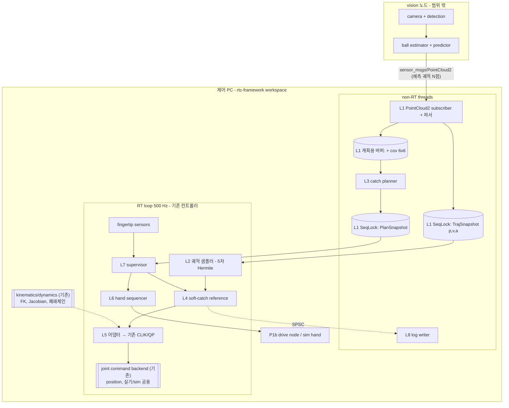

# CATCHING_MASTER — 제어 PC 포구(catching) 알고리즘 구현 마스터 문서

- 문서 버전: v0.4 (2026-09-19)
- 대상 독자: 구현자(Claude Code 포함), 이론 검토자(Junho)
- 구현 대상: **기존 `rtc-framework` workspace** (신규 workspace 아님)
- 문서 세트: 본 마스터 + `WORKSPACE_ANALYSIS.md`(단계 W) + `L0_core.md` … `L8_bringup.md` + 같은 폴더의 참조 구현·테스트(`README.md` 참조)
- 상태 표기: `[확정]` 사용자 결정, `[권장]` 설계 권장안, `[TBD-xx]` 미확정(추측 금지, §9 참조), `[논문 외 유도]` 원문에 없는 본 문서의 유도

### 0.1 개정 이력

| 버전 | 일자 | 내용 |
|---|---|---|
| v0.1 | 2026-09-17 | 초안 |
| v0.2 | 2026-09-18 | `_REVIEW_catching_2026-09-18.md` 반영. 주요 변경: 포구 오차 예산 식 교체(L3 §4.6), 접근축 오차를 회전벡터 기반으로 교체(L4 §4.5, L3 §4.2, L5 §4.2), 속도 포화 시 반환 가속도 수정(L4 §5.1), `COMMITTED` 이후 γ 하향 경로 신설(L3 §4.7, L4 §5.1, L7 §4.6), 충격량 예산 절 신설(L7 §4.7), impact 계열 문헌 추가(§8), 구현 순서에서 `T_close` 식별 선행(§4), Jacobian 규약 명시(§3), 참조 구현 1벌로 통합 |
| v0.3 | 2026-09-18 | 구현 대상을 기존 `rtc-framework` workspace로 확정. 입력 계약을 자체 정의 `catching_msgs/BallState`에서 **vision 노드의 `sensor_msgs/PointCloud2`**로 교체(§5). 제어 PC는 궤적을 재전파하지 않고 vision 예측을 그대로 신뢰 — L2가 전파기에서 **궤적 샘플러**로 축소(L2 전면 개정). kinematics·dynamics·QP·과제 클래스·joint command backend는 **기존 구현 재사용**으로 확정(§1.2, L5). 단계 W(`WORKSPACE_ANALYSIS.md`) 신설 — L0 포함 모든 구현의 선행 단계 |
| v0.4 | 2026-09-19 | 에이전트 4개(정합성·수식 재유도·v0.3 잔재·데이터 흐름/RT) 교차 검증 반영. **기능 결함 5건 수정**: `derateGamma` 수락 기준을 목표 γ_f 로(L4 §5.2.1), retreat 끌개를 $p_c$ 로(L4 §5.3), `track_epoch` 를 스냅샷 필드로(L2 §5.1), 시간축 단일 원점·두 축 규약(§3, L2 §4.4), 재무장 리셋 목록(L7 §4.8). **근거 수정**: γ 하향 점프가 시간에 단조가 아님(L4 §5.2.1, L7 §4.6). **신설**: 예측 일관성 감시 $\bar\nu$(L1 §4.5), QP 반복 상한·`QP_FAILED`(L5 §4.3, L7 §4.2), 상태 전이 행렬 완전성(L7 §4.1). 테스트 커버리지 보강(보간 속도 경로, `tRest` 4분기, 안정 경계 ±0.2%, γ 하향 3분기) |

[R3] 식 대조는 v0.2에서 완료했다(L4 §4.1). v0.1이 "T-RO 본문 대조 미완"으로 남겨 둔 항목이다.

**v0.3·v0.4 주의.** 이 두 버전은 입력 계약과 재사용 범위를 바꿨을 뿐, **상세 구현을 확정하지 않았다.** `rtc-framework`의 실제 API·구조를 아직 보지 않았기 때문이다. 각 layer의 §5 C++ 코드는 여전히 참조 구현이며, 실제 이식 형태는 단계 W 이후에 정한다.

---

## 1. 목적과 범위

비행하는 공을 로봇 손으로 받는 기능 중 **제어 PC 쪽 전체**를 기존 `rtc-framework` workspace 위에 구현한다. vision 노드가 발행하는 **예측 궤적**(`sensor_msgs/PointCloud2`)을 입력으로 받아, 포구점 계획 → 기준 궤적 생성 → 관절 명령 → 손 폐쇄 → 접촉 후 감속까지 수행한다.

범위 밖: 카메라 처리와 공 상태 추정·예측(vision 노드 소관), PTP 설정 절차(인프라 문서 소관), 그리고 **이미 workspace에 있는 기능 전부**(§1.2).

### 1.1 상세 구현 착수 조건 `[확정]`

**단계 W(`WORKSPACE_ANALYSIS.md`)를 먼저 끝낸다.** 본 문서 세트는 `rtc-framework`의 실제 구조를 보지 않은 상태에서 작성됐다. 각 layer 문서 §2의 "코드 확인 게이트"가 그 미확인 항목이며, 단계 W가 그것을 한 번에 처리한다. 게이트가 비어 있는 상태에서 나오는 "상세 구현"은 추측이므로 하지 않는다.

우선 확인 두 가지: **제어기가 명령을 어디에 싣는가**(W4-1), **vision 메시지의 실제 필드 레이아웃**(W5-2).

### 1.2 기존 구현 재사용 `[확정]`

다음은 **이미 workspace에 있고, 새로 만들지 않는다.**

| 대상 | 내용 | 조사 항목 |
|---|---|---|
| vision 예측 | 공 궤적 예측과 `PointCloud2` 발행. 제어 PC는 **재전파하지 않고 그대로 신뢰**한다 | W5 |
| kinematics / dynamics | arm-hand system의 FK, frame pose, Jacobian, 폐쇄 체인 제약, (필요 시) RNEA/ABA | W3 |
| 과제·QP·CLIK | `rtc_tsid`의 velocity-level CLIK, 과제 클래스, ProxQP 사용 방식, 적분 | W3-6~8 |
| joint command backend | 실기·시뮬레이션 양쪽에 맞춰 이미 구현됨. **명령은 전부 position** | W4 |
| RT 원시형 | SeqLock / SPSC, 시간 타입, lifecycle, 로깅 | W2 |

**제어기가 하는 일은 연산 결과를 workspace 구조에 맞는 자리에 데이터로 실어 주는 것까지다.** 드라이버 파라미터, 명령 경로, 안전 정지는 backend와 드라이버 소관이며 본 구현은 감시만 한다.

포구 전용으로 새로 만드는 것은 다음뿐이다: 궤적 샘플러(L2), soft-catch 기준 생성기(L4), 포구 계획기(L3), 손 시퀀서(L6), 슈퍼바이저(L7). L5는 기존 CLIK에 과제를 붙이는 **얇은 어댑터**로 남는다.

### 1.3 대상 시스템 `[확정]`

| 구분 | 구성 | 용도 | 비고 |
|---|---|---|---|
| 주 타깃 | `ur5e_p1b` = UR5e + 자체 개발 4-finger 핸드 P1b (cross 4-bar 폐쇄 체인) | 실기 + MuJoCo | MuJoCo 모델 있음(폐쇄 체인 포함) |
| 시뮬레이션 전용 | `iiwa7_leap` = KUKA iiwa7 + LEAP Hand | MuJoCo | 실기 구동 계획 없음 |

- 최우선 순위: **MuJoCo 시뮬레이션에서의 알고리즘 검증** `[확정]`
- 관절 명령: **전부 position** `[확정]`. 실기·시뮬레이션 backend가 workspace에 이미 구현돼 있으며, 제어기는 계산한 $q_c$를 그 자리에 싣는다(§1.2, W4)
- P1b 실기 구동 경로: **별도 드라이브/노드** (팔의 RT 루프 밖) `[확정]`
- 실기 접촉 신호: **지문(fingertip) 센서만** `[확정]` (UR5e 툴 플랜지 F/T는 사용하지 않음)
- 코드 기반: **기존 `rtc-framework` workspace + `rtc_tsid` 재사용** `[확정]`
- 입력: vision 노드의 **`sensor_msgs/PointCloud2` 예측 궤적** `[확정]` (§5). 제어 PC는 궤적을 재전파하지 않는다
- Pinocchio: **4.0** `[확정]`
- P1b 사양(작성 시점 기준 사용자 진술): thumb 4, index 3, middle 2, ring 1 = 10 actuated DoF, 관절 모터 1.5 Nm·12.46 rad/s. 구현 시 URDF/MJCF와 대조할 것(L6 게이트).

### 1.4 시뮬레이션 검증의 한계 `[권장]`

`iiwa7_leap`와 `ur5e_p1b`는 팔 자유도(7 대 6), 명령 경로(`servoj` 보간 지연 유무), 손(포켓 형상, 폐쇄 지연, 센서 배치)이 다르다. 각 검증 항목에 다음 태그를 붙인다.

- `[SIM-ANY]` 어느 시뮬레이션 모델로도 유효 (로직, 수치 정합)
- `[SIM-P1B]` `ur5e_p1b` MuJoCo 모델 필요 (도달 가능성, 6-DoF 여유, 손 타이밍)
- `[HW-P1B]` 실기 필요 (`servoj` 지연, 실측 `T_close`, 센서 잡음, 시계 동기)

---

## 2. 시스템 구조



점선 상자는 **workspace에 이미 있는 것**이다(§1.2). 실선 상자 중 L2–L7이 이번에 만드는 부분이고, L5는 기존 CLIK에 과제를 붙이는 어댑터다.

### 2.1 실행 영역 원칙 `[권장]`

1. 토픽 도착은 제어 명령을 트리거하지 않는다. RT 루프는 시간 구동이며 최신 스냅샷만 읽는다.
2. non-RT → RT 공유 상태는 단일 writer SeqLock(또는 RTC 프레임워크의 동등 원시형)으로만 전달한다.
3. RT → non-RT 기록은 고정 크기 레코드의 SPSC 링으로만 전달한다.
4. RT 경로 금지 패턴은 RTC 프레임워크 규칙(RT-1 … RT-9+)을 그대로 따른다: 동적 할당, 예외, blocking I/O, mutex, tf2 조회 금지.
5. 시간 기준: 실기는 PTP로 동기된 system time, 시뮬레이션은 `use_sim_time=true`. RT 루프에서 스탬프 비교에 쓰는 시간은 스탬프와 같은 시계여야 한다(L1 게이트).

---

## 3. 표기와 규약

| 항목 | 규약 |
|---|---|
| 단위 | SI (m, s, rad, N). 각도 YAML 입력은 rad (deg 입력 금지) |
| 좌표계 | `W` world(공 추정·계획·기준 생성 전부), `B` robot base, `C` catch frame(손), `S_i` 지문 센서 i |
| 공 상태 | vision이 준 샘플 $(p,v,a,t,\Sigma_{6\times6})$. 제어 PC는 이 사이를 보간만 한다 (§5, L2) |
| 공 모델 | $\dot p=v,\ \dot v=g-k\Vert v\Vert v$ — **시뮬레이션 fixture 전용**(L0 §1). 실시간 경로에서는 쓰지 않는다 |
| 접근축 | $\hat z_C$ = catch frame의 손바닥 **바깥 방향** 법선. 목표 $a_d=-\hat v_B(t_c)$ `[TBD-FRAME-01]` |
| 접근축 오차 | 회전벡터 $e_a=\theta\,\hat u$, $\hat u=\dfrac{z\times a_d}{\Vert z\times a_d\Vert}$, $\theta=\mathrm{atan2}(\Vert z\times a_d\Vert,\ z^\top a_d)$. $\exp([e_a]_\times)z=a_d$ (L4 §4.5) |
| 회전 | Hamilton quaternion, 회전행렬 $R_{WC}$ (C → W). $\mathrm{Log}:SO(3)\to\mathbb R^3$ |
| 각속도 | 기본 표현은 world $\omega^W$, $\dot R_{WC}=[\omega^W]_\times R_{WC}$. LOCAL은 $\omega^L=R_{WC}^\top\omega^W$ |
| Jacobian | **과제별로 다르므로 항상 명시한다.** 병진: `LOCAL_WORLD_ALIGNED` ($J_p$). 각속도: L3 §4.2·L5 §4.2는 `LOCAL` ($J_\omega^L$), L4 §4.5의 $J_a$ 유도와 L5 §4.2의 대체 표현은 `WORLD` ($J_\omega^W$). 코드에서는 `LOCAL`/`WORLD` 각속도를 서로 다른 타입으로 구분할 것 `[권장]` |
| softness | $\gamma\in[0,1]$, 0 = 정지 포구, 1 = 완전 추종 |
| 시간 원점 | **모든 상대시각의 원점은 궤적 메시지의 `header.stamp`($t_{ref}$)** 다. `PlanSnapshot::t_ref` 도 계획에 쓴 메시지의 같은 값을 싣는다 (L2 §4.4) |
| 시간 축 | 둘을 구분해 쓰고 **서로 다른 타입으로 선언한다** `[권장]`. **실제시각축** $t_{real}=10^{-9}(t_{now}-t_{ref})$: 손 명령 $t_{cmd}$, 접촉 판정, stale. **선행축** $t_{lead}=t_{real}+T_{arm}$: 궤적 샘플링, γ 프로파일, $t_c$, `setIntercept`/`derateGamma`, `CLOSING→DECEL` |
| 시간 | $t_c$ 포구 시각(선행축), $t_{cmd}$ 손 폐쇄 명령 시각(실제시각축) |
| 지연 | $T_{arm}$ 팔 추종 지연(= 선행 보상량), $T_{close}$ 손 폐쇄 시간, $T_{link}$ 손 명령 전달 지연, $T_{tick}=h/2$ 틱 양자화 예산 |
| 가속도 기호 | $a$ 공 가속도(vision), $a_{\max}$ TCP 가속 한계(L4), $\bar a$ 관절 가속 한계(L3 §4.3) $=\ddot q_{\max}$(L5), $a_{dec}$ 감속(L7). **$a_{dec}\le a_{\max}$** 여야 한다(L7 §4.3) |
| 속력 기호 | $v_{\max}$ TCP 속도 한계, $v_{dir,\max}$ 방향 달성 속력(L3 §4.5), $\Vert v\Vert_{\max}$ **받을 수 있는 최대 공 속력**(L3 §4.5) — 셋을 혼동하지 말 것 |

---

## 4. Layer 구성

패키지 이름은 가칭이다. `rtc-framework`의 기존 구조에 맞춰 단계 W(W1-5)에서 확정한다.

| Layer | 패키지(가칭) | 브랜치 | 단위 기능 | 선행 |
|---|---|---|---|---|
| **W** | — | — | **`rtc-framework` workspace 종합 분석** (`WORKSPACE_ANALYSIS.md`) | — |
| L0 | `catching_core` | `feat/catching-L0-core` | 공용 타입, 파라미터 검증. 공 동역학 라이브러리는 **시뮬레이션 fixture 전용**으로 격하 | W |
| L1 | `catching_io` | `feat/catching-L1-io` | `PointCloud2` 수신·파싱·검증, 좌표 정리, 스냅샷 브리지, stale 판정 | W, L0 |
| L2 | `catching_prediction` | `feat/catching-L2-prediction` | **궤적 샘플러** (5차 Hermite 보간, 시각 정렬, 지평 감시) | W, L0 |
| L3 | `catching_planner` | `feat/catching-L3-planner` | 포구점·시각·γ 결정 | L1, L2, L4, L5 |
| L4 | `catching_reference` | `feat/catching-L4-reference` | soft-catch DS, 접근축 정렬, 복귀 | L0 |
| L5 | `catching_joint_cmd` | `feat/catching-L5-joint-cmd` | **기존 CLIK/QP 어댑터** — 과제 구성, 한계, backend에 $q_c$ 싣기 | W, L4 |
| L6 | `catching_hand` | `feat/catching-L6-hand` | 손 시퀀서, 명령 포트 추상화, `T_close` 식별 | W, L0, L1 |
| L7 | `catching_supervisor` | `feat/catching-L7-supervisor` | 상태 머신, 접촉 판정, 감속, abort | L1–L6 |
| L8 | `catching_bringup`, `catching_sim_fixtures` | `feat/catching-L8-bringup` | 컨트롤러 통합, launch, YAML, 로깅·지표, 시나리오 테스트 | 전체 |

v0.2 대비 변경: `catching_msgs` 삭제(§5), L2 축소, L5를 어댑터로 명시, 단계 W 추가.

L3는 γ rollout에 L4의 기준 생성기를 **같은 코드로** 호출하므로 L4 이후에 병합한다.

**권장 순서 `[권장]`: W → L0 → L1 → L2 → L6a → L4 → L5 → L3 → L6b → L7 → L8.**

단계 W는 건너뛸 수 없다(§1.1).

`L6a`는 L6 문서의 L6.1–L6.3(손 프로파일, `InLoopHandPort`, `T_close` 식별 도구)만 떼어낸 것이고, 가능하면 L6.5(실기 $T_{close,tot}$ 종단 간 실측)까지 앞당긴다. `L6b`는 나머지다.

이유는 §4.1에 적는다.

### 4.1 `T_close,tot` 선행 측정 `[권장]`

γ 창이 비는 조건(L3 §4.5)은 다음과 같다.

$$\Vert v(t_c)\Vert>\min(v_{dir,\max},v_{\max})+\frac{d_{eff}}{T_{close,tot}}$$

우변이 **받을 수 있는 최대 공 속력**이다. 참조 구현(`test_l3`)으로 확인한 값: $v_{dir,\max}=1.5$ m/s, $d_{eff}=4$ cm, $T_{close,tot}=60$ ms이면 상한이 2.17 m/s다. 6 m/s를 받으려면 $T_{close,tot}\le d_{eff}/(\Vert v\Vert-v_{dir,\max})=8.9$ ms가 필요하다. [R1]의 DLR-Hand-II가 5 ms 급이었다는 점을 생각하면 자명한 요구가 아니다.

즉 `TBD-HAND-01`($T_{close}$) 하나가 목표 투척 속도(`TBD-BALL-02`), `reference.a_max`, γ 격자, rollout 창 길이를 전부 결정한다. 이 값을 모른 채 L3–L5를 튜닝하면 재작업이 확정이다. 최소한 시뮬레이션 손 모델로 자릿수를 먼저 잡고, 실기 값이 나오면 `planner.*`와 `reference.*`를 재산정한다(L3 게이트 G3-F).

### 4.2 브랜치 전략 `[권장]` `[TBD-GIT-01]`

- 기준 브랜치: `TBD-GIT-01` (예: `develop`). 각 layer 브랜치는 직전 layer 병합 후의 기준 브랜치에서 분기한다.
- 병합 조건: 해당 layer 문서 §9 게이트 전부 통과 + 리뷰. 통과 시 태그 `catching-Lx-verified`.
- layer 내부 단위 기술은 커밋 단위로 나눈다(Conventional Commits, scope = `catching-Lx`).
- 게이트 공통 항목(모든 RT 코드): RT 경로 page fault 0, RT 경로 할당 0, `noexcept` 경계 유지, 고정 QP 차원 + **반복 상한 `max_iter` 설정 및 미수렴 시 `QP_FAILED` 경로 확인**(L5 §4.3), 컴파일 경고 0(`-Wall -Wextra`).
- `noexcept` 경계는 선언만으로 보증되지 않는다. layer별 게이트에 **예외 주입 테스트**를 하나 이상 포함한다 — RT 경계 함수가 호출하는 하위 루틴에 강제로 던지는 스텁을 넣어 `std::terminate` 가 아니라 설계된 실패 코드로 빠지는지 확인한다(주입 테스트는 비RT 빌드에서만 수행).

### 4.3 Layer 문서 공통 목차

1. 범위 / 비범위
2. 코드 확인 게이트 (구현 전 실제 코드에서 확인할 것)
3. 참고자료 (본 문서 §8의 [Rn] 인용)
4. 수학적 이론 (표기 → 식 → 유도 → 논문 대응 → sanity check)
5. C++ 구현 (인터페이스 → 핵심 구현 → RT 규칙)
6. YAML 파라미터
7. 단위 기술 구현 순서
8. 디버깅 방법
9. 검증 방법과 합격 게이트
10. 미확정 항목

---

## 5. vision → 제어 PC 입력 계약 `[확정]`

메시지는 **vision 노드가 이미 발행하고 있는 것**이며, 제어 PC가 정의하지 않는다. v0.2까지 있던 자체 정의 `catching_msgs/BallState`·`BallModel`은 폐기한다.

### 5.1 `sensor_msgs/PointCloud2` — 예측 궤적

| 항목 | 값 | 비고 |
|---|---|---|
| 토픽 이름 | `TBD-VIS-01` | 사용자 미정 |
| `header.stamp` | 예측 기준 시각 | 점의 `t`가 이 시각 기준 상대값 |
| `header.frame_id` | 추정 frame | `world`와 같은지 `TBD-VIS-06` |
| `height` × `width` | 1 × $N$ | 점 하나가 한 행(unordered) |
| `point_step` | 약 372 B | **산술이 닫히지 않는다 — 아래 참조** |

점 하나의 필드(사용자 진술):

| 필드 | 타입 | 의미 |
|---|---|---|
| `x, y, z` | float64 ×3 | 예측 위치 [m] |
| `vx, vy, vz` | float64 ×3 | 예측 속도 [m/s] |
| `ax, ay, az` | float64 ×3 | 가속도 [m/s²]. "중력($g$) 모델 상수" — 항력 포함 여부 `TBD-VIS-05` |
| `t` | float64 (초) 또는 uint32 (ns) | `header.stamp` 기준 horizon. `TBD-VIS-03` |
| `cov` | float64 ×36 | 6×6, 순서 $(p_x,p_y,p_z,v_x,v_y,v_z)$ |

**`point_step` 산술.** float64 ×9 = 72 B, cov 36×8 = 288 B → 소계 360 B. 여기에 `t`가 float64면 368 B, uint32면 364 B다. 진술된 372 B와 4–8 B 차이가 난다(정렬 패딩이거나 미언급 필드). **파서는 offset을 가정하지 않고 `PointField` 배열에서 읽어 구성한다**(L1 §5.1). 실제 덤프로 확정한다(`TBD-VIS-02`, W5-2).

**`PointCloud2`에 없는 것.** `track_id`, 트랙 상태(초기화/추적/소실), NIS 같은 추정기 건강도, 모델 버전 필드가 없다. 따라서

- 트랙 연속성·소실 판정은 스탬프 연속성과 궤적 점프 크기로 대체한다(L1 §4.4, `TBD-VIS-07`).
- 모델 버전 대신 **필드 레이아웃 해시**를 검증한다(L1 §5.1).
- 추정기 건강도 감시(v0.2의 NIS 창 평균)는 입력이 없어 제거한다.

QoS는 vision 노드가 정한 것을 따른다(`TBD-VIS-08`). 제어 PC는 스탬프 나이 검사를 기본 감시로 쓴다(L1).

### 5.2 제어 PC가 궤적을 재전파하지 않는다 `[확정]`

vision의 예측을 그대로 신뢰한다. 제어 PC는 $(p,v,a)$ 샘플 열 사이를 **보간**할 뿐이고, 자체 공 동역학 모델로 다시 적분하지 않는다(L2 §4.1).

따라서 v0.2의 "두 PC 공용 동역학 라이브러리"와 `kModelVersion` 계약은 사라진다. `ball_dynamics.hpp`는 **L8 시뮬레이션 fixture 전용**으로 남는다(L0 §1).

### 5.3 시계

두 PC는 PTP로 동기한다(인프라 문서). 제어 PC는 시작 시 동기 상태를 확인하고, 임계 초과 시 `ARMED` 진입을 막는다(L7, `[TBD-NET-01]`).

---

## 6. YAML 구성

단일 파일 `config/catching_<robot>.yaml`에 layer별 네임스페이스를 둔다. robot-specific 값은 `robot.*`에만 둔다(robot-agnostic 원칙).

```yaml
catching:
  robot: {...}        # L5/L6/L3 공통 로봇 고유값 (frame 이름, 관절 한계, 손 자세)
  sim: {...}          # L0 fixture, L5 지연 에뮬레이션, L8 투척·측정·vision 발행기
  core: {...}         # L0
  io: {...}           # L1
  prediction: {...}   # L2
  planner: {...}      # L3
  reference: {...}    # L4
  joint_cmd: {...}    # L5
  supervisor: {...}   # L7
  logging: {...}      # L8
```

모든 키는 layer 문서 §6 표에 `이름 / 타입 / 단위 / 기본값 / 허용 범위 / 근거`로 정의한다.

**TBD 검사는 "현재 활성 구성이 참조하는 키"에만 적용한다 `[권장]`.** 전체 키에 걸면 절대 `ARMED` 가 되지 않는다 — 실기에서 `sim.*`, 시뮬레이션에서 `robot.hand.async.topic`, backend가 지연을 보상할 때 `joint_cmd.lag.*` 가 영구히 TBD로 남기 때문이다. L0 검증기는 launch 구성(실기/시뮬, 손 포트, `lead_enable`)에 따라 검사 대상 집합을 정한다.

**층간 일치 제약도 검증기가 검사한다.** 문서에 "같은 값"이라고 적어 두는 것만으로는 어긋남을 못 잡는다.

| 키 A | 키 B | 관계 |
|---|---|---|
| `reference.v_max` | L3 `gammaWindow` 의 `v_tcp_max` | 같은 값 |
| `planner.stop.a_dec` | `supervisor.decel.a_dec` | 같은 값 |
| `reference.gamma_derate.ramp` | `supervisor.gamma.ramp` | 같은 값 |
| `supervisor.decel.a_dec` | `reference.a_max` | $a_{dec}\le a_{\max}$ (L7 §4.3) |
| `prediction.lead` | `joint_cmd.lag.T_arm` × `lead_enable` | 같은 값 (L2 §4.4) |
| `robot.hand.T_pre` | `planner.freeze.T_freeze` | $T_{pre}\le T_{freeze}$ (L6 §5.3) |
| `robot.hand.q_close[i]` | `robot.hand.q_pre[i]` | caging 관절에서 $\vert$차$\vert>$ `rho_eps` (L6 §4.2) |
| `reference.axis.sin_eps` | `axisAlignJacobian` 인자 | 같은 값 (L4 §4.5) |

---

## 7. 이론 ↔ 코드 대응 색인

| 이론 항목 | 출처 | 문서 | 코드 위치(예정) |
|---|---|---|---|
| 항력 탄도 모델, RK4, 선형화 | [R8] 교과서 | L0 §4 | `ball_dynamics.hpp` (시뮬레이션 fixture 전용) |
| 궤적 샘플링 (5차 Hermite, $C^2$) | 논문 외 유도 | L2 §4.2 | `traj_sampler.hpp` |
| `PointCloud2` 파싱·레이아웃 검증 | 논문 외 설계 | L1 §5.1 | `cloud_parser.hpp` |
| 관절 최소 도달시간 (P1 램프 제약) | [R1] + 논문 외 유도 | L3 §4.3 | `time_feasibility.hpp` (`tMinChecked`) |
| 5-DoF 포구 자세, 접근축 제약 | [R1] 식(3)의 변형 | L3 §4.2 | `catch_ik.hpp` |
| γ 창 부등식, 방향 속력 | 논문 외 유도 | L3 §4.5 | `time_feasibility.hpp` (`gammaWindow`, `maxCatchableSpeed`), `directional_speed.hpp` |
| 포구 오차 예산 (직교 분해) | 논문 외 유도 | L3 §4.6 | `catch_planner.cpp` |
| 오차 좌표 soft-catch DS | [R3] 식(4)(5) | L4 §4.1 | `soft_catch_reference.hpp` |
| Corollary(원점 = 포구점) | [R3] Corollary 1 | L4 §4.2 | 〃 |
| 예측 오차·재예측 점프 ($e$, $\dot e$) | 논문 외 유도 | L4 §4.3 | 〃 |
| 수렴 한계 (임계감쇠 닫힌해, 감쇠율 LMI) | 논문 외 유도 | L4 §4.4 | 〃 (`criticallyDampedError`) |
| 접근축 회전벡터 오차와 Jacobian | 논문 외 유도 | L4 §4.5, L3 §4.2, L5 §4.2 | 〃 (`axisAlignError`/`Omega`/`Jacobian`), `rtc_tsid` 마스크 과제 |
| 반암시적 오일러 안정 경계 | 논문 외 유도 | L4 §4.7 | `test_l4.cpp` |
| γ 하향(동결 후 유일한 계획 변경) | 논문 외 설계 | L3 §4.7, L7 §4.6 | `soft_catch_reference.hpp` (`derateGamma`) |
| `servoj` 지연 식별·선행 보상 | 논문 외 설계 | L5 §4.4–4.5 | `tools/identify_arm_lag.py` |
| 가상 감속 대상(연속 전환) | 논문 외 유도 | L7 §4.3 | `decel_target.hpp` |
| 충격량 예산 | [R16][R17][R18] + 논문 외 유도 | L7 §4.7 | `catch_planner.cpp`, L8 지표 |
| 투척 생성 슈팅 | 논문 외 설계 | L8 §4.2 | `catching_sim_fixtures` |
| velocity CLIK / QP | [R9][R10] | L5 §4 | **기존 `rtc_tsid` 재사용** (W3-6~8) |
| FK / Jacobian / 폐쇄 체인 | [R9] | L3 §4.2, L5 §4.2 | **기존 kinematics 구현 재사용** (W3-1~4) |
| position 명령 전달 | — | L5 §4.3 | **기존 backend 재사용** (W4) |
| NEES/NIS 일관성 | [R8] | L8 §4 | `metrics.py` |
| Wilson 신뢰구간 | [R13] | L8 §4 | `metrics.py` |

---

## 8. 참고자료

서지 사항은 1차 출처(출판사 페이지, 학회 proceedings, 공식 문서)로 확인한 것만 적는다. `(확인 필요)` 표시 항목은 구현 전 확인한다.

| ID | 문헌 | 용도 |
|---|---|---|
| R1 | B. Bäuml, T. Wimböck, G. Hirzinger, "Kinematically optimal catching a flying ball with a hand-arm-system," IEEE/RSJ IROS 2010. DOI 10.1109/IROS.2010.5651175 (페이지 2592–2599 `확인 필요`) | 관절 램프, 포구 제약, 손 caging |
| R2 | S. Kim, A. Shukla, A. Billard, "Catching objects in flight," IEEE T-RO 30(5):1049–1065, 2014. DOI 10.1109/TRO.2014.2316022 | 포구 자세 탐색, 예측 중단 시점 |
| R3 | S. S. Mirrazavi Salehian, M. Khoramshahi, A. Billard, "A dynamical system approach for softly catching a flying object: Theory and experiment," IEEE T-RO, 2016. DOI 10.1109/TRO.2016.2536749 (권/호/페이지 32(2):462–471 `확인 필요` — 보유 PDF가 저자 버전이라 헤더 없음) | soft catch, γ. **본 문서의 1차 근거**(L4 §4.1) |
| R4 | S. S. Mirrazavi Salehian, N. Figueroa, A. Billard, "Coordinated multi-arm motion planning: Reaching for moving objects in the face of uncertainty," RSS 2016. DOI `확인 필요` | γ 스케줄. **전문 미보유 — 식 번호 인용 금지**(L4 §4.1, §4.6) |
| R5 | epfl-lasa/bimanual-dynamical-system (GitHub) | R4 공개 코드. **미열람** — L4 §4.6은 재확인 대상 |
| R6 | S. M. Khansari-Zadeh, A. Billard, "Learning stable nonlinear dynamical systems with Gaussian mixture models," IEEE T-RO 27(5):943–957, 2011 | 관련 연구(본 구현 미사용) |
| R7 | J. Solà, J. Deray, D. Atchuthan, "A micro Lie theory for state estimation in robotics," arXiv:1812.01537 | SO(3) Log, Jacobian 규약 |
| R8 | Y. Bar-Shalom, X. R. Li, T. Kirubarajan, *Estimation with Applications to Tracking and Navigation*, Wiley, 2001 | 공분산 전파, Joseph form, NEES/NIS |
| R9 | J. Carpentier et al., "The Pinocchio C++ library," IEEE/SICE SII 2019 | kinematics. 4.0 API는 공식 문서로 확인 |
| R10 | A. Bambade et al., "PROX-QP: Yet another quadratic programming solver for robotics and beyond," RSS 2022 | QP solver |
| R11 | Universal Robots ROS 2 Driver 문서 (docs.ros.org, `ur_robot_driver`, Jazzy) | position/velocity 인터페이스, 컨트롤러 |
| R12 | IEEE Std 1588-2019 (PTP) | 시계 동기 |
| R13 | E. B. Wilson, "Probable inference, the law of succession, and statistical inference," JASA 22(158):209–212, 1927 | 성공률 신뢰구간 |
| R14 | E. Todorov, T. Erez, Y. Tassa, "MuJoCo: A physics engine for model-based control," IEEE/RSJ IROS 2012 | 시뮬레이터 |
| R15 | J. Nocedal, S. J. Wright, *Numerical Optimization*, 2nd ed., Springer, 2006 | L3 부록 SQP |
| R16 | L. Yan, T. Stouraitis, J. Moura, W. Xu, M. Gienger, S. Vijayakumar, "Impact-aware bimanual catching of large-momentum objects," IEEE T-RO, 2024. DOI 10.1109/TRO.2024.3381551 | 충격량 분배, 접촉점 선택, 강성·접촉력 동시 최적화 (L7 §4.7) |
| R17 | M. M. Schill, M. Buss, "Robust ballistic catching: A hybrid system stabilization problem," IEEE T-RO 34(6):1502–…, 2018 (페이지 `확인 필요`) | 포구의 정량적 안정성 척도, 초기 상대상태의 영향. 인용 위치: **L3 §4.10(대안 정식화, 미채택)**, L7 §4.7(충격량 예산) |
| R18 | J. J. van Steen, N. van de Wouw, A. Saccon, "Robot control for simultaneous impact tasks via quadratic programming-based reference spreading," ACC 2022 / 확장판 IEEE T-RO 2024 | 충격 순간의 기준 궤적 불연속 처리 (L7 §4.7 대안) |
| R19 | Y.-B. Jia, "Three-dimensional impact energy-based modeling of tangential compliance," IJRR, 2013 (권/페이지 `확인 필요`) | 접선 컴플라이언스. L3 §4.5의 $d(1+1/e)$ 가 무시하는 성분 |

[R16]–[R19]는 v0.2에서 추가했다. v0.1은 `55_Dynamic_Catching` 폴더의 impact 계열 문헌을 한 편도 인용하지 않았고, 그 결과 충격 처리가 설계에서 빠져 있었다(L7 §4.7).

---

## 9. 미확정 항목 (추측 금지)

| ID | 내용 | 영향 layer | 확정 방법 |
|---|---|---|---|
| TBD-FRAME-01 | 두 로봇의 catch frame 이름, 손바닥 바깥 법선 축 | L3, L4, L5 | URDF/MJCF 확인 후 사용자 확정 |
| TBD-BALL-01 | 공 지름·질량·재질(반발) | L0, L3 | 사용자 제공 |
| TBD-BALL-02 | 투척 속도·거리 범위, 포구 허용 작업공간 | L3, L8 | 사용자 제공 |
| TBD-HAND-01 | P1b `T_close` | L3, L6 | L6 식별 도구로 실측 `[HW-P1B]` |
| TBD-HAND-02 | P1b 명령 경로(메시지·노드)와 `T_link` | L6 | 사용자 제공 + 실측 |
| TBD-HAND-03 | 지문 센서 인터페이스·주기·부호·frame | L6, L7 | 코드·데이터시트 확인 |
| TBD-HAND-04 | 포켓 유효 깊이 $d_{eff}$ (두 손) | L3 | CAD 측정 + 투척 실험 |
| TBD-HAND-05 | P1b preshape/폐쇄 자세, 전류(토크) 한계 | L6 | 사용자 제공 |
| TBD-ARM-01 | 명령을 싣는 자리(인터페이스 형태·필드·단위), 실기/sim 전환, backend가 이미 보상하는 지연이 있는지 | L3, L5 | W4-1, W4-2 |
| TBD-WS-02 | 포구 코드를 새 패키지로 둘지 기존 패키지에 넣을지, 패키지 이름 확정 | 전체 | W1-5 + 사용자 결정 |
| TBD-ARM-02 | 운용 관절 가속 한계 | L3, L5 | 사용자 결정 |
| TBD-SIM-01 | MuJoCo ↔ ros2_control 연동 방식 | L8 | 사용자 제공 |
| TBD-SIM-02 | MJCF 공 유체 모델 설정 | L0, L8 | MJCF 확인 후 $k$ 식별 |
| TBD-GIT-01 | 기준 브랜치 이름, 기존 명명 규칙 | 전체 | 사용자 제공 |
| ~~TBD-PRED-01~~ | 폐기(v0.3). 제어 PC가 전파하지 않으므로 $q$ 공유가 불필요. fixture 전용 `sim.ekf.q_acc` 로 대체 | — | — |
| TBD-WS-01 | 바닥 높이, 작업셀 경계 (`W`) | L2 | 셀 측정 |
| TBD-ARM-03 | UR 드라이버 speed scaling 상태 인터페이스 | L7 | [R11] 확인 |
| TBD-NET-01 | PTP 상태 확인 방법(인터페이스) | L7 | 인프라 문서 |
| TBD-VIS-01 | vision 토픽 이름 | L1, L8 | 사용자 제공 |
| TBD-VIS-02 | `PointField` 실제 레이아웃(offset·datatype·count), `point_step` 372 B의 미설명 4–8 B | L1 | W5-2 실제 덤프 |
| TBD-VIS-03 | `t` 필드 타입·기준 (float64 초 / uint32 ns) | L1, L2 | W5-3 |
| TBD-VIS-04 | 발행 주기, $N$ 범위, 지평 길이, 지연 분포 → L2 버퍼·L3 슬라이스 범위 | L1, L2, L3 | W5-6 실측 |
| TBD-VIS-05 | `ax,ay,az`가 상수 $g$인지 항력 포함 총 가속도인지 | L0, L2, L4 | W5-4 실제 데이터 |
| TBD-VIS-06 | `header.frame_id`와 `world`의 관계 | L1 | W5-5 |
| TBD-VIS-07 | 트랙 식별·상태(소실) 판정 수단. `PointCloud2`에는 자리가 없다. **vision 쪽 요청 사항으로 격상**(W5-7) — `track_id`/`valid` 필드 1~2개면 유령 트랙 문제가 닫힌다 | L1, L3, L7 | W5-7, vision 담당과 협의 |
| TBD-VIS-08 | vision 토픽 QoS | L1 | W5 |
| TBD-COV-01 | 공분산을 RT까지 넘길지, non-RT 계획 버퍼에만 둘지 | L1, L2, L3 | W2-2(SeqLock 관례) 확인 후 결정 |
| TBD-IMP-01 | 공 질량·반발계수와 허용 충격량(손가락 관절 토크, UR5e 보호 정지 임계) | L3, L7 | TBD-BALL-01 + 데이터시트 + 시뮬레이션 측정 |
| TBD-REF-01 | [R4] 전문·[R5] 코드 확보 후 L4 §4.6 재확인 | L4 | 문헌 확보 |
| TBD-RTC-xx | 아래 하위표 | | |

### 9.1 `TBD-RTC-*` 하위표

layer 문서들이 개별 번호를 인용하므로 여기에 정의를 모은다. 전부 단계 W에서 닫는다.

| ID | 내용 | 참조 layer | W 항목 |
|---|---|---|---|
| TBD-RTC-01 | SeqLock/SPSC 원시형 헤더·API·재시도 정책 | L0 G0-1, L1 G1-8, L3 G3-2 | W2-2 |
| TBD-RTC-02 | 시간 타입 규약 (ns 정수 / double s, clock type) | L0 G0-2 | W2-3 |
| TBD-RTC-03 | YAML 파라미터 로딩 패턴 | L0 G0-3 | W2-6 |
| TBD-RTC-04 | subscription callback executor / callback group | L1 G1-6 | W2-5 |
| TBD-RTC-05 | RT `update()` 의 clock type과 스탬프 clock 일치 | L1 G1-7 | W2-3 |
| TBD-RTC-07 | **CLIK이 받는 과제 기준의 형식** (위치+속도+가속도? 속도만?) | L4 G4-1 | W3-12 |
| TBD-RTC-08 | 기존 SE(3)/SO(3) 오차 헬퍼와 §L4 4.5 축 정렬의 공존 | L4 G4-2 | W3-9 |
| TBD-RTC-09 | velocity-level CLIK 입출력·적분 상태 소유자 | L5 G5-3 | W3-6 |
| TBD-RTC-10 | 과제 마스크 지원 방식 (LOCAL 고정축) | L5 G5-4 | W3-7 |
| TBD-RTC-11 | QP solver 사용 방식, box 제약, warm start, **반복 상한** | L5 G5-5 | W3-8 |
| TBD-RTC-12 | frame Jacobian 함수 이름·`ReferenceFrame` 인자 | L5 G5-6 | W3-3 |
| TBD-RTC-13 | 기존 `DemoWbcController` 버그(Stage C-0)의 영향 | L5 G5-8 | W2-8 |
| TBD-RTC-14 | 모델 로드 경로·FK API (폐쇄 체인 손 포함) | L3 G3-1 | W3-1~3 |
| TBD-RTC-16 | non-RT 스레드 생성·우선순위, CPU 격리 | L3 G3-3 | W2-1 |
| TBD-RTC-17 | 기존 WBC 손 명령 경로와의 충돌 | L6 G6-6 | W4-9 |
| TBD-RTC-18 | 기존 상태 머신·lifecycle 과 L7 `Mode` 의 매핑 | L7 G7-1 | W2-1 |
| TBD-RTC-19 | 컨트롤러 기반 클래스·lifecycle 훅 | L8 G8-1 | W2-1 |
| TBD-RTC-20 | 로깅 도구: RT 레코드 형식, rosbag 규약 | L8 G8-4 | W2-7 |

v0.3의 `TBD-RTC-06`(결번)과 `TBD-RTC-15`(W2-2가 01로 이미 다룸)는 폐기했다.

---

## 10. 위험 목록

| 위험 | 영향 | 완화 |
|---|---|---|
| **$T_{close,tot}$ 실측값이 예산 초과** | 목표 속도 전 구간에서 γ 창이 비어 포구 자체가 불가 | §4.1 선행 측정. 초과 시 `TBD-BALL-02`(목표 속도)를 낮추고 `planner.*`·`reference.*` 재산정 |
| **접촉 충격량** | 손가락 관절·감속기 손상, UR5e 보호 정지, 공 튕겨나감 | L7 §4.7 충격량 예산, γ 최대화, `effort_limit_hold`, 저속 단계적 도입(L8 §9.2) |
| 시계 오차 | 위치 오차 ≈ $\Vert v_B\Vert\,\delta$ | PTP, 시작 시 점검, stale 판정 |
| `servoj` 지연 미보상 | 포구 시각 편향 | L5 식별, L3·L6 보상 |
| soft catch 중 포화 | 간극 급증 (hard catch보다 나빠짐) | L3 γ rollout, L7 §4.6 γ 하향(1차), 포화 abort(2차) |
| 지문 센서만으로 접촉 판정 | 손바닥 선접촉 시 검출 지연 | 감속은 시각 기준, 센서는 판정용(L7) |
| 시뮬레이션과 실기 손 차이 | 성공률 과대평가 | `[SIM-P1B]`/`[HW-P1B]` 태그 분리, `T_close` 실측 반영 |
| vision 메시지 레이아웃 변경 | 파싱이 조용히 어긋나 예측이 틀어짐 | `PointField` 배열에서 offset을 읽고, 레이아웃 해시를 검증해 불일치 시 거부(L1 §5.1) |
| **vision 메시지의 의미 변경** (레이아웃은 그대로, `t` 기준·`a` 정의·cov 순서·단위가 바뀜) | 해시가 못 잡는다. v0.2의 `model_version` 보다 조용히 틀리는 경로가 넓어졌다 | L1 §5.1 물리 일관성 검사(가속도 잔차, 속도 잔차, `frame_id` 매 메시지 비교), L1 §4.5 $\bar\nu$ 추세 |
| **유령 트랙** (vision이 공을 놓치고 관성 예측만 발행) | 스탬프는 신선하고 궤적 점프는 **작아져** 모든 대체 지표가 반대로 움직인다 | 현재 판별 수단 없음. `TBD-VIS-07` 을 vision 쪽 요청 사항으로 격상(W5-7). 그전까지는 **미해결 위험으로 기록한 채 진행** |
| **실기 공분산 미검증** | $\kappa_\sigma$, $n_\sigma$ 가 보정 불가 | 실기에는 $p_{true}$ 가 없다. L8 §6의 세 대체 수단(포획률 회귀, 접촉 시각 편차, 1회 외부 계측) 중 하나는 해야 한다 |
| 재무장 상태 오염 | 두 번째 투척이 다르게 동작 (옛 plan 재사용, 직전 포구점 복귀, 첫 틱 `bound_conflict`) | L7 §4.8 재무장 리셋 목록 + G8-A2 연속 투척 시나리오 |
| QP 반복 폭주 | RT 틱에서 유일하게 상한 없는 항목 | `max_iter` 고정 + 감쇠 폴백 + `QP_FAILED` (L5 §4.3) |
| 게이트를 비운 채 구현 착수 | 기존 API와 어긋나 대규모 재작업 | 단계 W 선행(§1.1). GW-A~E 통과 전 상세 구현 금지 |
| 기존 기능 중복 구현 | 유지보수 이원화, 동작 불일치 | §1.2 재사용 목록. 새로 만드는 것은 포구 전용 5개뿐 |
| 공개 코드(R5) 이식 | 정상상태 추종 오차 | 논문 식 기준 구현, 코드 대조 금지 목록(L4 §4.6) |
| 참조 구현이 여러 벌로 갈라짐 | L3 rollout과 L4 실행이 다른 코드가 되어 계획이 무의미해짐 | `soft_catch_reference.hpp` 1벌 유지, 테스트가 그 헤더를 쓰는지 리뷰에서 확인 |
