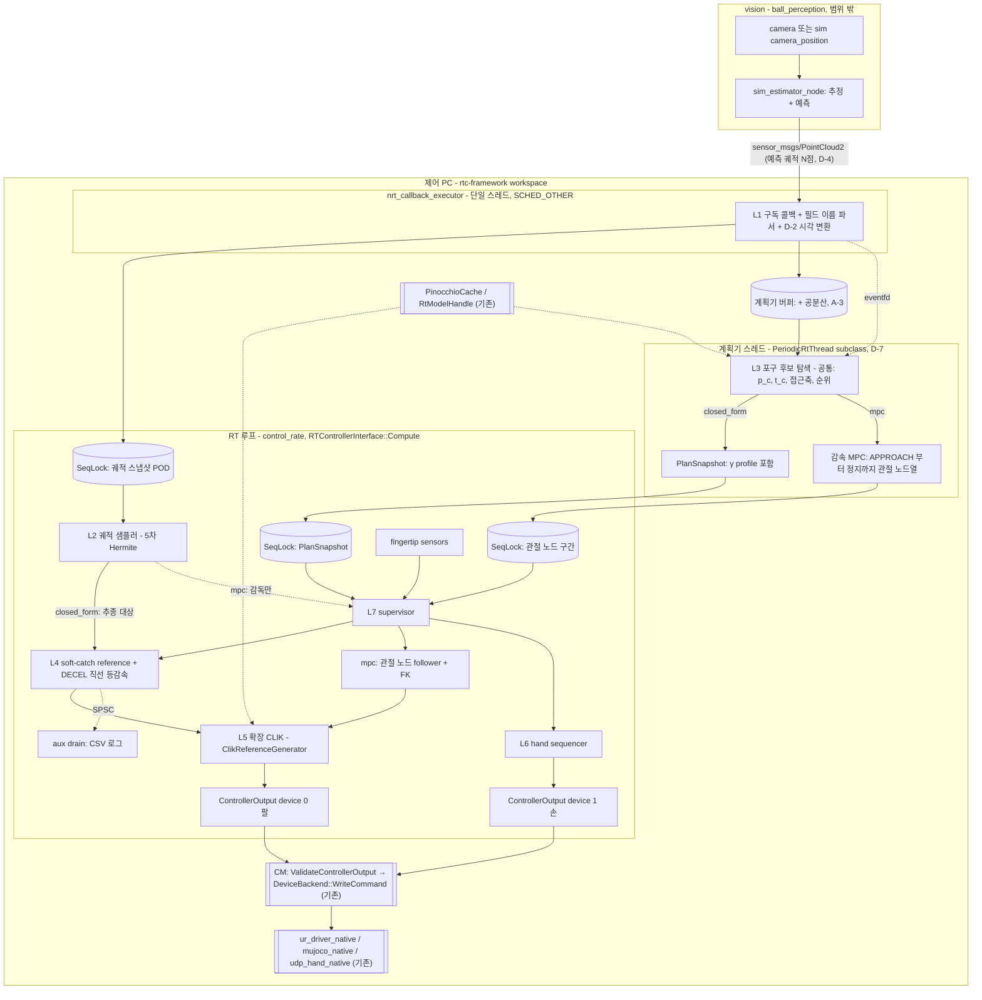

# CATCHING_MASTER — 제어 PC 포구(catching) 알고리즘 구조 문서

이 문서는 현재 구현의 전체 구조 (문제 정의 · 계층 · planner 둘 · 입력 계약 · 교차 제약 · 서지) 를 표현한다.

- 대상 독자: 구현자(Claude Code 포함), 이론 검토자(Junho)
- 구현 대상: **기존 `rtc-framework` workspace** (신규 workspace·신규 패키지 아님, D-1)
- 문서 세트: 본 문서 + `L0_core.md` … `L8_bringup.md`. 수식 정식화는 `mpc_multiframe_clik_formulation.md`
- 상태 표기: `[확정]` 사용자 결정, `[확정 D-x]` plan 결정 로그의 결정, `[권장]` 설계 권장안, `[TBD-xx]` 미확정(추측 금지, §9 참조), `[논문 외 유도]` 원문에 없는 본 문서의 유도

### 0.1 개정 이력

두지 않는다 — 변경 이력은 git 이 갖는다.

---

## 1. 목적과 범위

비행하는 공을 로봇 손으로 받는 기능 중 **제어 PC 쪽 전체**를 기존 `rtc-framework` workspace 위에 구현한다. vision 노드가 발행하는 **예측 궤적**(`sensor_msgs/PointCloud2`)을 입력으로 받아, 포구점 계획 → 기준 궤적 생성 → 관절 명령 → 손 폐쇄 → 접촉 후 감속까지 수행한다.

범위 밖: 카메라 처리와 공 상태 추정·예측(vision 노드 소관), PTP 설정 절차(인프라 문서 소관), 그리고 **이미 workspace에 있는 기능 전부**(§1.2).

**planner 가 둘이다 `[확정]`.** `closed_form` 과 `mpc` 는 같은 입력 (추정기의 공 미래 궤적 + 공분산) 을 받아 같은 자리의 출력 (CLIK 입력 — task pose · twist feedforward · 접근축, null space 자세 목표) 을 내는 두 planner 다. 선택은 `supervisor.decel.mode` 이고 (이름은 역사적), **출하 기본값은 `mpc`** 다. 포구 후보 탐색 ($p_c$ · $t_c$ · 접근축 · 순위), 추정기, supervisor FSM, 손 시퀀서, CLIK, `ABORT_SAFE`, E-STOP 은 공통이다 (§2, §4). 이 문서와 L 문서들은 절마다 **공통 / closed_form 전용 / mpc 전용** 을 밝힌다.

### 1.1 상세 구현 착수 조건 `[확정]`

각 layer 문서 §2 의 "코드 확인 게이트" 는 닫혀 있고, 남은 미확정은 §9 표에 있다. 구현의 결정과 단계는 plan 이 갖는다.

### 1.2 기존 구현 재사용 `[확정]`

다음은 **이미 workspace에 있고, 새로 만들지 않는다.** 단 CLIK 는 그대로 쓰지 않고 **확장**한다(D-5·D-6).

| 대상 | 내용 | 근거 |
|---|---|---|
| vision 예측 | ball_perception(형제 저장소, 사용자 개발)의 `sim_estimator_node` 가 예측 궤적 `PointCloud2` 를 발행. 제어 PC는 **재전파하지 않고 그대로 신뢰**한다 | D-4 |
| kinematics / dynamics | `PinocchioModelBuilder` 1개를 CM 이 공유하고, Data 는 컨트롤러별 `PinocchioCache`(Jacobian `LOCAL_WORLD_ALIGNED` 고정) 또는 스레드별 `RtModelHandle`(LOCAL/LWA/WORLD, heap-free). P1b 폐쇄 체인은 sidecar closure YAML, 손바닥 frame 은 루프 상류. offset frame 은 로봇 config 의 `extra_frames` 로 모델 빌더가 추가한다 | D-10·D-17 |
| CLIK | `rtc::tsid::ClikReferenceGenerator`(ProxQP dense box-QP, pose 목표, LWA 6행, 위치∩속도 box). **옵션(기본 off)으로 확장**: twist feedforward, LOCAL 접근축 2행, 가속 행 (토크 행 `dynamic` 또는 box), status 노출, `max_iter` 설정, q_c 평가 모드. off 시 기존 출력 bit-identical | D-5·D-6 |
| IK | 독립 IK 없음 → `rtc::compliance::DifferentialIk`(σ_min 적응 λ, heap-free) 재사용 | D-7d |
| SE(3)/SO(3) 헬퍼 | `rtc_math` se3 `log3`/`exp3`/`Jlog3`, `rtc_tsid` se3_error `ComputeTaskPoseError`(LWA BodyLog6) | |
| 명령 경로 | 컨트롤러가 `ControllerOutput.devices[]`(팔 device 0, 손 device 1 관례)를 채우면 CM 이 `ValidateControllerOutput` → 실패 시 `BuildHoldOutput`, E-STOP (과 해제 검증 창) 동안 slot 별 latch 로 `BuildLatchedHoldOutput` → `DeviceBackend::WriteCommand`(RT 스레드 inline). backend: `ur_driver_native`·`mujoco_native`·`udp_hand_native`. **명령은 position**(`CommandType` kPosition) | |
| RT 원시형 | `rtc::SeqLock`, `rtc::SpscQueue`, `rtc::PeriodicRtThread`, eventfd, lifecycle 훅, 할당 게이트(`ScopedAllocGate`·`ScopedNoMalloc`) | |
| sim | `rtc_mujoco_sim`: lock-step, 공 발사·리셋 서비스, ground truth·카메라 위치 토픽, 항력·Magnus 자체 구현 | |

**제어기가 하는 일은 연산 결과를 `ControllerOutput` 의 device slot 에 싣는 것까지다.** 드라이버 파라미터, 명령 경로, 안전 정지는 backend·CM 소관이며 본 구현은 감시만 한다. workspace 에 없는 것: UR 지연 보상, speed scaling 노출, `ApplySafetyLayer` production 호출, 스트리밍 목표를 받는 컨트롤러.

**포구 구현의 구성 (D-1, 새 패키지 없음).**

- rtc_controllers 의 `catching` 하위 디렉토리 (namespace `rtc::catching`): 궤적 타입·샘플러(L2), 시간 타입, soft-catch 기준 생성기(L4, closed_form), 도달 가능성·계획기 탐색 코어·catchability 판정(L3), 감속 MPC 코어와 계획기 연결 (`decel_mpc*.hpp`, `decel_planner.hpp`, `node_follower.hpp` — mpc), L7 순수 조각, 파라미터 검증(L0)
- `rtc_math` se3: 접근축 정렬 오차·각속도·Jacobian
- `rtc_tsid`: CLIK 확장
- `rtc_urdf_bridge` 모델 빌더: YAML 선언 추가 frame
- `rtc_mujoco_sim`: 발사 srv(D-14, `rtc_msgs`), 접촉 truth, clock 위상 진단
- `integrated_bringup`: 포구 컨트롤러 바인딩, `PointCloud2` 파서·구독, 계획기 스레드 소유, 손 시퀀서 배선, YAML·launch

### 1.3 대상 시스템 `[확정]`

| 구분 | 구성 | 용도 | 비고 |
|---|---|---|---|
| 주 타깃 | `ur5e_p1b` = UR5e + 자체 개발 4-finger 핸드 P1b (cross 4-bar 폐쇄 체인) | 실기 + MuJoCo | MuJoCo 모델 있음(폐쇄 체인 `<equality><connect>` 5개). P1b MJCF 는 형제 저장소 hand-description 에 있다 |
| 시뮬레이션 전용 | `iiwa7_leap` = KUKA iiwa7 + LEAP Hand | MuJoCo | 실기 구동 계획 없음 |

- 최우선 순위: **MuJoCo 시뮬레이션에서의 알고리즘 검증** `[확정]`
- 제어 주기: `control_rate` YAML (default 500 Hz, 범위 100–5000 Hz — SSoT 는 [invariants.md](../../../agent_docs/invariants.md) §RT Path). 틱 간격 $h$ 는 `ControllerState::dt` 로 읽고 500 Hz 를 가정하지 않는다
- 관절 명령: **전부 position** `[확정]`. 팔은 `ControllerOutput` device 0 에 $q_c$ 를 싣는다(§1.2). 실기 UR 은 vendor `forward_position_controller` 토픽 경유이며 지연 보상이 없다
- 손 명령: `ControllerOutput` 의 **손 device slot**(device 1)에 직접 기록한다 `[확정 D-11]`. P1b 실기는 `udp_hand_native` → `/p1b/joint_command` → 별도 프로세스 `udp_hand_node`(250 Hz, 팔 RT 루프 밖). 명령 `header.stamp` 는 쓰이지 않고, 실기 손은 feedforward 를 무시한다(= position only)
- 실기 접촉 신호: **지문(fingertip) 센서만** `[확정]` (UR5e 툴 플랜지 F/T는 사용하지 않음). 실기 `HandSensorState` 와 sim `WrenchStamped` 는 같은 finger-on-object 부호·250 Hz 다. 접촉 판정은 바이어스를 뺀 크기 ‖F − b‖ 만 쓰므로 부호에 의존하지 않는다 (L7 §4.4)
- 코드 기반: **기존 `rtc-framework` workspace + `rtc_tsid` CLIK 확장** `[확정 D-1, D-5]`
- 입력: vision 노드의 **`sensor_msgs/PointCloud2` 예측 궤적** `[확정 D-4]` (§5). 제어 PC는 궤적을 재전파하지 않는다
- Pinocchio: **4.0** `[확정]`
- P1b 사양: thumb 4, index 3, middle 2, ring 1 = 10 actuated DoF. 관절 모터 토크 한계는 설정·모델값 (YAML `max_torque` = URDF effort = MJCF forcerange) 이 일치하며, 이를 운용 한계로 쓸 수 있는지 (nominal·continuous·peak·설정값 중 어느 것인가) 는 **D-12 미결정** (L6 G6-3)

### 1.4 시뮬레이션 검증의 한계 `[권장]`

`iiwa7_leap`와 `ur5e_p1b`는 팔 자유도(7 대 6), 명령 경로(실기 UR 드라이버 추종 지연 유무), 손(포켓 형상, 폐쇄 지연, 센서 배치·부호)이 다르다. 각 검증 항목에 다음 태그를 붙인다.

- `[SIM-ANY]` 어느 시뮬레이션 모델로도 유효 (로직, 수치 정합)
- `[SIM-P1B]` `ur5e_p1b` MuJoCo 모델 필요 (도달 가능성, 6-DoF 여유, 손 타이밍)
- `[HW-P1B]` 실기 필요 (팔 추종 지연 $T_{arm}$, 실측 `T_close,tot`, 센서 잡음, 시계 동기)

---

## 2. 시스템 구조

두 planner 의 데이터 흐름이다. 입력 (vision) · 수신 (L1) · 탐색 (L3) · supervisor (L7) · 손 (L6) · CLIK (L5) · 출력은 공통이고, **기준 생성**이 planner 마다 다르다.



이중 테두리 상자는 **workspace에 이미 있는 것**이다(§1.2). 나머지가 포구 구현이고, L5 는 기존 CLIK 을 옵션으로 확장한 것을 쓴다(D-5·D-6). 계획기 스레드는 nrt_callback executor 에 올리지 않는다 — 단일 스레드라 계획 계산이 궤적 수신·lifecycle 서비스를 막는다(D-7).

**planner 별 구분.**

| | 공통 | closed_form 전용 | mpc 전용 |
|---|---|---|---|
| 포구 후보 ($p_c$ · $t_c$ · $a_d$ · `q_star`) | L3 탐색 (계획기 스레드). 후보의 순위와 $\gamma_f$ 는 soft-catch DS rollout 으로 매긴다 (L3 §4.8) | | |
| APPROACH – CLOSING 기준 | | L4 soft-catch DS 가 매 tick 생성 (γ profile 은 `PlanSnapshot`) | MPC 구간이 계획 (계획기 스레드) → 관절 노드 → RT 가 노드를 보간해 따르고 FK 로 손 pose 를 얻는다. **RT 는 soft-catch DS 를 돌리지 않는다** (DS 는 탐색의 후보 순위 rollout 에만 남는다) |
| 포구 후 정지 (DECEL) | | TCP 직선 등감속 (L7 §4.3, 가상 감속 대상) | MPC 구간의 꼬리 (관절 공간) |
| RT 의 공 샘플 | 지평 · stale 감독 (L7 §4.2) | 샘플 $(p,v,a)$ 를 L4 추종 대상으로 넘긴다 | 구간은 샘플을 읽지 않는다 (L2 §5.2) |
| 구간 · plan 교체 | | $e_d$ 점프 교체 (L3 §4.7) | 구간 교체 gate (`supervisor.decel.switch_margin`) — 탐색은 구간을 따르는 동안 건너뛴다 |
| CLIK 입력 | 손 pose · twist ff · 접근축 $a_d$ | 자세 목표는 대기 자세 | 자세 목표 $q_{ref}+\dot q_{ref}/K_n$ |
| `ABORT_SAFE` | 원인과 무관하게 항상 관절공간 정지 (`RunJointSpaceAbort`) | | |

### 2.1 실행 영역 원칙 `[권장]`

1. 토픽 도착은 제어 명령을 트리거하지 않는다. RT 루프는 시간 구동이며 최신 스냅샷만 읽는다. 토픽 도착이 깨우는 것은 계획기 스레드뿐이다(eventfd, D-7c).
2. non-RT → RT 공유 상태는 단일 writer `rtc::SeqLock` 으로만 전달한다. payload 는 trivially copyable 이어야 하므로 `Eigen::Vector3d` 대신 `std::array` 기반 POD 를 쓴다(L0 §5.2).
3. RT → non-RT 기록은 고정 크기 레코드의 `rtc::SpscQueue` 로만 전달하고 aux 타이머가 drain 한다.
4. RT 경로 금지 패턴은 RTC 프레임워크 규칙 RT-1~10(RT-7 은퇴)을 그대로 따른다: 동적 할당, 예외(`throw`/`catch` 모두), blocking I/O, mutex, tf2 조회 금지. 계획기 스레드도 스케줄링 클래스와 무관하게 이 규칙으로 작성한다(D-7a, L3 §5.3).
5. 시간 기준 `[확정 D-2]`: 내부 시각은 **절대 steady ns** 로 통일한다. nrt 수신 시 한 번 `t_ref_steady = recv_steady − (recv_wall − stamp)` 로 변환하고, 이후 `header.stamp` 는 쓰지 않는다. `use_sim_time` 은 쓰지 않는다 — sim 도 wall clock 이며 시행별 clock 위상 오차 (δ_max·pause) 를 공변량으로 기록한다 (L8 의 sim 시간축 절, D-3). stale 판정은 `now_steady − recv_steady` 로만 한다(repo 시계 규칙).

---

## 3. 표기와 규약

| 항목 | 규약 |
|---|---|
| 단위 | SI (m, s, rad, N). 각도 YAML 입력은 rad (deg 입력 금지) |
| 좌표계 | `W` world(공 추정·계획·기준 생성 전부), `B` robot base(CLIK `base_frame`), `C` catch frame(손), `S_i` 지문 센서 i |
| 공 상태 | vision이 준 샘플 $(p,v,a)$ + 점별 지평 `horizon_ns`, 공분산 $\Sigma_{6\times6}$(NaN = 모름). 제어 PC는 이 사이를 보간만 한다 (§5, L2). 공분산은 계획기 버퍼에만 둔다 `[확정 A-3]` |
| 공 모델 | $\dot p=v,\ \dot v=g-k\Vert v\Vert v$ — **시뮬레이션 fixture 전용**(L0 §1). 실시간 경로에서는 쓰지 않는다 |
| 접근축 | $\hat z_C$ = catch frame 의 **+z** = 손바닥 바깥 방향 법선 (규약). 목표 $a_d=-\hat v(t_c)$ `[확정 D-17]` — catch frame 의 부모·offset·자세는 YAML, 값은 확정 (`provisional: false`) |
| 접근축 오차 | 회전벡터 $e_a=\theta\,\hat u$, $\hat u=\dfrac{z\times a_d}{\Vert z\times a_d\Vert}$, $\theta=\mathrm{atan2}(\Vert z\times a_d\Vert,\ z^\top a_d)$. $\exp([e_a]_\times)z=a_d$ (L4 §4.5). 구현 위치는 `rtc_math` se3 (D-1) |
| 회전 | Hamilton quaternion, 회전행렬 $R_{WC}$ (C → W). $\mathrm{Log}:SO(3)\to\mathbb R^3$ |
| 각속도 | 기본 표현은 world $\omega^W$, $\dot R_{WC}=[\omega^W]_\times R_{WC}$. LOCAL은 $\omega^L=R_{WC}^\top\omega^W$ |
| Jacobian | **과제별로 다르므로 항상 명시한다.** 병진: `LOCAL_WORLD_ALIGNED` ($J_p$). 각속도: L3 §4.2·L5 §4.2 접근축 2행은 `LOCAL` ($J_\omega^L$), L4 §4.5의 $J_a$ 유도는 `WORLD` ($J_\omega^W$). `PinocchioCache` 는 LWA 고정이므로 LOCAL 각속도 행은 LWA 각속도 행을 $R_{WC}^\top$ 로 회전해 얻는다(계획기 스레드의 `RtModelHandle` 은 LOCAL 을 직접 줄 수 있다). 코드에서는 `LOCAL`/`WORLD` 각속도를 서로 다른 타입으로 구분할 것 `[권장]` |
| softness | $\gamma\in[0,1]$, 0 = 정지 포구, 1 = 완전 추종 |
| 시간 표현 | `[확정 D-2]` 내부 시각은 **절대 steady ns**. 궤적 원점은 수신 시 1회 변환한 $t_{ref}$ (§2.1 원칙 5). 상대시각은 수치 코어 경계에서만 만든다. `PlanSnapshot` 의 시각도 절대 steady 다 |
| 시간 타입 | `[확정 D-2]` `BallTime`(공의 물리 시각), `NowReal`(매 tick steady 실측 now — tick 수 × dt 로 계산하지 않는다), `NowLead` $=$ now $+T_{arm}$. 비교는 타입별 오버로드로만 한다. 판정별 비교 대상은 L0 §4.5 표가 SSoT: 궤적 샘플링·γ 프로파일·기준 생성·`CLOSING→DECEL`·지평 끝 경고는 `NowLead`, `APPROACH→COMMITTED`·손 Preshape/Close·접촉 판정 창은 `NowReal`, 메시지 나이는 `now_steady − recv_steady`. **$T_{arm}\ne0$ fixture 필수** |
| 시간 | $t_c$ 포구 시각, $t_{cmd}$ 손 폐쇄 명령 시각 — 둘 다 공의 물리 시각(`BallTime`) 단일 정의이고, 비교하는 '지금' 만 판정별로 다르다 |
| 지연 | $T_{arm}$ 팔 추종 지연(= 선행 보상량), $T_{close,tot}$ 손 명령 → 폐쇄 종단 간 시간(D-11: $T_{link}$ 를 따로 재지 않는다), $T_{tick}=h/2$ 틱 양자화 예산 ($h$ = `ControllerState::dt`) |
| 가속도 기호 | $a$ 공 가속도(vision), $a_{\max}$ TCP 가속 한계(L4), $\bar a$ 관절 가속 한계(L3 §4.3) $=\ddot q_{\max}$(L5) — 토크 한계에서 도출(D-16), $a_{dec}$ 감속(L7). **$a_{dec}\le a_{\max}$** 여야 한다(L7 §4.3) |
| 속력 기호 | $v_{\max}$ TCP 속도 한계, $v_{dir,\max}$ 방향 달성 속력(L3 §4.5, 투영 $\hat v^\top J_p\dot q$), $\Vert v\Vert_{\max}$ **받을 수 있는 최대 공 속력**(L3 §4.5) — 셋을 혼동하지 말 것 |

---

## 4. Layer 구성

layer 는 설계 문서의 단위다. 코드 위치는 D-1 로 확정됐다 — 새 패키지를 만들지 않는다.

| Layer | 코드 위치 (D-1) | 단위 기능 | planner |
|---|---|---|---|
| L0 | rtc_controllers `catching` (공용 타입·파라미터 검증), 공 동역학은 테스트 fixture 전용 위치 | 공용 타입, 파라미터 검증(활성 구성 키만 TBD 검사, 교차제약) | 공통 |
| L1 | `integrated_bringup` 바인딩 (구독·필드 이름 파서·D-2 변환), 궤적 타입은 `catching` 공용 | `PointCloud2` 수신·파싱·검증, 스냅샷 브리지, stale 판정 | 공통 |
| L2 | rtc_controllers `catching` | 궤적 샘플러 (5차 Hermite, 시각 정렬, 지평 감시), 시간 타입 | 공통 (샘플의 용도는 planner 가 정한다) |
| L3 | 탐색 코어는 `catching`, 스레드 소유는 `integrated_bringup` | 포구점·시각·접근축 탐색, catchability(D-18), 계획기 스레드(D-7); closed_form 은 γ 결정과 plan 교체, mpc 는 APPROACH–정지 MPC (`decel_mpc*.hpp`) | 탐색 공통, 나머지 planner 별 |
| L4 | `catching` (`soft_catch.hpp`), 접근축 정렬은 `rtc_math` se3 | soft-catch DS, 접근축 정렬. closed_form 의 RT 기준이고 mpc 에서는 탐색의 후보 순위 rollout 에만 쓰인다 | closed_form (mpc 는 rollout 만) |
| L5 | `rtc_tsid` CLIK 확장 + 포구 컨트롤러(`catching` + `integrated_bringup`), catch frame 은 `rtc_urdf_bridge` | 확장 CLIK 과제 구성, 가속 행 (D-16), device 0 에 $q_c$ | 공통 |
| L6 | `catching` (시퀀서), 손 프로파일 YAML 은 `integrated_bringup` | 손 시퀀서 → 손 device slot, `T_close,tot` | 공통 |
| L7 | `catching` (순수 조각), FSM 배선은 포구 컨트롤러 | 상태 머신, 접촉 판정, 감속, abort, E-STOP·fault(D-13) | 공통 (감속 법은 planner 별) |
| L8 | `integrated_bringup` (YAML·launch·로깅), `rtc_mujoco_sim` (발사·truth) | 컨트롤러 통합, 시나리오 테스트, 지표 | 공통 |

L3 는 후보 순위의 γ rollout 에 L4 의 기준 생성기를 **같은 코드로** 호출한다(참조 구현 1벌, §10). 이 rollout 은 mpc 에서도 탐색이 돌린다.

### 4.1 `T_close,tot` 와 γ 창 `[권장]`

γ 창이 비는 조건(L3 §4.5)은 다음과 같다.

$$\Vert v(t_c)\Vert>\min(v_{dir,\max},v_{\max})+\frac{d_{eff}}{T_{close,tot}}$$

우변이 **받을 수 있는 최대 공 속력**이다. 받으려는 속력 $\Vert v\Vert$ 에 대해 $T_{close,tot}\le d_{eff}/(\Vert v\Vert-v_{dir,\max})$ 가 필요하다 — 손 폐쇄가 느리면 목표 속도 전 구간에서 창이 비어 포구 자체가 불가능하다. 즉 `TBD-HAND-01`($T_{close}$) 하나가 목표 투척 속도(D-18 catchability 지도와 함께), `reference.a_max`, γ 격자, rollout 창 길이를 전부 결정한다. sim 의 $T_{close}$ 분포는 손 device slot step 으로 재고, 실기 $T_{close,tot}$ 는 실기 단계에서 잰다. 실기 값이 나오면 `planner.*`와 `reference.*`를 재산정한다(L3 게이트 G3-F). D-16 의 보수적 가속 box 도 같은 판정에 들어간다.

### 4.2 게이트 공통 항목 `[확정]`

브랜치·커밋 규약은 AGENTS.md §10 · conventions.md 가 갖는다. 모든 RT 코드(계획기 스레드 포함)의 공통 게이트:

- RT 경로 할당 0(`ScopedAllocGate`·`ScopedNoMalloc`), `noexcept` 경계 유지, RT 경로에 `throw`/`catch` 없음(RT-2), 고정 QP 차원 + **반복 상한 `max_iter` 및 미수렴 시 실패 경로 확인**(`ClikReferenceGenerator` 실패 시 q_ref = q_meas·v = 0·false, L5 §4.3), 기존 테스트 assertion 무수정, 컴파일 경고 0(`-Wall -Wextra`).
- `noexcept` 경계는 선언만으로 보증되지 않는다. RT 경로는 예외를 잡는 대신 **던지지 않는 코드로만** 구성한다(오류 코드·`std::optional`). 필요하면 **비RT 테스트 빌드에서만** 하위 루틴에 던지는 스텁을 주입해 그 예외가 RT 경계에 닿지 않는 구조(설정·검증 단계에서 처리)인지 확인한다.

### 4.3 Layer 문서 공통 목차

1. 범위 / 비범위
2. 코드 확인 게이트 (결과와 남은 확인 항목)
3. 참고자료 (본 문서 §8의 [Rn] 인용)
4. 수학적 이론 (표기 → 식 → 유도 → 논문 대응 → sanity check)
5. C++ 구현 (헤더 포인터, RT 규칙)
6. YAML 파라미터
7. 단위 기술 구현 순서
8. 디버깅 방법
9. 검증 방법과 합격 게이트
10. 미확정 항목

---

## 5. vision → 제어 PC 입력 계약 `[확정 D-4]`

메시지는 **vision 노드가 이미 발행하고 있는 것**이며, 제어 PC가 정의하지 않는다.

발행기: ball_perception(형제 workspace, 사용자 개발) `ball_perception_sim` 패키지의 `sim_estimator_node` — `/sim/ball/camera_position` 을 구독해 예측 궤적을 발행한다. **debug 토픽이라 stable ABI 가 아니다** (제품 ABI 는 ball_perception E6-F02 로 defer).

### 5.1 `sensor_msgs/PointCloud2` — 예측 궤적

| 항목 | 값 | 비고 |
|---|---|---|
| 토픽 이름 | sim: `/ball_perception/debug/prediction/trajectory` | 제품 토픽은 `TBD-VIS-01` |
| `header.stamp` | **예측 원점 시각** | 점의 `horizon_ns` 가 이 시각 기준 상대값. 수신 시 D-2 로 1회 변환 |
| `header.frame_id` | 추정 frame | `world` (TBD-VIS-06) |
| `height` × `width` | 1 × $N$ | 점 하나가 한 행(unordered) |
| `point_step`, 엔디안 | little-endian | 파서는 offset 을 가정하지 않고 **필드 이름·datatype** 으로 구성한다 |

점 하나의 필드. **offset · `point_step` 수치는 헤더의 사본이므로 두지 않는다 — `integrated_bringup/include/integrated_bringup/controllers/catching/traj_input.hpp` (`BuildFieldMap`) 가 갖는다.** 파서는 이름으로 찾고 stable ABI 가 아니라고 가정한다.

| 필드 | 타입 | 의미 |
|---|---|---|
| `x, y, z` | FLOAT64 | 예측 위치 [m] |
| `vx, vy, vz` | FLOAT64 | 예측 속도 [m/s] |
| `ax, ay, az` | FLOAT64 | 가속도 [m/s²] — profile 이 정한다: 항력 profile (출하 sim) 은 그 점의 총 가속도 $g - k\lVert v\rVert v$, 항력 절이 없으면 상수 $g$ |
| `covariance` | FLOAT64 ×36 | 6×6 row-major, 순서 $(p_x,p_y,p_z,v_x,v_y,v_z)$. 모르면 NaN |
| `snapshot_sequence` | UINT32 ×2 | 스냅샷 순번 (uint64 low/high) |
| `generation` | UINT32 ×2 | 트랙 세대 (uint64 low/high) |
| `horizon_ns` | UINT32 | `header.stamp` 기준 상대 ns |
| `validity` | UINT8 | 0 NOT_EVALUATED, 1 VALID |

트랙 식별·상태는 `generation`·`validity`·`snapshot_sequence` 로 판정한다(TBD-VIS-07). 레이아웃 변경은 필드 이름·datatype 검사와 **레이아웃 해시 진단**이 감지한다(P-3, L1 §4.6). NIS 같은 추정기 건강도 필드는 없다.

**요구 사양은 제어기가 정한다 `[확정 D-15]`.** 지평·간격·점 수·발행률은 목표 투척 분포에서 산출하고, sim 에서는 ball_perception sim profile 을 그에 맞춘다(설정은 사용자; 값은 vision profile 과 `io.horizon_min` · `prediction.dt_expected`, L1 §6). 수신 궤적의 지평이 요구보다 짧으면 계획 후보에서 제외하고 진단한다. 예측점은 `step, 2·step, …, horizon` 이라 t = 0 이 없다. 궤적 용량 `kCap` 은 provisional 이고 점 수 요구는 `kCap` 이하여야 한다 (구현의 런타임 상한은 `kCap` 이다 — `n_max` 키는 없다, L2 §5.1; L0 §5.2).

QoS는 vision 노드가 정한 것을 따른다 — publisher RELIABLE/VOLATILE, 구독은 `best_effort` KEEP_LAST(1) (TBD-VIS-08). 제어 PC는 수신 나이(`now_steady − recv_steady`) 검사를 기본 감시로 쓴다(L1).

### 5.2 제어 PC가 궤적을 재전파하지 않는다 `[확정]`

vision의 예측을 그대로 신뢰한다. 제어 PC는 $(p,v,a)$ 샘플 열 사이를 **보간**할 뿐이고, 자체 공 동역학 모델로 다시 적분하지 않는다(L2 §4.1). `ball_dynamics` (공 운동 모델) 는 **시뮬레이션·테스트 fixture 전용**이다(L0 §1).

### 5.3 시계

실기에서 두 PC는 PTP로 동기한다(인프라 문서). 제어 PC는 시작 시 동기 상태를 확인하고, 임계 초과 시 `ARMED` 진입을 막는다(L7, `[TBD-NET-01]`). stamp 를 시간 원점으로 쓰는 D-2 변환은 이 동기를 전제하며, [invariants.md](../../../agent_docs/invariants.md) 에 E-1 기록된 예외로 명문화됐다 (stamp 사용 계약은 L1 §4.1). 실기 적용 조건(PTP 동기)은 실기 단계에서 재확인한다. sim 은 `sim_estimator_node` 를 `use_sim_time=false` 로 띄워 wall epoch 의 stamp 를 쓴다(D-3) — 공 lane stamp 는 발사 기준 sim 시간축을 wall 에 얹은 값이다 (`rtc_mujoco_sim` README §Projectile Ball stamp).

---

## 6. YAML 구성

repo 패턴을 따른다: 포구 컨트롤러 YAML 은 로봇별 `integrated_bringup` config 의 controllers 디렉토리 (`demo_catching_controller.yaml`) 에 두고 `LoadConfig` + `ParseXxxParams` 로 읽으며, 런타임 조정 gain 만 `declare_parameter` 로 연다(generate_parameter_library 는 쓰지 않는다). 탐색 · planner 별 법의 키는 같은 디렉토리의 `catching/` 아래 조각 파일 (`search_grid.yaml` — 탐색, 두 planner 가 읽는다 · `planner_closed_form.yaml` · `planner_mpc.yaml`) 로 나뉘고, include 되어 같은 트리로 합쳐진다. robot-specific 값은 로봇 config 와 `robot.*` 에만 둔다(robot-agnostic 원칙, ARCH-1).

```yaml
catching:
  robot: {...}        # L5/L6/L3 공통 로봇 고유값 (catch_frame 이름, 손 자세)
  sim: {...}          # L0 fixture, sim 전용 overlay
  core: {...}         # L0
  io: {...}           # L1
  prediction: {...}   # L2
  planner: {...}      # L3 (catchability 포함), mpc 의 planner.decel_mpc
  reference: {...}    # L4 (closed_form 의 soft-catch 기준; 탐색의 rollout 은 mpc 에서도 읽는다)
  joint_cmd: {...}    # L5 (확장 CLIK 옵션, 가속 행)
  supervisor: {...}   # L7 (supervisor.decel.mode 가 planner 선택)
  logging: {...}      # L8
```

모든 키는 layer 문서 §6 표에 `이름 / 타입 / 단위 / 범위 / 뜻` 으로 정의한다 (값은 YAML). 관절 위치·속도·토크 한계는 로봇 config 의 `devices.<group>.joint_limits`(URDF 와 교집합)를 쓰고 포구 YAML 에 복제하지 않는다.

**한 물리량 = 한 키 `[확정]`.** 이름이 둘이던 같은 값은 단일 키다: `io.n_min`, `supervisor.decel.a_dec` (L7 §6, L3 가 읽음). `derate_step`·ramp 는 D-8 로 v1 에서 쓰이지 않으며 재도입 시 단일 키로 다시 정한다.

**새 키.**

- catch frame `[확정 D-17]`: 로봇 config 의 `extra_frames`(이름·부모·`xyz`·`rpy`·`provisional`)를 `rtc_urdf_bridge` 모델 빌더가 Pinocchio 모델에 추가하고, 포구 YAML 은 frame 이름만 참조한다(`catch_frame`). 스키마·초기값 산출은 L5 의 catch frame 절
- catchability `[확정 D-18]`: `planner.catchability.manipulability_min.{arm_5row,arm_6row}`(provisional), `planner.catchability.definition`(`arm_5row` 기본, w₅·w₆ 모두 기록 — C-3). 정의·스키마: L3 §4.2. 지도 도구와 계획기가 **같은 키**를 쓴다. 발사 영역 `sim.throw_region.*` 는 YAML 키로 만들어지지 않았다 (동결 분포는 러너 인자, D-S8-2)
- 관절 가속 한계 `[확정 D-16]`: 토크 한계에서 도출한 보수적 상수 box 를 provenance 와 함께 YAML (`robot.arm.qdd_max`) 로 출력한다 (도출은 L3 §4.3). 이 box 는 **탐색의 도달시간 한계**에 쓰이고, 런타임 CLIK 의 가속 행은 `joint_cmd.accel_constraint` 가 정한다 (출하 `dynamic` = 토크 행)

**TBD 검사는 "현재 활성 구성이 참조하는 키"에만 적용한다 `[권장]`.** 전체 키에 걸면 절대 `ARMED` 가 되지 않는다 — 실기에서 `sim.*` 가 영구히 TBD로 남기 때문이다. L0 검증기는 launch 구성(실기/시뮬, `lead_enable`)에 따라 검사 대상 집합을 정한다. `provisional: true` 인 값(D-12 사용자 값, catch frame)은 실기 arm 을 막는다(D-12, D-17).

**층간 일치 제약도 검증기가 검사한다 (L0 §5.3).** 같은 값 제약은 단일 키로 없앴고, 남는 것은 부등식·관계다.

| 키 A | 키 B | 관계 |
|---|---|---|
| L3 `ComputeGammaWindow` 의 TCP 속도 | `reference.v_max` | $= \eta_v\cdot$ `reference.v_max`, $0<\eta_v\le1$ `[확정 D-9]` (`planner.gamma.eta_v`) |
| `supervisor.decel.a_dec` | `reference.a_max` | $a_{dec}\le a_{\max}$ (L7 §4.3) |
| 선행 보상량 (`NowLead` 의 $T_{arm}$) | `joint_cmd.lag.T_arm` × `lead_enable` | 같은 값 (L2 §4.4) |
| `planner.freeze.T_freeze` | `robot.hand.T_close_e2e`, `joint_cmd.lag.T_arm`, $h$ | $T_{freeze}\ge T_{close,e2e}+T_{arm}+h$ (L3 §4.11) |
| `robot.hand.q_close[i]` | `robot.hand.q_pre[i]` | caging 관절에서 $\vert$차$\vert>$ `rho_eps` (L6 §4.2) |
| 축 정렬 오차 `AxisAlignError` 의 `sin_eps` | `AxisAlignJacobian` 의 `sin_eps` | 같은 값 (L4 §4.5) — YAML 키가 아니라 함수 인자다 |
| ζ, ω, $h$ | `ControllerState::dt` | 이산 안정 범위 (L4 §4.7, L0 §5.3) |

---

## 7. 이론 ↔ 코드 대응 색인

경로는 `rtc_controllers/include/rtc_controllers/catching/` 기준 (`catching/`), 그 밖은 표기.

| 이론 항목 | 출처 | 문서 | 코드 위치 |
|---|---|---|---|
| 항력 탄도 모델, RK4, 선형화 | [R8] 교과서 | L0 §4 | `rtc_controllers/test/include/rtc_controllers/testing/catching_ball_fixture.hpp` (fixture 전용) |
| 궤적 샘플링 (5차 Hermite, $C^2$) | 논문 외 유도 | L2 §4.2 | `catching/traj_sampler.hpp` |
| 시간 타입 `BallTime`/`NowReal`/`NowLead` | 논문 외 설계 | §3, L2 §4.4 | `catching/time_types.hpp` (D-2) |
| `PointCloud2` 파싱·레이아웃 검증 | 논문 외 설계 | L1 §5.1 | `integrated_bringup/include/integrated_bringup/controllers/catching/traj_input.hpp` (D-4) |
| 순서·트랙·stale 판정 | 논문 외 설계 | L1 §4.4, §5.3 | `catching/traj_ingress.hpp` |
| 관절 최소 도달시간 (P1 램프 제약) | [R1] + 논문 외 유도 | L3 §4.3 | `catching/time_feasibility.hpp` (`TMinChecked`) |
| 5-DoF 포구 자세, 접근축 제약 | [R1] 식(3)의 변형 | L3 §4.2 | `catching/catch_pose_ik.hpp` (`rtc::compliance::DifferentialIk` m=5), 계획기 코어 `catching/planner_search.hpp` |
| catchability (arm 5행 manipulability) | 논문 외 설계 | L3 §4.2 | `catching/` 단일 함수 — 지도 도구와 계획기 공용 (D-18) |
| γ 창 부등식, 방향 속력 | 논문 외 유도 | L3 §4.5 | `catching/time_feasibility.hpp` (`ComputeGammaWindow`, `MaxCatchableSpeed`) |
| 포구 오차 예산 (직교 분해) | 논문 외 유도 | L3 §4.6 | `catching/planner_search.hpp` |
| 계획기 스레드 | 논문 외 설계 | L3 §5.3 | `rtc::PeriodicRtThread` subclass, `integrated_bringup` 소유 (D-7); 한 주기는 `catching/planner_cycle.hpp` |
| 오차 좌표 soft-catch DS (closed_form 의 RT 기준, mpc 의 rollout) | [R3] 식(4)(5) | L4 §4.1 | `catching/soft_catch.hpp` |
| Corollary(원점 = 포구점) · 예측 오차·재예측 점프 · 수렴 한계 (임계감쇠 닫힌해) | [R3] Corollary 1 + 논문 외 유도 | L4 §4.2–4.4 | `catching/soft_catch.hpp` (`CriticallyDampedError` 등) |
| 접근축 회전벡터 오차와 Jacobian | 논문 외 유도 | L4 §4.5, L3 §4.2, L5 §4.2 | `rtc_math/include/rtc_math/se3/axis_align.hpp` + CLIK LOCAL 접근축 2행 |
| 반암시적 오일러 안정 경계 | 논문 외 유도 | L4 §4.7 | `rtc_controllers/src/params/catching_params.cpp` 검증기 (L0 §5.3) |
| 감속 MPC (jerk 입력 condensed QP, APPROACH 부터 정지) | formulation | L3, L7 | `catching/decel_mpc.hpp`, `decel_planner.hpp`, `node_follower.hpp` (mpc) |
| 가상 감속 대상(연속 전환) | 논문 외 유도 | L7 §4.3 | `catching/decel_target.hpp` (closed_form) |
| 충격량 예산 | [R16][R17][R18] + 논문 외 유도 | L7 §4.7 | 계획기 코어, L8 지표 (손–공 첫 접촉 episode 만) |
| 팔 추종 지연 식별·선행 보상 | 논문 외 설계 | L5 §4.4–4.5 | 식별 도구 (실기 단계). backend 에 지연 보상 없음 |
| 투척 생성·발사 | 논문 외 설계 | L8 §4.2 | `rtc_mujoco_sim` 발사 srv (D-14) + catchability 지도 |
| catch frame | 논문 외 설계 | L5 (catch frame 절) | `rtc_urdf_bridge` 모델 빌더 추가 frame (D-10·D-17) |
| velocity CLIK / QP | [R9][R10] | L5 §4 | `rtc::tsid::ClikReferenceGenerator` **확장** (`rtc_tsid/include/rtc_tsid/kinematics/clik_reference.hpp`, D-5·D-6) |
| FK / Jacobian / 폐쇄 체인 | [R9] | L3 §4.2, L5 §4.2 | 기존 `PinocchioCache`·`RtModelHandle` 재사용 |
| position 명령 전달 | — | L5 §4.3 | `ControllerOutput` → `DeviceBackend::WriteCommand` 재사용 |
| NEES/NIS 일관성 | [R8] | L8 §4 | ball_perception_sim `sim_evaluator_node`/`sim_capture_evaluate` 재사용 |
| Wilson 신뢰구간 | [R13] | L8 §4 | `rtc_tools` `catching_trials` 오프라인 평가 |

---

## 8. 참고자료

서지 사항은 1차 출처(출판사 페이지, 학회 proceedings, 공식 문서)로 확인한 것만 적는다. `(확인 필요)` 표시 항목은 인용 전에 확인한다.

| ID | 문헌 | 용도 |
|---|---|---|
| R1 | B. Bäuml, T. Wimböck, G. Hirzinger, "Kinematically optimal catching a flying ball with a hand-arm-system," IEEE/RSJ IROS 2010. DOI 10.1109/IROS.2010.5651175 (페이지 2592–2599 `확인 필요`) | 관절 램프, 포구 제약, 손 caging |
| R2 | S. Kim, A. Shukla, A. Billard, "Catching objects in flight," IEEE T-RO 30(5):1049–1065, 2014. DOI 10.1109/TRO.2014.2316022 | 포구 자세 탐색, 예측 중단 시점 |
| R3 | S. S. Mirrazavi Salehian, M. Khoramshahi, A. Billard, "A dynamical system approach for softly catching a flying object: Theory and experiment," IEEE T-RO, 2016. DOI 10.1109/TRO.2016.2536749 (권/호/페이지 32(2):462–471 `확인 필요` — 보유 PDF가 저자 버전이라 헤더 없음) | soft catch, γ. **본 문서의 1차 근거**(L4 §4.1) |
| R4 | S. S. Mirrazavi Salehian, N. Figueroa, A. Billard, "Coordinated multi-arm motion planning: Reaching for moving objects in the face of uncertainty," RSS 2016. DOI `확인 필요` | γ 스케줄. **전문 미보유 — 식 번호 인용 금지**(L4 §4.1, §4.6) |
| R5 | epfl-lasa/bimanual-dynamical-system (GitHub) | R4 공개 코드. **미열람** — L4 §4.6은 재확인 대상 |
| R6 | S. M. Khansari-Zadeh, A. Billard, "Learning stable nonlinear dynamical systems with Gaussian mixture models," IEEE T-RO 27(5):943–957, 2011 | 관련 연구(본 구현 미사용) |
| R7 | J. Solà, J. Deray, D. Atchuthan, "A micro Lie theory for state estimation in robotics," arXiv:1812.01537 | SO(3) Log, Jacobian 규약 |
| R8 | Y. Bar-Shalom, X. R. Li, T. Kirubarajan, *Estimation with Applications to Tracking and Navigation*, Wiley, 2001 | 공분산 전파, Joseph form, NEES/NIS |
| R9 | J. Carpentier et al., "The Pinocchio C++ library," IEEE/SICE SII 2019 | kinematics. 4.0 API는 공식 문서로 확인 |
| R10 | A. Bambade et al., "PROX-QP: Yet another quadratic programming solver for robotics and beyond," RSS 2022 | QP solver |
| R11 | Universal Robots ROS 2 Driver 문서 (docs.ros.org, `ur_robot_driver`, Jazzy) | position/velocity 인터페이스, 컨트롤러 |
| R12 | IEEE Std 1588-2019 (PTP) | 시계 동기 |
| R13 | E. B. Wilson, "Probable inference, the law of succession, and statistical inference," JASA 22(158):209–212, 1927 | 성공률 신뢰구간 |
| R14 | E. Todorov, T. Erez, Y. Tassa, "MuJoCo: A physics engine for model-based control," IEEE/RSJ IROS 2012 | 시뮬레이터 |
| R15 | J. Nocedal, S. J. Wright, *Numerical Optimization*, 2nd ed., Springer, 2006 | 수치 최적화 일반 (SQP 는 v1 범위 밖) |
| R16 | L. Yan, T. Stouraitis, J. Moura, W. Xu, M. Gienger, S. Vijayakumar, "Impact-aware bimanual catching of large-momentum objects," IEEE T-RO, 2024. DOI 10.1109/TRO.2024.3381551 | 충격량 분배, 접촉점 선택, 강성·접촉력 동시 최적화 (L7 §4.7) |
| R17 | M. M. Schill, M. Buss, "Robust ballistic catching: A hybrid system stabilization problem," IEEE T-RO 34(6):1502–…, 2018 (페이지 `확인 필요`) | 포구의 정량적 안정성 척도, 초기 상대상태의 영향. 인용 위치: **L3 §4.10(대안 정식화, 미채택)**, L7 §4.7(충격량 예산) |
| R18 | J. J. van Steen, N. van de Wouw, A. Saccon, "Robot control for simultaneous impact tasks via quadratic programming-based reference spreading," ACC 2022 / 확장판 IEEE T-RO 2024 | 충격 순간의 기준 궤적 불연속 처리 (L7 §4.7 대안) |
| R19 | Y.-B. Jia, "Three-dimensional impact energy-based modeling of tangential compliance," IJRR, 2013 (권/페이지 `확인 필요`) | 접선 컴플라이언스. L3 §4.5의 $d(1+1/e)$ 가 무시하는 성분 |

---

## 9. 미확정 항목 (추측 금지)

열려 있는 것과 코드가 인용하는 ID 만 둔다. 닫힌 항목의 답은 해당 layer 문서와 코드에 있다.

| ID | 내용 | 영향 layer | 확정 방법 |
|---|---|---|---|
| TBD-BALL-01 | 실제 공 지름·질량·재질(반발). sim 공 제원은 `rtc_mujoco_sim/config/mujoco_default.yaml` 의 `projectile_ball` (`radius_m`·`mass_kg`) 이고 `core.ball.*` 는 그 값을 provisional 로 복사한 것이다 | L0, L3 | 사용자 제공 (D-12) |
| TBD-HAND-01 | P1b 실기 `T_close,tot` | L3, L6 | 실기 식별 `[HW-P1B]` |
| TBD-HAND-03 | 지문 센서의 실기 잡음 (인터페이스·부호는 확정 — 접촉 판정은 ‖F − b‖ 크기만 쓴다) | L6, L7 | 실기 (L6 §10) |
| TBD-HAND-04 | 포켓 유효 깊이 $d_{eff}$ · 포획 반경 $r_{cap}$ (두 손). 값은 provisional 이고 `planner.hand` (`search_grid.yaml`) 에 있다 — 실기 park 은 `planner.provisional` (블록 전체) 이 한다. `planner.hand.d_eff` 키의 뜻은 포켓 깊이가 아니라 시각 발동 fly-in 허용 상대속도 × $T_{close,tot}$ 다 (L3 §4.5·L6 §4.5); 깊이는 접촉 물리량이다. 투척 보정은 sim 에서 하지 않고 실기 단계 (#613) 에서만 한다 | L3 | 실기 |
| TBD-HAND-05 | P1b preshape/폐쇄 자세, 전류(토크) 한계 | L6 | 사용자 제공. 자세는 손 프로파일 YAML (`robot.hand`, provisional), 전류(토크) 한계는 D-12 미결정 |
| TBD-ARM-03 | UR 드라이버 speed scaling 상태 인터페이스 | L7 | 노출 없음. 신호 출처 확보는 실기 단계 |
| TBD-WS-01 | 바닥 높이, 작업셀 경계 (`W`) | L2 | 셀 측정 |
| TBD-NET-01 | PTP 상태 확인 방법(인터페이스). 실기 `io.future_tol` 이 이 동기 오차 예산이다 | L1, L7 | 인프라 문서 (sim 은 해당 없음, D-3) |
| TBD-VIS-01 | vision 제품 토픽 이름 | L1, L8 | sim 은 debug 토픽. 제품 토픽은 미정 (ball_perception E6-F02) |
| TBD-VIS-04 | 발행 주기, $N$ 범위, 지평 길이, 지연 분포 → L2 버퍼·L3 슬라이스 범위 | L1, L2, L3 | 요구 사양은 제어기가 정한다 (D-15, §5.1); 실기 분포는 실기 단계 |
| TBD-VIS-06 | `header.frame_id` 와 `world` 의 관계 | L1 | 닫힘 — `world`, 변환 없음. 모델 world 변환은 별개다 (L1 §1) |
| TBD-VIS-07 | 트랙 식별·소실 판정 수단 | L1, L3, L7 | 닫힘 — `generation`·`validity`·`snapshot_sequence` (L1 §4.4) |
| TBD-VIS-08 | vision 토픽 QoS | L1 | 닫힘 — 구독 `best_effort` KEEP_LAST(1) (L1 G1-2) |
| TBD-IMP-01 | 공 질량·반발계수와 허용 충격량(손가락 관절 토크, UR5e 보호 정지 임계) | L3, L7 | TBD-BALL-01 + 데이터시트 + 시뮬레이션 측정 |
| TBD-REF-01 | [R4] 전문·[R5] 코드 확보 후 L4 §4.6 재확인 | L4 | 문헌 확보 |

### 9.1 `TBD-RTC-*` 하위표

`TBD-RTC-01` ~ `TBD-RTC-20` 은 모두 닫혔다 (SeqLock/SPSC 원시형, 시간 타입, YAML 로딩, executor, CLIK 확장 방식, 스레드 배치, lifecycle 훅, 로깅). 답은 L0 §2, L1 §2, L5, L7, L8 의 코드 확인 게이트와 코드에 있다.

---

## 10. 위험 목록

| 위험 | 영향 | 완화 |
|---|---|---|
| **$T_{close,tot}$ 실측값이 예산 초과** | 목표 속도 전 구간에서 γ 창이 비어 포구 자체가 불가 | §4.1. 초과 시 목표 속도를 낮추고 `planner.*`·`reference.*` 재산정. sim $T_{close}$ 는 MJCF 게인에 의존하므로 실기 측정 전까지 잠정 |
| **토크 도출 가속 box 가 보수적** (D-16) | 탐색의 도달시간 한계가 받을 수 있는 공 속력을 낮춤 | 런타임 CLIK 은 토크 행 (`accel_constraint: dynamic`) 이라 box 에 묶이지 않고, box 는 탐색의 도달시간에만 쓴다 (L3 §4.3). 실기 값은 실기 식별 |
| **접촉 충격량** | 손가락 관절·감속기 손상, UR5e 보호 정지, 공 튕겨나감 | L7 §4.7 충격량 예산, γ 최대화 (closed_form), `effort_limit_hold`, 저속 단계적 도입(L8 §9.2) |
| 시계 오차 | 위치 오차 ≈ $\Vert v\Vert\,\delta$. 실기 시계 오프셋이 **미래 방향** 이면 지평 검사는 통과하고 $t_c$ 만 늦어진다 (6 m/s · 10 ms = 6 cm) — L3 §4.6 의 $\varepsilon_{clk}$ 는 분산 항이라 bias 를 모델링하지 않고, sim 은 같은 호스트라 드러나지 않는다 | PTP, 시작 시 점검, D-2 수신 시 1회 변환, stale 판정. bias 는 실기 단계의 D-2 예외 ③ 조건 (`TBD-NET-01`) 재확인 |
| **sim 시간축 (D-3)** | clock 이 벌어지는 구간에서 wall 기준 예측과 sim 공이 어긋남 | 시행별 clock 위상 오차 (δ_max·pause) 를 공변량으로 기록하고 부하 A/B 로 상계 (L8 의 sim 시간축 절) |
| 팔 추종 지연 미보상 | 포구 시각 편향 | backend 보상 없음. `NowLead` 선행(§3), 실기 $T_{arm}$ 식별은 실기 단계 |
| sim 팔 actuator 는 1차 지연이다 (MJCF 게인) | 선행 보상 (순수 지연) 이 비-순수지연분을 남기고, sim 에서 잰 lead 이득은 UR5e 이득을 예측하지 않는다 | L5 §4.4, 실기 식별 |
| sim 이 실시간보다 느려짐 (host 부하, RTF < 1) | 공 stamp 가 벽시계보다 뒤처져 steady 나이 검사가 입력을 `BALL_STALE` 로 끊는다 — 성공률이 host 부하에 좌우된다. `sim_stall` 규칙은 sim 스텝 간격만 봐서 못 잡는다 | 시행 도중 부하를 감시하고 부하 시행은 재실행한다 (L8 의 sim 시간축 절). 성공률을 읽을 때 부하 구간을 분리 |
| UR 벤더 position 컨트롤러 자체의 가감속·보호 정지 | repo 밖이라 도출 가속 box 와 실제 한계가 다를 수 있다 | 실기 식별 (L3 §4.3) |
| soft catch 중 포화 (closed_form) | 간극 급증 (hard catch보다 나빠짐) | L3 γ rollout, η_v 여유(D-9). γ 하향은 v1 에서 제외(D-8) → COMMITTED 전 RETREAT, 이후 ABORT_SAFE. 시행별 `ref_saturated` 와 `supervisor.sat_ticks` 로 감시. mpc 에서는 soft-catch DS 가 RT 에서 돌지 않아 발생하지 않는다 |
| 지문 센서만으로 접촉 판정 | 손바닥 선접촉 시 검출 지연 | 감속은 시각 기준, 센서는 판정·abort 전용(A-5). 손바닥·손가락 링크 접촉의 false-Missed 는 손 관절 q·토크를 두 번째 증거로 더해 완화 (L7 §4.4) |
| 시뮬레이션과 실기 손 차이 | 성공률 과대평가 | `[SIM-P1B]`/`[HW-P1B]` 태그 분리, `T_close` 실측 반영 |
| **vision 토픽이 stable ABI 가 아님** (D-4) | 필드·의미가 예고 없이 바뀔 수 있음 | 필드 이름·datatype 검사, 레이아웃 해시 진단(L1 §4.6, P-3). 제품 ABI 는 ball_perception E6-F02 |
| **vision 메시지의 의미 변경** (레이아웃은 그대로, `horizon_ns` 기준·`a` 정의·공분산 순서·단위가 바뀜) | 해시가 못 잡는다 | 물리 일관성 검사와 $\bar\nu$ 추세는 설계했으나 구현하지 않았다 (L1 §4.5, §7). 지금의 방어는 `frame_id` 매 메시지 비교와 궤적 형식 검사뿐이라 의미 변경은 잡지 못한다 |
| **vision 지평이 짧음** | 계획 가능한 포구 창이 줄어듦 — 계획기가 보는 창 끝이 지평보다 짧아 늦게 잡는 자세가 시도 대상에서 빠진다 | D-15: 요구 사양을 제어기가 정하고 sim profile 을 맞춘다. 짧은 궤적은 후보 제외·진단 |
| **실기 공분산 미검증** | $\kappa_\sigma$, $n_\sigma$ 가 보정 불가 | 실기에는 $p_{true}$ 가 없다. L8 §6의 세 대체 수단(포획률 회귀, 접촉 시각 편차, 1회 외부 계측) 중 하나는 해야 한다 (실기 단계) |
| 재무장 상태 오염 | 두 번째 투척이 다르게 동작 (옛 plan 재사용, 직전 포구점 복귀, 첫 틱 `bound_conflict`) | L7 §4.8 재무장 리셋 목록 + 연속 투척 시나리오 (G8-A2) |
| QP 반복 폭주 | RT 틱에서 유일하게 상한 없는 항목 | `max_iter` 상한 + 실패 시 q_ref = q_meas·v = 0 + QP 비의존 관절공간 abort 경로 |
| **1차원 탐색 분해의 한계** | 탐색이 vision 샘플 격자 위 1차원 시간 탐색 + 후보별 IK 라 시각·자세 결합 후보를 놓친다 | 계획기 코어 단일 진입 함수 경계 유지. 포구 시각 $t_c$ 를 결정변수로 두는 안은 구현하지 않은 검토안이다 (formulation 의 "구현하지 않은 검토안" 절) |
| 기존 기능 중복 구현 | 유지보수 이원화, 동작 불일치 | §1.2 재사용 목록, P5 일반화(D-5 CLIK 확장, D-7 스레드 기반 공유) |
| 공개 코드(R5) 이식 | 정상상태 추종 오차 | 논문 식 기준 구현, 코드 대조 금지 목록(L4 §4.6) |
| 참조 구현이 여러 벌로 갈라짐 | L3 rollout과 L4 실행(closed_form)이 다른 코드가 되어 순위가 무의미해짐 | `catching/soft_catch.hpp` 1벌을 rollout 과 실행이 함께 쓰고, 테스트가 그 코드를 쓰는지 리뷰에서 확인. catchability 도 지도·계획기 공용 1벌(D-18) |
