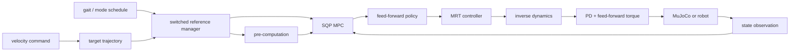

# WB Humanoid MPC 구현 알고리즘 분석

> 분석 기준: `main` / `d6a0be7799b06ad06d47c34e2f99d389d80591d7` (2026-10-01)  
> 대상: G1 centroidal MPC, whole-body acceleration MPC, 공통 reference/gait/constraint, ROS 2 및 MuJoCo 실행 경로  
> 방법: 현재 체크아웃의 producer-to-consumer 정적 코드 추적. 문헌은 구현의 배경 설명에만 사용하고, 실제 동작 판단은 연결된 코드와 설정을 우선한다. WB 질량행렬 관련 항목만 Pinocchio 4.1.0으로 별도 수치 확인했다([12. 검증 상태](#12-검증-상태)).

## 1. 핵심 결론

이 저장소에는 같은 보행 reference와 contact schedule을 공유하는 두 개의 switched nonlinear MPC가 구현되어 있다.

| 구분 | Centroidal MPC | Whole-body(WB) MPC |
|---|---:|---:|
| 상태 | 정규화 centroidal momentum + generalized position | generalized position + generalized velocity |
| 상태 차원(G1) | 35 | 58 |
| 입력 | 양발 6D wrench + 23개 joint velocity | 양발 6D wrench + 23개 joint acceleration |
| 입력 차원(G1) | 35 | 35 |
| 최적화된 동역학 | centroidal momentum + kinematics | floating-base rigid-body dynamics + kinematics |
| joint torque | 정책 이후 inverse dynamics로 계산 | 정책 이후 inverse dynamics로 계산 |
| horizon / grid | 1.2 s / 0.02 s | 1.1 s / 0.035 s |
| update당 SQP 반복 | 1 | 1 |

따라서 WB 구현을 엄밀히 “joint-torque-input MPC”라고 부르기는 어렵다. 실제 OCP 입력은 contact wrench와 joint acceleration이고, torque cost는 연결되지 않았으며 torque bound도 없다. 토크는 최적화 결과로부터 사후 복원된다. OCP 조립의 근거는 [CentroidalMpcInterface.cpp:151-237](https://github.com/manumerous/wb_humanoid_mpc/blob/d6a0be7799b06ad06d47c34e2f99d389d80591d7/humanoid_nmpc/humanoid_centroidal_mpc/src/CentroidalMpcInterface.cpp#L151-L237)와 [WBMpcInterface.cpp:131-199](https://github.com/manumerous/wb_humanoid_mpc/blob/d6a0be7799b06ad06d47c34e2f99d389d80591d7/humanoid_nmpc/humanoid_wb_mpc/src/WBMpcInterface.cpp#L131-L199)이다.

현재 구현에는 알고리즘의 실제 의미를 바꾸는 높은 영향의 문제가 있다. 영향이 닿는 위치별로 나누면 다음과 같다.

| 위치 | 문제 | 결과 |
|---|---|---|
| WB OCP 동역학 | base acceleration에서 translation-angular coupling 무시 | 최적화가 full EOM과 다른 동역학을 사용 |
| WB OCP 비용 | swing-foot cost weight 덮어쓰기 | 설정 파일과 다른 목적함수로 최적화 |
| WB feed-forward torque | CRBA 결과의 하삼각을 복원하지 않은 채 joint 행을 사용 | 관성 항이 빠진 torque. OCP 동역학에는 영향 없음 |
| Centroidal feed-forward torque | inverse dynamics에 joint velocity 0, joint acceleration 0이 들어감 | policy에서 wrench만 반영된 torque |

MPC joint index 벡터를 크기 없이 쓰는 undefined behavior도 있지만, 소비처가 시각화 경로뿐이어서 OCP와 제어 출력에는 닿지 않는다. 상세 내용은 [11. 구현 감사](#11-구현-감사-실제-동작에-영향을-주는-항목)에 정리한다.

## 2. 시스템 구조와 실행 데이터 흐름

두 OCP 모두 time-triggered mode schedule에 따라 비용과 제약을 켜고 끈다. contact mode는 `FLY=0`, `RF=1`, `LF=2`, `STANCE=3`이고, 두 비트가 각각 왼발과 오른발 contact 여부를 나타낸다. 정확한 enum과 변환은 [MotionPhaseDefinition.h:47-84](https://github.com/manumerous/wb_humanoid_mpc/blob/d6a0be7799b06ad06d47c34e2f99d389d80591d7/humanoid_nmpc/humanoid_common_mpc/include/humanoid_common_mpc/gait/MotionPhaseDefinition.h#L47-L84)에 있다.

ROS dummy 경로에서는 MPC node와 MRT node가 분리되며 observation, policy, reset topic으로 연결된다. 저장소 node 조립은 [CentroidalMpcSqpNode.cpp:60-90](https://github.com/manumerous/wb_humanoid_mpc/blob/d6a0be7799b06ad06d47c34e2f99d389d80591d7/humanoid_nmpc/humanoid_centroidal_mpc_ros2/src/CentroidalMpcSqpNode.cpp#L60-L90), [CentroidalMpcDummySimNode.cpp:62-89](https://github.com/manumerous/wb_humanoid_mpc/blob/d6a0be7799b06ad06d47c34e2f99d389d80591d7/humanoid_nmpc/humanoid_centroidal_mpc_ros2/src/CentroidalMpcDummySimNode.cpp#L62-L89)에 있고, topic 이름은 pinned OCS2의 [MPC_ROS_Interface.cpp:320-346](https://github.com/manumerous/ocs2_ros2/blob/34e12ef568791780c212253f97b95c4f90b20c4a/ocs2_ros2_interfaces/src/mpc/MPC_ROS_Interface.cpp#L320-L346)와 [MRT_ROS_Interface.cpp:244-269](https://github.com/manumerous/ocs2_ros2/blob/34e12ef568791780c212253f97b95c4f90b20c4a/ocs2_ros2_interfaces/src/mrt/MRT_ROS_Interface.cpp#L244-L269)에 정의된다. MuJoCo 경로는 한 프로세스 안에서 `MpcMrtInterface`와 solver thread를 사용한다.

## 3. 공통 모델과 좌표계

### 3.1 G1 모델 차원

G1 설정은 손목의 6개 fixed joint를 제외한 23개 actuated joint를 사용한다. 모델 설정과 제거 목록은 centroidal [task.info:32-63](https://github.com/manumerous/wb_humanoid_mpc/blob/d6a0be7799b06ad06d47c34e2f99d389d80591d7/robot_models/unitree_g1/g1_centroidal_mpc/config/mpc/task.info#L32-L63), WB [task.info:30-61](https://github.com/manumerous/wb_humanoid_mpc/blob/d6a0be7799b06ad06d47c34e2f99d389d80591d7/robot_models/unitree_g1/g1_wb_mpc/config/mpc/task.info#L30-L61)에 있다. 각 발 wrench는

$$
W_i = \begin{bmatrix} f_i \\ \tau_i \end{bmatrix}
= [F_x,F_y,F_z,M_x,M_y,M_z]^\top \in \mathbb{R}^6
$$

이며 contact 수와 wrench 차원은 [Types.h:84-102](https://github.com/manumerous/wb_humanoid_mpc/blob/d6a0be7799b06ad06d47c34e2f99d389d80591d7/humanoid_nmpc/humanoid_common_mpc/include/humanoid_common_mpc/common/Types.h#L84-L102)에 고정돼 있다.

floating base는 quaternion이 아니라 3D translation과 `SphericalZYX` joint로 생성된다. 따라서 base orientation state는 ZYX Euler angle이고, WB velocity의 회전 성분은 Euler angle derivative다. 모델 생성은 [createPinocchioModel.cpp:60-66](https://github.com/manumerous/wb_humanoid_mpc/blob/d6a0be7799b06ad06d47c34e2f99d389d80591d7/humanoid_nmpc/humanoid_common_mpc/src/pinocchio_model/createPinocchioModel.cpp#L60-L66), contact/collision frame 추가는 [createPinocchioModel.cpp:144-181](https://github.com/manumerous/wb_humanoid_mpc/blob/d6a0be7799b06ad06d47c34e2f99d389d80591d7/humanoid_nmpc/humanoid_common_mpc/src/pinocchio_model/createPinocchioModel.cpp#L144-L181)을 참조한다.

### 3.2 switched optimal-control problem

고정된 mode schedule $\sigma(t)$에 대해 두 MPC가 푸는 공통 형태는 다음과 같다.

$$
\begin{aligned}
\min_{x(\cdot),u(\cdot)}\quad
& \Phi_f(x(T)) + \int_{t_0}^{T}
\left(\ell_q(x,u,t)+\ell_{ee}^{\sigma(t)}+\ell_{soft}^{\sigma(t)}\right)dt,\\
\text{s.t.}\quad
& \dot{x}=f_{\sigma(t)}(x,u),\\
& g_{\sigma(t)}(x,u,t)=0.
\end{aligned}
$$

여기서 hard equality는 stance/swing kinematics 및 swing wrench이고, friction cone, contact moment, joint limit, self-collision은 relaxed-barrier soft cost다. 즉 이 구현에는 hard inequality feasibility 보장이 없다. mode-dependent 활성화와 OCP 등록은 centroidal [CentroidalMpcInterface.cpp:151-237](https://github.com/manumerous/wb_humanoid_mpc/blob/d6a0be7799b06ad06d47c34e2f99d389d80591d7/humanoid_nmpc/humanoid_centroidal_mpc/src/CentroidalMpcInterface.cpp#L151-L237), WB [WBMpcInterface.cpp:131-199](https://github.com/manumerous/wb_humanoid_mpc/blob/d6a0be7799b06ad06d47c34e2f99d389d80591d7/humanoid_nmpc/humanoid_wb_mpc/src/WBMpcInterface.cpp#L131-L199)에서 확인된다.

## 4. Centroidal MPC

### 4.1 상태와 입력

상태와 입력은

$$
x_c=\begin{bmatrix}\bar h_l\\\bar h_a\\q_b\\q_j\end{bmatrix}
\in\mathbb{R}^{35},\qquad
u_c=\begin{bmatrix}W_L\\W_R\\\dot q_j\end{bmatrix}
\in\mathbb{R}^{35}
$$

이다. $\bar h=h/m$는 질량으로 정규화한 centroidal momentum, $q_b=[p_B,\theta_{ZYX}]\in\mathbb{R}^6$, $q_j\in\mathbb{R}^{23}$이다. 실제 index 정의는 [CentroidalMpcRobotModel.h:51-84](https://github.com/manumerous/wb_humanoid_mpc/blob/d6a0be7799b06ad06d47c34e2f99d389d80591d7/humanoid_nmpc/humanoid_centroidal_mpc/include/humanoid_centroidal_mpc/common/CentroidalMpcRobotModel.h#L51-L84), accessors는 [CentroidalMpcRobotModel.h:108-147](https://github.com/manumerous/wb_humanoid_mpc/blob/d6a0be7799b06ad06d47c34e2f99d389d80591d7/humanoid_nmpc/humanoid_centroidal_mpc/include/humanoid_centroidal_mpc/common/CentroidalMpcRobotModel.h#L108-L147)에 있다.

### 4.2 동역학

centroidal momentum matrix를

$$
h=A(q)\nu,\qquad A(q)=[A_b(q)\;A_j(q)]
$$

라 두면 입력의 $\dot q_j$와 상태의 $\bar h$로부터 base generalized velocity를

$$
\nu_b=A_b^{-1}\left(m\bar h-A_j\dot q_j\right),
\qquad \nu=[\nu_b^\top,\dot q_j^\top]^\top
$$

로 복원한다. 각 contact 위치와 COM 사이의 벡터를 $r_i=p_i-p_{COM}$라 하면 구현된 normalized momentum dynamics는

$$
\dot{\bar h}_l=g+\frac{1}{m}\sum_i f_i,
\qquad
\dot{\bar h}_a=\frac{1}{m}\sum_i\left(r_i\times f_i+\tau_i\right)
$$

이고 전체 flow map은

$$
\dot x_c=
\begin{bmatrix}
\dot{\bar h}_l\\\dot{\bar h}_a\\\nu_b\\\dot q_j
\end{bmatrix}.
$$

저장소 wrapper는 [CentroidalDynamicsAD.cpp:38-64](https://github.com/manumerous/wb_humanoid_mpc/blob/d6a0be7799b06ad06d47c34e2f99d389d80591d7/humanoid_nmpc/humanoid_centroidal_mpc/src/dynamics/CentroidalDynamicsAD.cpp#L38-L64)에서 pinned OCS2 구현을 호출한다. 위 식의 authoritative implementation은 pinned [PinocchioCentroidalDynamicsAD.cpp:75-115](https://github.com/manumerous/ocs2_ros2/blob/34e12ef568791780c212253f97b95c4f90b20c4a/ocs2_pinocchio/ocs2_centroidal_model/src/PinocchioCentroidalDynamicsAD.cpp#L75-L115), [ModelHelperFunctions.cpp:167-194](https://github.com/manumerous/ocs2_ros2/blob/34e12ef568791780c212253f97b95c4f90b20c4a/ocs2_pinocchio/ocs2_centroidal_model/src/ModelHelperFunctions.cpp#L167-L194), [CentroidalModelPinocchioMapping.cpp:84-106](https://github.com/manumerous/ocs2_ros2/blob/34e12ef568791780c212253f97b95c4f90b20c4a/ocs2_pinocchio/ocs2_centroidal_model/src/CentroidalModelPinocchioMapping.cpp#L84-L106)이다. 현재 G1은 full centroidal dynamics type 0을 선택한다([task.info:1](https://github.com/manumerous/wb_humanoid_mpc/blob/d6a0be7799b06ad06d47c34e2f99d389d80591d7/robot_models/unitree_g1/g1_centroidal_mpc/config/mpc/task.info#L1)).

### 4.3 비용함수

기본 running cost는 OCS2 convention에 따라

$$
\ell_q=\frac12(x-x^*)^\top Q(x-x^*)
+\frac12(u-u_{wc})^\top R(u-u_{wc})
$$

이다. reference deviation 계산은 [StateInputQuadraticCost.cpp:67-77](https://github.com/manumerous/wb_humanoid_mpc/blob/d6a0be7799b06ad06d47c34e2f99d389d80591d7/humanoid_nmpc/humanoid_common_mpc/src/cost/StateInputQuadraticCost.cpp#L67-L77), G1의 $Q,R$은 [task.info:166-258](https://github.com/manumerous/wb_humanoid_mpc/blob/d6a0be7799b06ad06d47c34e2f99d389d80591d7/robot_models/unitree_g1/g1_centroidal_mpc/config/mpc/task.info#L166-L258)에 있다. $R$에는 전역 `1e-3` scaling이 적용된다. $u_{wc}$는 stance contact가 $n_c$개일 때 각 발의 $F_z=mg/n_c$이고 나머지는 0이다([DynamicsHelperFunctions.h:60-75](https://github.com/manumerous/wb_humanoid_mpc/blob/d6a0be7799b06ad06d47c34e2f99d389d80591d7/humanoid_nmpc/humanoid_common_mpc/include/humanoid_common_mpc/pinocchio_model/DynamicsHelperFunctions.h#L60-L75)). Terminal quadratic cost에는 설정된 $Q_f$에 3배 scaling이 적용된다([task.info:260-306](https://github.com/manumerous/wb_humanoid_mpc/blob/d6a0be7799b06ad06d47c34e2f99d389d80591d7/robot_models/unitree_g1/g1_centroidal_mpc/config/mpc/task.info#L260-L306), [HumanoidCostConstraintFactory.cpp:218-227](https://github.com/manumerous/wb_humanoid_mpc/blob/d6a0be7799b06ad06d47c34e2f99d389d80591d7/humanoid_nmpc/humanoid_common_mpc/src/HumanoidCostConstraintFactory.cpp#L218-L227)).

추가 비용은 다음과 같다.

- Swing-foot Gauss-Newton cost는 위치, 지면 법선에 대한 orientation, linear/angular velocity residual로 구성된다. 그러나 현재 reference는 위치 0, 법선 world-z, 속도 0으로 코드에 고정되어 있고, impact factor는 linear velocity residual에만 곱해진다. [CentroidalMpcEndEffectorFootCost.cpp:90-144](https://github.com/manumerous/wb_humanoid_mpc/blob/d6a0be7799b06ad06d47c34e2f99d389d80591d7/humanoid_nmpc/humanoid_centroidal_mpc/src/cost/CentroidalMpcEndEffectorFootCost.cpp#L90-L144), [task.info:313-333](https://github.com/manumerous/wb_humanoid_mpc/blob/d6a0be7799b06ad06d47c34e2f99d389d80591d7/robot_models/unitree_g1/g1_centroidal_mpc/config/mpc/task.info#L313-L333)
- torso `mid360` task-space tracking은 desired trajectory에서 target pose/twist를 얻는다. [CentroidalMpcInterface.cpp:318-348](https://github.com/manumerous/wb_humanoid_mpc/blob/d6a0be7799b06ad06d47c34e2f99d389d80591d7/humanoid_nmpc/humanoid_centroidal_mpc/src/CentroidalMpcInterface.cpp#L318-L348), [EndEffectorKinematicsQuadraticCost.cpp:80-138](https://github.com/manumerous/wb_humanoid_mpc/blob/d6a0be7799b06ad06d47c34e2f99d389d80591d7/humanoid_nmpc/humanoid_common_mpc/src/cost/EndEffectorKinematicsQuadraticCost.cpp#L80-L138)
- External torque cost는 $\tau_{ext}=J^\top W$ 중 다리 6개 joint를 선택하고, 반대 발 contact proximity로 scaling한다. [ExternalTorqueQuadraticCostAD.cpp:87-134](https://github.com/manumerous/wb_humanoid_mpc/blob/d6a0be7799b06ad06d47c34e2f99d389d80591d7/humanoid_nmpc/humanoid_common_mpc/src/cost/ExternalTorqueQuadraticCostAD.cpp#L87-L134), [task.info:363-409](https://github.com/manumerous/wb_humanoid_mpc/blob/d6a0be7799b06ad06d47c34e2f99d389d80591d7/robot_models/unitree_g1/g1_centroidal_mpc/config/mpc/task.info#L363-L409)
- 이름이 `ICP`인 항은 표준 capture point $p_{COM}+\dot p_{COM}/\omega_0$가 아니다. 구현 residual은 두 발 midpoint의 xy와 COM xy 차이이고 velocity term은 주석 처리되어 있다. 또한 G1 weight가 0이어서 현재 목적함수에 영향이 없다. [ICPCost.cpp:88-117](https://github.com/manumerous/wb_humanoid_mpc/blob/d6a0be7799b06ad06d47c34e2f99d389d80591d7/humanoid_nmpc/humanoid_centroidal_mpc/src/cost/ICPCost.cpp#L88-L117), [ICPCost.cpp:134-154](https://github.com/manumerous/wb_humanoid_mpc/blob/d6a0be7799b06ad06d47c34e2f99d389d80591d7/humanoid_nmpc/humanoid_centroidal_mpc/src/cost/ICPCost.cpp#L134-L154), [task.info:308-311](https://github.com/manumerous/wb_humanoid_mpc/blob/d6a0be7799b06ad06d47c34e2f99d389d80591d7/robot_models/unitree_g1/g1_centroidal_mpc/config/mpc/task.info#L308-L311)

### 4.4 phase별 hard equality

Stance 발은 다음 6D velocity-level stabilized equality를 사용한다.

$$
\begin{bmatrix}
v_x\\v_y\\v_z+k_z(z-z^*)\\
\omega+k_R e_R
\end{bmatrix}=0,
\qquad k_z=5,\;k_R=20.
$$

즉 x/y 위치 hold 항은 없고, z와 orientation에만 pose feedback이 있다. 등록은 [CentroidalMpcInterface.cpp:243-264](https://github.com/manumerous/wb_humanoid_mpc/blob/d6a0be7799b06ad06d47c34e2f99d389d80591d7/humanoid_nmpc/humanoid_centroidal_mpc/src/CentroidalMpcInterface.cpp#L243-L264), 계산은 [ZeroVelocityConstraintCppAd.cpp:61-91](https://github.com/manumerous/wb_humanoid_mpc/blob/d6a0be7799b06ad06d47c34e2f99d389d80591d7/humanoid_nmpc/humanoid_centroidal_mpc/src/constraint/ZeroVelocityConstraintCppAd.cpp#L61-L91)와 [EndEffectorKinematicsTwistConstraint.cpp:82-97](https://github.com/manumerous/wb_humanoid_mpc/blob/d6a0be7799b06ad06d47c34e2f99d389d80591d7/humanoid_nmpc/humanoid_common_mpc/src/constraint/EndEffectorKinematicsTwistConstraint.cpp#L82-L97)에 있다.

Swing 발에는 wrench zero equality $W_i=0$와 수직속도 tracking

$$
v_z+k_z(z-z^*)-\dot z^*=0
$$

가 적용된다. [ZeroWrenchConstraint.cpp:59-83](https://github.com/manumerous/wb_humanoid_mpc/blob/d6a0be7799b06ad06d47c34e2f99d389d80591d7/humanoid_nmpc/humanoid_common_mpc/src/constraint/ZeroWrenchConstraint.cpp#L59-L83), [NormalVelocityConstraintCppAd.cpp:61-87](https://github.com/manumerous/wb_humanoid_mpc/blob/d6a0be7799b06ad06d47c34e2f99d389d80591d7/humanoid_nmpc/humanoid_centroidal_mpc/src/constraint/NormalVelocityConstraintCppAd.cpp#L61-L87), [HumanoidPreComputation.cpp:96-123](https://github.com/manumerous/wb_humanoid_mpc/blob/d6a0be7799b06ad06d47c34e2f99d389d80591d7/humanoid_nmpc/humanoid_common_mpc/src/HumanoidPreComputation.cpp#L96-L123)

## 5. Whole-body acceleration MPC

### 5.1 상태와 입력

WB 상태와 입력은

$$
x_w=\begin{bmatrix}q\\\nu\end{bmatrix}\in\mathbb{R}^{58},
\quad
q=\begin{bmatrix}p_B\\\theta_{ZYX}\\q_j\end{bmatrix},
\quad
\nu=\begin{bmatrix}v_B^W\\\dot\theta_{ZYX}\\\dot q_j\end{bmatrix},
$$

$$
u_w=\begin{bmatrix}W_L\\W_R\\\ddot q_j\end{bmatrix}
\in\mathbb{R}^{35}.
$$

정확한 layout과 accessor는 [WBAccelMpcRobotModel.h:47-78](https://github.com/manumerous/wb_humanoid_mpc/blob/d6a0be7799b06ad06d47c34e2f99d389d80591d7/humanoid_nmpc/humanoid_wb_mpc/include/humanoid_wb_mpc/common/WBAccelMpcRobotModel.h#L47-L78), [WBAccelMpcRobotModel.h:85-159](https://github.com/manumerous/wb_humanoid_mpc/blob/d6a0be7799b06ad06d47c34e2f99d389d80591d7/humanoid_nmpc/humanoid_wb_mpc/include/humanoid_wb_mpc/common/WBAccelMpcRobotModel.h#L85-L159)에 있다. `getBaseComVelocity()`라는 함수명과 달리 반환값은 base origin의 world linear velocity와 Euler derivatives다([WBAccelMpcRobotModel.h:120-139](https://github.com/manumerous/wb_humanoid_mpc/blob/d6a0be7799b06ad06d47c34e2f99d389d80591d7/humanoid_nmpc/humanoid_wb_mpc/include/humanoid_wb_mpc/common/WBAccelMpcRobotModel.h#L120-L139)).

### 5.2 floating-base dynamics

구현이 의도한 rigid-body equation은

$$
M(q)\ddot q+h(q,\nu)
=S^\top\tau_j+\sum_iJ_i(q)^\top W_i
$$

이다. base/joint block으로 나누면 unactuated base equation에서

$$
M_{bb}\ddot q_b
=-h_b-M_{bj}\ddot q_j+\sum_iJ_{i,b}^\top W_i
$$

이므로 이상적인 해는

$$
\ddot q_b=M_{bb}^{-1}
\left(-h_b-M_{bj}\ddot q_j+\sum_iJ_{i,b}^\top W_i\right).
$$

하지만 현재 코드는 $M_{bb}$ 전체를 풀지 않고 base translation 3×3과 angular 3×3을 따로 역행렬화해 translation-angular cross block을 무시한다([DynamicsHelperFunctions.cpp:196-217](https://github.com/manumerous/wb_humanoid_mpc/blob/d6a0be7799b06ad06d47c34e2f99d389d80591d7/humanoid_nmpc/humanoid_common_mpc/src/pinocchio_model/DynamicsHelperFunctions.cpp#L196-L217)). 코드 주석은 base 질량행렬이 block diagonal이라고 가정하지만, 이는 base origin이 전체 COM과 일치할 때만 성립한다. G1 neutral 자세에서 COM은 base origin에서 약 $(0.02, 0, -0.07)\,m$ 떨어져 있어 cross block은 0이 아니다. 그러므로 아래 flow 식은 의도된 수식이고, 현재 수치 구현은 일반적으로 그 정확한 계산과 같지 않다.

CRBA가 `data.M`의 upper triangle만 채운다는 점은 이 solve에 영향을 주지 않는다. Floating base가 nv=6인 composite joint 하나이고([createPinocchioModel.cpp:60-66](https://github.com/manumerous/wb_humanoid_mpc/blob/d6a0be7799b06ad06d47c34e2f99d389d80591d7/humanoid_nmpc/humanoid_common_mpc/src/pinocchio_model/createPinocchioModel.cpp#L60-L66)), CRBA는 한 joint의 대각 블록을 대칭으로 모두 채우므로 `M.topLeftCorner(3,3)`과 `M.block(3,3,3,3)`은 올바른 값이다. 하삼각 문제는 joint 행을 읽는 torque 복원([5.3](#53-torque-복원))에만 해당한다.

같은 base acceleration은 dynamics뿐 아니라 swing-foot cost([EndEffectorDynamicsFootCost.cpp:102](https://github.com/manumerous/wb_humanoid_mpc/blob/d6a0be7799b06ad06d47c34e2f99d389d80591d7/humanoid_nmpc/humanoid_wb_mpc/src/cost/EndEffectorDynamicsFootCost.cpp#L102))와 end-effector acceleration 계산([PinocchioEndEffectorDynamicsCppAd.cpp:642-655](https://github.com/manumerous/wb_humanoid_mpc/blob/d6a0be7799b06ad06d47c34e2f99d389d80591d7/humanoid_nmpc/humanoid_wb_mpc/src/end_effector/PinocchioEndEffectorDynamicsCppAd.cpp#L642-L655))에도 들어가므로, coupling 오차는 stance/swing acceleration equality에도 전파된다.

$$
\dot x_w=
\begin{bmatrix}
\nu\\\ddot q_b\\\ddot q_j
\end{bmatrix}.
$$

flow 조립은 [WB DynamicsHelperFunctions.cpp:96-133](https://github.com/manumerous/wb_humanoid_mpc/blob/d6a0be7799b06ad06d47c34e2f99d389d80591d7/humanoid_nmpc/humanoid_wb_mpc/src/dynamics/DynamicsHelperFunctions.cpp#L96-L133), CppAD wrapper는 [WBAccelDynamicsAD.cpp:40-57](https://github.com/manumerous/wb_humanoid_mpc/blob/d6a0be7799b06ad06d47c34e2f99d389d80591d7/humanoid_nmpc/humanoid_wb_mpc/src/dynamics/WBAccelDynamicsAD.cpp#L40-L57)에 있다. Pinocchio의 CRBA API가 `data.M`의 upper triangular part를 계산한다는 계약은 [Pinocchio CRBA API](https://docs.ros.org/en/noetic/api/pinocchio/html/crba_8hpp.html)에 명시되어 있다.

### 5.3 torque 복원

MPC가 반환한 $q,\nu,W_i,\ddot q_j$에서 base acceleration을 먼저 계산한 뒤,

$$
\tau_j=M_{jb}\ddot q_b+M_{jj}\ddot q_j+h_j
-\sum_iJ_{i,j}^\top W_i
$$

로 actuator torque를 복원한다. 공통 구현은 [DynamicsHelperFunctions.cpp:232-269](https://github.com/manumerous/wb_humanoid_mpc/blob/d6a0be7799b06ad06d47c34e2f99d389d80591d7/humanoid_nmpc/humanoid_common_mpc/src/pinocchio_model/DynamicsHelperFunctions.cpp#L232-L269), WB wrapper는 [WB DynamicsHelperFunctions.cpp:198-218](https://github.com/manumerous/wb_humanoid_mpc/blob/d6a0be7799b06ad06d47c34e2f99d389d80591d7/humanoid_nmpc/humanoid_wb_mpc/src/dynamics/DynamicsHelperFunctions.cpp#L198-L218)이다.

이 경로는 CRBA 직후 대칭 복원 없이 `data.M.bottomRows(n_joints)`를 읽는다. Joint 행의 base 열($M_{jb}$)은 전부 strict lower 영역이라 0이고, $M_{jj}$는 상삼각만 남는다. 따라서 실제로 계산되는 값은

$$
\tau_j^{code}=\mathrm{triu}(M_{jj})\,\ddot q_j+h_j-\sum_iJ_{i,j}^\top W_i
$$

이며 $M_{jb}\ddot q_b$ 항 전체와 $M_{jj}$의 하삼각 기여가 빠진다. 가속도가 0이면 관성 항이 사라지므로 정지 자세의 중력·접촉 보상은 올바르고, 오차는 가속이 있을 때만 나타난다. Centroidal controller도 같은 함수를 쓴다([9](#9-정책-평가-inverse-dynamics-actuator-출력)).

### 5.4 비용함수와 실제 swing-foot weight

기본 state/input 및 terminal quadratic cost 구조는 centroidal과 같다. G1 running $Q,R$은 [task.info:188-305](https://github.com/manumerous/wb_humanoid_mpc/blob/d6a0be7799b06ad06d47c34e2f99d389d80591d7/robot_models/unitree_g1/g1_wb_mpc/config/mpc/task.info#L188-L305), terminal $Q_f$는 [task.info:308-378](https://github.com/manumerous/wb_humanoid_mpc/blob/d6a0be7799b06ad06d47c34e2f99d389d80591d7/robot_models/unitree_g1/g1_wb_mpc/config/mpc/task.info#L308-L378)에 있고 terminal scaling은 4다.

Swing 발의 18차원 Gauss-Newton residual은 개념적으로

$$
r_{foot}=s(t)\,\sqrt{w}\odot
\begin{bmatrix}
p-p^*\\e_R\\v-v^*\\\omega-\omega^*\\a-a^*\\\alpha-\alpha^*
\end{bmatrix}
$$

이다. 하지만 실제 코드는 position residual을 0으로 두고, orientation은 world-z plane에 맞추며, velocity/acceleration target은 모두 0으로 둔다. impact proximity $s(t)$는 residual 전체에 곱해져 비용에는 $s(t)^2$로 작용한다([EndEffectorDynamicsFootCost.cpp:91-151](https://github.com/manumerous/wb_humanoid_mpc/blob/d6a0be7799b06ad06d47c34e2f99d389d80591d7/humanoid_nmpc/humanoid_wb_mpc/src/cost/EndEffectorDynamicsFootCost.cpp#L91-L151)).

설정 파일의 acceleration weight를 loader가 velocity field에 다시 대입하는 오류 때문에 실제 weight는 다음과 같다. loader는 [EndEffectorDynamicsCostHelpers.cpp:101-110](https://github.com/manumerous/wb_humanoid_mpc/blob/d6a0be7799b06ad06d47c34e2f99d389d80591d7/humanoid_nmpc/humanoid_wb_mpc/src/cost/EndEffectorDynamicsCostHelpers.cpp#L101-L110), default는 [EndEffectorDynamicsCostHelpers.h:42-50](https://github.com/manumerous/wb_humanoid_mpc/blob/d6a0be7799b06ad06d47c34e2f99d389d80591d7/humanoid_nmpc/humanoid_wb_mpc/include/humanoid_wb_mpc/cost/EndEffectorDynamicsCostHelpers.h#L42-L50), 입력 설정은 [task.info:381-401](https://github.com/manumerous/wb_humanoid_mpc/blob/d6a0be7799b06ad06d47c34e2f99d389d80591d7/robot_models/unitree_g1/g1_wb_mpc/config/mpc/task.info#L381-L401)이다.

| residual | 설정 의도 | 실제 사용 |
|---|---:|---:|
| position | `[0,0,0]` | `[0,0,0]` |
| orientation | `[10000,10000,0]` | `[10000,10000,0]` |
| linear velocity | `[50,50,0]` | **`[5,5,0]`** |
| angular velocity | `[100,100,100]` | **`[2,2,2]`** |
| linear acceleration | `[5,5,0]` | **`[0.01,0.01,0.01]`** |
| angular acceleration | `[2,2,2]` | **`[0.01,0.01,0.01]`** |

`JointTorqueCost`는 interface에서 주석 처리되어 있고 torque constraint도 등록되지 않는다([WBMpcInterface.cpp:146-149](https://github.com/manumerous/wb_humanoid_mpc/blob/d6a0be7799b06ad06d47c34e2f99d389d80591d7/humanoid_nmpc/humanoid_wb_mpc/src/WBMpcInterface.cpp#L146-L149)).

### 5.5 phase별 hard equality

Stance 발에는 acceleration-level stabilized equality

$$
b+A_x\begin{bmatrix}p-p^*\\e_R\end{bmatrix}
+A_v\begin{bmatrix}v-v^*\\\omega-\omega^*\end{bmatrix}
+A_a\begin{bmatrix}a-a^*\\\alpha-\alpha^*\end{bmatrix}=0
$$

가 적용된다. G1 설정으로 풀어 쓰면 xy에는 $20v_{xy}+a_{xy}=0$, z에는 $100(z-z^*)+10v_z+a_z=0$, attitude에는 $80e_R+20\omega+\alpha=0$이다. x/y position feedback은 없다. 등록은 [WBMpcInterface.cpp:205-229](https://github.com/manumerous/wb_humanoid_mpc/blob/d6a0be7799b06ad06d47c34e2f99d389d80591d7/humanoid_nmpc/humanoid_wb_mpc/src/WBMpcInterface.cpp#L205-L229), 평가식은 [EndEffectorDynamicsAccelerationsConstraint.cpp:84-102](https://github.com/manumerous/wb_humanoid_mpc/blob/d6a0be7799b06ad06d47c34e2f99d389d80591d7/humanoid_nmpc/humanoid_wb_mpc/src/constraint/EndEffectorDynamicsAccelerationsConstraint.cpp#L84-L102), gain은 [task.info:12-22](https://github.com/manumerous/wb_humanoid_mpc/blob/d6a0be7799b06ad06d47c34e2f99d389d80591d7/robot_models/unitree_g1/g1_wb_mpc/config/mpc/task.info#L12-L22)에 있다.

Swing 발은 $W_i=0$과

$$
100(z-z^*)+10(\dot z-\dot z^*)+(\ddot z-\ddot z^*)=0
$$

을 만족해야 한다. pre-computation은 [WBMpcPreComputation.cpp:68-113](https://github.com/manumerous/wb_humanoid_mpc/blob/d6a0be7799b06ad06d47c34e2f99d389d80591d7/humanoid_nmpc/humanoid_wb_mpc/src/WBMpcPreComputation.cpp#L68-L113), equality는 [SwingLegVerticalConstraintCppAd.cpp:61-91](https://github.com/manumerous/wb_humanoid_mpc/blob/d6a0be7799b06ad06d47c34e2f99d389d80591d7/humanoid_nmpc/humanoid_wb_mpc/src/constraint/SwingLegVerticalConstraintCppAd.cpp#L61-L91)에 있다.

## 6. 공통 soft inequality

### 6.1 friction cone

stance contact마다

$$
h_f(W)=\mu_f(F_z+F_{grip})
-\sqrt{F_x^2+F_y^2+\varepsilon}\ge 0
$$

를 relaxed barrier로 비용화한다. G1은 $\mu_f=0.4$, $F_{grip}=0$, $\varepsilon=25$, barrier $\mu=0.2,\delta=5$다. 따라서 $F_x=F_y=0$이어도 경계에서 $F_z\ge12.5\,N$이 필요하다. 식과 default는 [FrictionForceConeConstraint.h:41-83](https://github.com/manumerous/wb_humanoid_mpc/blob/d6a0be7799b06ad06d47c34e2f99d389d80591d7/humanoid_nmpc/humanoid_common_mpc/include/humanoid_common_mpc/constraint/FrictionForceConeConstraint.h#L41-L83), [FrictionForceConeConstraint.cpp:70-84](https://github.com/manumerous/wb_humanoid_mpc/blob/d6a0be7799b06ad06d47c34e2f99d389d80591d7/humanoid_nmpc/humanoid_common_mpc/src/constraint/FrictionForceConeConstraint.cpp#L70-L84)에 있다. surface rotation은 identity이고 setter는 예외를 던지므로 friction cone은 실제로 world-z 기준이다([FrictionForceConeConstraint.cpp:62-65](https://github.com/manumerous/wb_humanoid_mpc/blob/d6a0be7799b06ad06d47c34e2f99d389d80591d7/humanoid_nmpc/humanoid_common_mpc/src/constraint/FrictionForceConeConstraint.cpp#L62-L65)).

### 6.2 contact moment / CoP rectangle

contact-local wrench에 대해

$$
\begin{aligned}
M_x-y_{min}F_z&\ge0,&-M_x+y_{max}F_z&\ge0,\\
-M_y-x_{min}F_z&\ge0,&M_y+x_{max}F_z&\ge0
\end{aligned}
$$

를 둔다. G1 foot rectangle은 $x\in[-0.09,0.09]$, $y\in[-0.03,0.03]\,m$다. torsional moment $M_z$ bound는 없다. [ContactMomentXYConstraintCppAd.cpp:77-103](https://github.com/manumerous/wb_humanoid_mpc/blob/d6a0be7799b06ad06d47c34e2f99d389d80591d7/humanoid_nmpc/humanoid_common_mpc/src/constraint/ContactMomentXYConstraintCppAd.cpp#L77-L103)

### 6.3 joint limit과 self-collision

joint position limit은 URDF limit에 대한 piecewise-polynomial barrier 합이다([JointLimitsSoftConstraint.cpp:57-99](https://github.com/manumerous/wb_humanoid_mpc/blob/d6a0be7799b06ad06d47c34e2f99d389d80591d7/humanoid_nmpc/humanoid_common_mpc/src/constraint/JointLimitsSoftConstraint.cpp#L57-L99)). Self-collision은 발과 무릎 sphere pair 16개의

$$
h_{ab}=\lVert p_a-p_b\rVert-r_a-r_b\ge0
$$

를 사용하며 double stance에서는 비활성화된다([FootCollisionConstraint.cpp:80-143](https://github.com/manumerous/wb_humanoid_mpc/blob/d6a0be7799b06ad06d47c34e2f99d389d80591d7/humanoid_nmpc/humanoid_common_mpc/src/constraint/FootCollisionConstraint.cpp#L80-L143)). 현재는 joint velocity/acceleration bound, torque bound, 상체 collision constraint가 없다.

## 7. 명령에서 reference와 gait가 만들어지는 과정

속도 명령은 body-frame xy를 현재 yaw로 world frame에 회전하고, target base velocity를 $[v_x,v_y,0,\dot\psi,0,0]$로 만든다. horizon의 70% 지점과 terminal pose를 평균속도로 적분하며 joint target은 default posture, joint velocity target은 0이다. 공통 시간 생성은 [TargetTrajectoriesCalculatorBase.cpp:114-145](https://github.com/manumerous/wb_humanoid_mpc/blob/d6a0be7799b06ad06d47c34e2f99d389d80591d7/humanoid_nmpc/humanoid_common_mpc/src/command/TargetTrajectoriesCalculatorBase.cpp#L114-L145), centroidal reference는 [CentroidalMpcTargetTrajectoriesCalculator.cpp:86-156](https://github.com/manumerous/wb_humanoid_mpc/blob/d6a0be7799b06ad06d47c34e2f99d389d80591d7/humanoid_nmpc/humanoid_centroidal_mpc/src/command/CentroidalMpcTargetTrajectoriesCalculator.cpp#L86-L156), WB reference는 [WBMpcTargetTrajectoriesCalculator.cpp:80-135](https://github.com/manumerous/wb_humanoid_mpc/blob/d6a0be7799b06ad06d47c34e2f99d389d80591d7/humanoid_nmpc/humanoid_wb_mpc/src/command/WBMpcTargetTrajectoriesCalculator.cpp#L80-L135)에 있다.

running state reference에는 phase sinusoid와 local forward speed에 비례하는 shoulder pitch/elbow arm swing offset $\pm0.15$가 추가된다([SwitchedModelReferenceManager.cpp:110-134](https://github.com/manumerous/wb_humanoid_mpc/blob/d6a0be7799b06ad06d47c34e2f99d389d80591d7/humanoid_nmpc/humanoid_common_mpc/src/reference_manager/SwitchedModelReferenceManager.cpp#L110-L134)). 다만 terminal cost는 managed arm-swing state가 아니라 raw target trajectory를 사용하는 표준 terminal quadratic cost이므로 running/terminal reference semantics가 다르다.

Procedural gait manager는 `STANCE → slow_walk → walk → slower_trot → slow_trot → trot → run` 순서로 gait를 전환한다([ProceduralMpcMotionManager.h:108-147](https://github.com/manumerous/wb_humanoid_mpc/blob/d6a0be7799b06ad06d47c34e2f99d389d80591d7/humanoid_nmpc/humanoid_common_mpc/include/humanoid_common_mpc/reference_manager/ProceduralMpcMotionManager.h#L108-L147), [ProceduralMpcMotionManager.cpp:86-159](https://github.com/manumerous/wb_humanoid_mpc/blob/d6a0be7799b06ad06d47c34e2f99d389d80591d7/humanoid_nmpc/humanoid_common_mpc/src/reference_manager/ProceduralMpcMotionManager.cpp#L86-L159)). Swing 높이는 두 개의 cubic Hermite spline으로 lift-off에서 중간 최대 높이, 이후 touch-down을 연결한다([SwingTrajectoryPlanner.cpp:87-190](https://github.com/manumerous/wb_humanoid_mpc/blob/d6a0be7799b06ad06d47c34e2f99d389d80591d7/humanoid_nmpc/humanoid_common_mpc/src/swing_foot_planner/SwingTrajectoryPlanner.cpp#L87-L190), [CubicSpline.cpp:38-80](https://github.com/manumerous/wb_humanoid_mpc/blob/d6a0be7799b06ad06d47c34e2f99d389d80591d7/humanoid_nmpc/humanoid_common_mpc/src/swing_foot_planner/CubicSpline.cpp#L38-L80)).

코드는 지면 높이를 추정한 직후 `terrainHeight = 0.0`으로 덮어쓴다([SwitchedModelReferenceManager.cpp:83-103](https://github.com/manumerous/wb_humanoid_mpc/blob/d6a0be7799b06ad06d47c34e2f99d389d80591d7/humanoid_nmpc/humanoid_common_mpc/src/reference_manager/SwitchedModelReferenceManager.cpp#L83-L103)). 따라서 swing trajectory, stance stabilizer, friction은 모두 flat ground 가정에 묶여 있다.

## 8. SQP, 이산화, 자동미분

두 MPC 모두 OCS2 fork의 multiple-shooting SQP를 사용한다. 한 update의 실제 계산은 다음과 같다.

1. mode event를 포함하는 time grid를 구성하고 현재 trajectory를 rollout한다.
2. dynamics/비용/제약을 병렬로 linearize 또는 quadratize한다.
3. state-input equality를 projection한다.
4. HPIPM으로 OCP-QP를 푼다.
5. filter line search로 step을 선택하고 convergence를 평가한다.
6. 설정상 SQP iteration이 1이므로 다음 MPC update로 넘어간다.

이는 real-time iteration에 가까운 운용이다. pinned solver 근거는 [OCS2 SQP README](https://github.com/manumerous/ocs2_ros2/blob/34e12ef568791780c212253f97b95c4f90b20c4a/ocs2_sqp/ocs2_sqp/README.md), [SqpSolver.cpp:290-318](https://github.com/manumerous/ocs2_ros2/blob/34e12ef568791780c212253f97b95c4f90b20c4a/ocs2_sqp/ocs2_sqp/src/SqpSolver.cpp#L290-L318), [SqpSolver.cpp:346-424](https://github.com/manumerous/ocs2_ros2/blob/34e12ef568791780c212253f97b95c4f90b20c4a/ocs2_sqp/ocs2_sqp/src/SqpSolver.cpp#L346-L424), [SqpSolver.cpp:530-601](https://github.com/manumerous/ocs2_ros2/blob/34e12ef568791780c212253f97b95c4f90b20c4a/ocs2_sqp/ocs2_sqp/src/SqpSolver.cpp#L530-L601)이다.

| 설정 | Centroidal | WB |
|---|---:|---:|
| prediction horizon | 1.2 s | 1.1 s |
| multiple-shooting dt | 0.02 s | 0.035 s |
| integrator | RK4 | RK4 |
| SQP iterations/update | 1 | 1 |
| worker threads | 4 | 4 |
| equality projection | on | on |
| feedback policy | off | off |
| configured MPC/MRT rate | 80/100 Hz | 60/500 Hz |

설정 원문은 centroidal [task.info:79-120](https://github.com/manumerous/wb_humanoid_mpc/blob/d6a0be7799b06ad06d47c34e2f99d389d80591d7/robot_models/unitree_g1/g1_centroidal_mpc/config/mpc/task.info#L79-L120), WB [task.info:76-117](https://github.com/manumerous/wb_humanoid_mpc/blob/d6a0be7799b06ad06d47c34e2f99d389d80591d7/robot_models/unitree_g1/g1_wb_mpc/config/mpc/task.info#L76-L117)이다. 별도의 ODE45 rollout 설정이 있지만 현재 `SqpMpc` 생성자에는 rollout object가 전달되지 않으므로 authoritative discretization은 multiple-shooting RK4다.

Dynamics와 end-effector kinematics/dynamics, contact moment, collision, Gauss-Newton residual은 Pinocchio scalar model을 CppAD scalar로 변환하고 생성된 model/Jacobian을 사용한다. WB end-effector acceleration은 forward kinematics 후 `LOCAL_WORLD_ALIGNED` classical acceleration으로 계산된다([PinocchioEndEffectorDynamicsCppAd.cpp:54-201](https://github.com/manumerous/wb_humanoid_mpc/blob/d6a0be7799b06ad06d47c34e2f99d389d80591d7/humanoid_nmpc/humanoid_wb_mpc/src/end_effector/PinocchioEndEffectorDynamicsCppAd.cpp#L54-L201), [PinocchioEndEffectorDynamicsCppAd.cpp:642-655](https://github.com/manumerous/wb_humanoid_mpc/blob/d6a0be7799b06ad06d47c34e2f99d389d80591d7/humanoid_nmpc/humanoid_wb_mpc/src/end_effector/PinocchioEndEffectorDynamicsCppAd.cpp#L642-L655)).

## 9. 정책 평가, inverse dynamics, actuator 출력

두 controller는 현재 시간보다 5 ms 앞에서 feed-forward policy를 평가한다. WB는 policy의 $q,\nu,\ddot q_j,W$로 torque를 복원한다.

Centroidal의 feed-forward torque는 policy 값으로 계산되지 않는다. Policy에서 가져오는 것은 contact wrench뿐이고 나머지 입력은 다음과 같다([CentroidalMpcMrtJointController.cpp:153-175](https://github.com/manumerous/wb_humanoid_mpc/blob/d6a0be7799b06ad06d47c34e2f99d389d80591d7/humanoid_nmpc/humanoid_centroidal_mpc/src/mrt/CentroidalMpcMrtJointController.cpp#L153-L175)).

- $q$는 policy가 아니라 측정 observation의 값이다.
- Joint velocity는 observation input에서 읽는데, 그 input이 0으로 채워지므로([:130](https://github.com/manumerous/wb_humanoid_mpc/blob/d6a0be7799b06ad06d47c34e2f99d389d80591d7/humanoid_nmpc/humanoid_centroidal_mpc/src/mrt/CentroidalMpcMrtJointController.cpp#L130)) $\dot q_j=0$이다. Base velocity도 $A_b^{-1}m\bar h$로만 재구성되어 joint 기여가 빠진다.
- Joint acceleration은 $k_p(q^*-q)+k_d(\dot q^*-\dot q)$인데 두 gain이 0으로 채워져 있어([:65-67](https://github.com/manumerous/wb_humanoid_mpc/blob/d6a0be7799b06ad06d47c34e2f99d389d80591d7/humanoid_nmpc/humanoid_centroidal_mpc/src/mrt/CentroidalMpcMrtJointController.cpp#L65-L67)) $\ddot q_j=0$이다.

코드 주석도 이 경로의 inverse dynamics에 버그가 남아 있다고 적고 있다. Policy의 $q^*,\dot q_j^*$는 아래 PD 항의 목표로만 쓰인다. 최종 actuator 명령은

$$
\tau_{cmd}=K_p(q^*-q)+K_d(\dot q^*-\dot q)+\tau_{ff}
$$

이며 G1 active joint gain은 $K_p=1200$, $K_d=10$이다. Centroidal 경로는 [CentroidalMpcMrtJointController.cpp:153-188](https://github.com/manumerous/wb_humanoid_mpc/blob/d6a0be7799b06ad06d47c34e2f99d389d80591d7/humanoid_nmpc/humanoid_centroidal_mpc/src/mrt/CentroidalMpcMrtJointController.cpp#L153-L188), WB 경로는 [WBMpcMrtJointController.cpp:125-158](https://github.com/manumerous/wb_humanoid_mpc/blob/d6a0be7799b06ad06d47c34e2f99d389d80591d7/humanoid_nmpc/humanoid_wb_mpc/src/mrt/WBMpcMrtJointController.cpp#L125-L158), MuJoCo 최종 적용은 [MujocoSimInterface.cpp:357-364](https://github.com/manumerous/wb_humanoid_mpc/blob/d6a0be7799b06ad06d47c34e2f99d389d80591d7/robot_runtime/mujoco_sim_interface/src/MujocoSimInterface.cpp#L357-L364)에 있다.

MuJoCo timestep은 0.5 ms이고 외부 controller loop는 두 MPC 모두 500 Hz다. 반면 solver thread 목표는 centroidal 80 Hz, WB 60 Hz다. Dummy ROS loop의 hard-coded rate는 centroidal 100 Hz, WB 80 Hz로 설정 파일의 MRT rate와도 다르다. 따라서 “MPC rate”, “policy 소비 rate”, “physics rate”를 구분해야 한다.

현재 MuJoCo observation의 foot contact flag는 sensor 경로가 주석 처리되어 항상 `{true,true}`다([MujocoSimInterface.cpp:303-329](https://github.com/manumerous/wb_humanoid_mpc/blob/d6a0be7799b06ad06d47c34e2f99d389d80591d7/robot_runtime/mujoco_sim_interface/src/MujocoSimInterface.cpp#L303-L329)). 다만 OCP의 constraint activation은 measured flag가 아니라 reference mode schedule에 의해 결정된다. 측정 mode는 observation/reset 및 정책 동기화 의미에 영향을 준다.

## 10. Centroidal과 WB의 구현상 차이

| 관점 | Centroidal | WB |
|---|---|---|
| 최적화가 직접 설명하는 것 | COM/momentum 및 configuration | full configuration/velocity와 base EOM |
| joint motion input | velocity | acceleration |
| contact stance equality | velocity level | acceleration level |
| base acceleration | momentum에서 간접 결정 | mass matrix equation으로 계산 |
| torque 의미 | 측정 상태 + policy wrench의 inverse dynamics | OCP 결과에서 사후 복원 |
| 주요 approximation | centroidal reduction | base block 분리 solve (OCP), 하삼각 누락 (torque 복원) |
| swing foot cost | pose/twist 중심 | pose/twist/acceleration GN residual |

Centroidal formulation의 개념적 기반은 저장소가 직접 인용하는 Sleiman et al.이고([README.md:12-14](https://github.com/manumerous/wb_humanoid_mpc/blob/d6a0be7799b06ad06d47c34e2f99d389d80591d7/README.md#L12-L14)), WB formulation의 전신은 Galliker et al.이다([README.md:16-19](https://github.com/manumerous/wb_humanoid_mpc/blob/d6a0be7799b06ad06d47c34e2f99d389d80591d7/README.md#L16-L19)). 후자는 planar AMBER-3M 논문이므로 현재 3D G1 구현과 동일한 수식/제약을 보증하는 명세가 아니라 conceptual predecessor로 봐야 한다.

## 11. 구현 감사: 실제 동작에 영향을 주는 항목

### 11.1 높은 우선순위

| 문제 | 실제 영향 | 교정 방향 | 근거 |
|---|---|---|---|
| WB base solve가 $M_{bb}$ coupling을 무시 | OCP 동역학, swing-foot cost, stance/swing acceleration equality가 모두 full EOM과 다른 base acceleration을 사용. G1은 COM이 base origin에서 약 7 cm 떨어져 있어 coupling이 0이 아님 | full 6×6 base block solve 및 residual test | [DynamicsHelperFunctions.cpp:196-217](https://github.com/manumerous/wb_humanoid_mpc/blob/d6a0be7799b06ad06d47c34e2f99d389d80591d7/humanoid_nmpc/humanoid_common_mpc/src/pinocchio_model/DynamicsHelperFunctions.cpp#L196-L217) |
| WB foot weight loader overwrite | 설정과 전혀 다른 swing regularization으로 최적화. 지금까지 동작이 확인된 것은 설정값이 아니라 [5.4](#54-비용함수와-실제-swing-foot-weight)의 실효값임 | 각 acceleration field에 올바르게 대입하고 config-to-object test 추가. 수정 후에는 재튜닝 필요 | [EndEffectorDynamicsCostHelpers.cpp:101-110](https://github.com/manumerous/wb_humanoid_mpc/blob/d6a0be7799b06ad06d47c34e2f99d389d80591d7/humanoid_nmpc/humanoid_wb_mpc/src/cost/EndEffectorDynamicsCostHelpers.cpp#L101-L110) |
| torque 복원이 CRBA 하삼각을 복원하지 않은 $M$의 joint 행을 사용 | $M_{jb}\ddot q_b$ 항 전체와 $M_{jj}$ 하삼각 기여가 빠진 feed-forward torque. WB와 centroidal controller 모두 해당. Base solve와 OCP 동역학은 영향 없음([5.2](#52-floating-base-dynamics)) | CRBA 직후 strict lower를 transpose로 복원하거나 RNEA 사용, RNEA 대비 오차 assert test 추가 | [common DynamicsHelperFunctions.cpp:241-266](https://github.com/manumerous/wb_humanoid_mpc/blob/d6a0be7799b06ad06d47c34e2f99d389d80591d7/humanoid_nmpc/humanoid_common_mpc/src/pinocchio_model/DynamicsHelperFunctions.cpp#L241-L266), [Pinocchio CRBA API](https://docs.ros.org/en/noetic/api/pinocchio/html/crba_8hpp.html) |
| Centroidal inverse dynamics에 $\dot q_j=0$, $\ddot q_j=0$이 들어감 | observation input이 0이고 PD gain이 0이라 feed-forward torque가 측정 $q$와 policy wrench만 반영. Base velocity 재구성에서도 joint 기여가 빠짐 | 측정 joint velocity를 직접 전달하고, policy에서 일관된 acceleration reference를 만들어 사용 | [CentroidalMpcMrtJointController.cpp:65-67](https://github.com/manumerous/wb_humanoid_mpc/blob/d6a0be7799b06ad06d47c34e2f99d389d80591d7/humanoid_nmpc/humanoid_centroidal_mpc/src/mrt/CentroidalMpcMrtJointController.cpp#L65-L67), [:126-136](https://github.com/manumerous/wb_humanoid_mpc/blob/d6a0be7799b06ad06d47c34e2f99d389d80591d7/humanoid_nmpc/humanoid_centroidal_mpc/src/mrt/CentroidalMpcMrtJointController.cpp#L126-L136), [:153-175](https://github.com/manumerous/wb_humanoid_mpc/blob/d6a0be7799b06ad06d47c34e2f99d389d80591d7/humanoid_nmpc/humanoid_centroidal_mpc/src/mrt/CentroidalMpcMrtJointController.cpp#L153-L175) |
| Centroidal reset이 상태의 tail 29개를 “velocity”로 간주해 0으로 설정 | 35D centroidal state의 generalized coordinates 전체를 지우고 momentum 일부를 pitch/roll로 오인하므로 reset target 의미가 깨짐 | centroidal layout accessor로 momentum/configuration을 각각 다루고 reset-state test 추가 | [CentroidalMpcMrtJointController.cpp:275-289](https://github.com/manumerous/wb_humanoid_mpc/blob/d6a0be7799b06ad06d47c34e2f99d389d80591d7/humanoid_nmpc/humanoid_centroidal_mpc/src/mrt/CentroidalMpcMrtJointController.cpp#L275-L289) |
| solver worker가 `while(true)`이고 terminate flag를 검사하지 않음 (WB, centroidal 공통) | destructor `join()`이 영구 대기할 수 있음 | loop condition에 atomic terminate flag 사용, shutdown test | [WBMpcMrtJointController.cpp:64-71](https://github.com/manumerous/wb_humanoid_mpc/blob/d6a0be7799b06ad06d47c34e2f99d389d80591d7/humanoid_nmpc/humanoid_wb_mpc/src/mrt/WBMpcMrtJointController.cpp#L64-L71), [WBMpcMrtJointController.cpp:200-228](https://github.com/manumerous/wb_humanoid_mpc/blob/d6a0be7799b06ad06d47c34e2f99d389d80591d7/humanoid_nmpc/humanoid_wb_mpc/src/mrt/WBMpcMrtJointController.cpp#L200-L228), [CentroidalMpcMrtJointController.cpp:236-270](https://github.com/manumerous/wb_humanoid_mpc/blob/d6a0be7799b06ad06d47c34e2f99d389d80591d7/humanoid_nmpc/humanoid_centroidal_mpc/src/mrt/CentroidalMpcMrtJointController.cpp#L236-L270) |
| MuJoCo contact가 항상 double stance | 실제 접촉과 observation mode 불일치 | contact sensor/force 기반 debounced estimator 연결 | [MujocoSimInterface.cpp:303-329](https://github.com/manumerous/wb_humanoid_mpc/blob/d6a0be7799b06ad06d47c34e2f99d389d80591d7/robot_runtime/mujoco_sim_interface/src/MujocoSimInterface.cpp#L303-L329) |
| MuJoCo reset에서 mutex 이중 unlock 가능 | undefined behavior 또는 runtime failure | RAII lock 하나로 reset transaction 구성 | [MujocoSimInterface.cpp:366-386](https://github.com/manumerous/wb_humanoid_mpc/blob/d6a0be7799b06ad06d47c34e2f99d389d80591d7/robot_runtime/mujoco_sim_interface/src/MujocoSimInterface.cpp#L366-L386) |
| `setSimState()`가 인자 대신 내부 state에서 joint 값을 읽음 | 요청한 reset state와 실제 simulator state 불일치 | 함수 인자만 authoritative하게 사용하고 round-trip test | [MujocoSimInterface.cpp:267-296](https://github.com/manumerous/wb_humanoid_mpc/blob/d6a0be7799b06ad06d47c34e2f99d389d80591d7/robot_runtime/mujoco_sim_interface/src/MujocoSimInterface.cpp#L267-L296) |

위 순서는 OCP 자체를 바꾸는 항목, feed-forward torque를 바꾸는 항목, runtime lifecycle 항목 순이다.

### 11.2 중간 우선순위 및 모델 한계

- Centroidal target generator가 현재 base velocity를 `Ab_inv * initState.head(6)`으로 구하는데, 상태의 앞 6개는 질량으로 정규화한 momentum이므로 $m$을 곱해야 한다. 같은 repo의 controller는 $\bar h=A\nu/m$로 정규화한다([CentroidalMpcMrtJointController.cpp:118](https://github.com/manumerous/wb_humanoid_mpc/blob/d6a0be7799b06ad06d47c34e2f99d389d80591d7/humanoid_nmpc/humanoid_centroidal_mpc/src/mrt/CentroidalMpcMrtJointController.cpp#L118)). 따라서 여기서 얻는 base velocity는 약 $1/m$배로 작고, 중간 target의 평균속도는 사실상 command의 절반이 된다. yaw momentum target을 $\dot\psi/m$로 두는 것도 관성이 빠져 단위가 맞지 않는다. [CentroidalMpcTargetTrajectoriesCalculator.cpp:118-125](https://github.com/manumerous/wb_humanoid_mpc/blob/d6a0be7799b06ad06d47c34e2f99d389d80591d7/humanoid_nmpc/humanoid_centroidal_mpc/src/command/CentroidalMpcTargetTrajectoriesCalculator.cpp#L118-L125)
- Target averaging에서 yaw 성분으로 `baseVel[5]`를 사용하지만, 두 layout 모두 회전부가 ZYX Euler derivative라 yaw는 회전부 첫 성분, 즉 base velocity index 3이다. index 5는 roll 성분이다. WB와 centroidal 양쪽에 같은 코드가 있다. [WBMpcTargetTrajectoriesCalculator.cpp:100-108](https://github.com/manumerous/wb_humanoid_mpc/blob/d6a0be7799b06ad06d47c34e2f99d389d80591d7/humanoid_nmpc/humanoid_wb_mpc/src/command/WBMpcTargetTrajectoriesCalculator.cpp#L100-L108), [CentroidalMpcTargetTrajectoriesCalculator.cpp:125](https://github.com/manumerous/wb_humanoid_mpc/blob/d6a0be7799b06ad06d47c34e2f99d389d80591d7/humanoid_nmpc/humanoid_centroidal_mpc/src/command/CentroidalMpcTargetTrajectoriesCalculator.cpp#L125)
- `BreakFrequencyAlphaFilter`가 `y_last_`와 마지막 호출 시간을 갱신하지 않아 재귀 low-pass filter로 동작하지 않는다. [BreakFrequencyAlphaFilter.h:45-66](https://github.com/manumerous/wb_humanoid_mpc/blob/d6a0be7799b06ad06d47c34e2f99d389d80591d7/humanoid_nmpc/humanoid_common_mpc/include/humanoid_common_mpc/reference_manager/BreakFrequencyAlphaFilter.h#L45-L66)
- 느린 gait 전환 조건의 measured angular speed 자리에 command angular speed를 다시 사용한다. Gait index 증감에는 명시적 bound guard가 없고, 표 양끝의 sentinel 값(stance의 최소 속도 −0.1, run의 최대 속도 10.0)에만 의존한다. 현재 표에서는 범위를 벗어나지 않지만 표를 바꾸면 깨질 수 있다. [ProceduralMpcMotionManager.cpp:102-150](https://github.com/manumerous/wb_humanoid_mpc/blob/d6a0be7799b06ad06d47c34e2f99d389d80591d7/humanoid_nmpc/humanoid_common_mpc/src/reference_manager/ProceduralMpcMotionManager.cpp#L102-L150), [ProceduralMpcMotionManager.h:110-118](https://github.com/manumerous/wb_humanoid_mpc/blob/d6a0be7799b06ad06d47c34e2f99d389d80591d7/humanoid_nmpc/humanoid_common_mpc/include/humanoid_common_mpc/reference_manager/ProceduralMpcMotionManager.h#L110-L118)
- `reserve()`만 하고 size 0인 vector에 `operator[]`로 joint index를 기록한다. Undefined behavior이며 `ModelSettings`가 복사되면 mapping은 빈 vector가 된다. 다만 이 mapping을 읽는 곳은 시각화용 `getFullModelJointAngles()`뿐이고, controller는 `robotDescription.getJointIndices()`로 index를 따로 구하므로 OCP와 제어 출력에는 영향이 없다. `resize()` 후 대입하거나 `push_back()`을 쓰고 round-trip test를 추가한다. [ModelSettings.cpp:84-93](https://github.com/manumerous/wb_humanoid_mpc/blob/d6a0be7799b06ad06d47c34e2f99d389d80591d7/humanoid_nmpc/humanoid_common_mpc/src/common/ModelSettings.cpp#L84-L93), [MpcRobotModelBase.h:160-178](https://github.com/manumerous/wb_humanoid_mpc/blob/d6a0be7799b06ad06d47c34e2f99d389d80591d7/humanoid_nmpc/humanoid_common_mpc/include/humanoid_common_mpc/common/MpcRobotModelBase.h#L160-L178), [HumanoidVisualizer.cpp:141](https://github.com/manumerous/wb_humanoid_mpc/blob/d6a0be7799b06ad06d47c34e2f99d389d80591d7/humanoid_nmpc/humanoid_common_mpc_ros2/src/visualization/HumanoidVisualizer.cpp#L141)
- flat ground와 world-z friction 가정 때문에 경사면/terrain-aware locomotion은 현재 구현되지 않았다.
- WB torque cost는 주석 처리되고 torque/velocity/acceleration hard bound가 없다. 큰 PD gain까지 고려한 actuator saturation feasibility는 OCP가 보장하지 않는다.
- Solver 실패 시 worker가 빠져나갈 수 있지만 controller 측에 명시적 fail-safe torque 전환이 없다. 오래된 policy 지속 사용 여부를 별도로 정의해야 한다.
- 미사용 `EndEffectorDynamicsQuadraticCost`는 크기 12 vector에 18개 residual을 comma-initialize한다. 현재 OCP에는 연결되지 않았지만 재사용 시 오류가 된다. [EndEffectorDynamicsQuadraticCost.cpp:115-124](https://github.com/manumerous/wb_humanoid_mpc/blob/d6a0be7799b06ad06d47c34e2f99d389d80591d7/humanoid_nmpc/humanoid_wb_mpc/src/cost/EndEffectorDynamicsQuadraticCost.cpp#L115-L124)

### 11.3 안전성과 해석 경계

soft barrier는 위반을 비싸게 만들 뿐 불가능하게 만들지 않는다. torque saturation, contact unilateral bound, joint velocity/acceleration bound가 없는 상태에서 “solver가 수렴했다”는 것은 실제 actuator/접촉 feasibility와 동일하지 않다. 또한 feedback policy가 꺼져 있어 실행기는 최적 trajectory의 feed-forward sample과 큰 joint PD에 의존한다. 실제 로봇 적용 전에는 최소한 다음 residual을 독립적으로 계측해야 한다.

- full rigid-body EOM residual $M\ddot q+h-S^T\tau-\sum J^TW$
- stance/swing equality residual과 접촉 전환 직후 discontinuity
- friction/CoP 최소 margin 및 normal force sign
- torque, joint velocity/acceleration saturation margin
- policy age, solver completion age, observation-to-command latency
- reset/shutdown 시 torque fail-safe와 thread termination

## 12. 검증 상태

이 문서는 현재 checkout의 정적 구현 분석 결과이며, WB 질량행렬 관련 항목만 별도 수치 확인을 거쳤다.

### 12.1 수치로 확인한 것

Pinocchio 4.1.0(ROS 2 Jazzy 배포판)과 G1 URDF로, 원본과 같은 Translation + SphericalZYX base에 손목 6개 joint를 고정한 모델(nv=29)을 만들어 확인했다. 재현 스크립트는 저장소에 포함되어 있지 않다.

- C++에서 `data.M`을 0으로 채운 뒤 `crba`를 호출하면 base 6×6 블록은 대칭으로 모두 채워지고, joint 행의 base 열은 0으로 남는다. [5.2](#52-floating-base-dynamics)와 [5.3](#53-torque-복원)의 영향 범위 구분은 이 결과에 근거한다. Python 바인딩의 `crba`는 반환 전에 대칭화하므로 이 동작을 재현하지 못한다.
- 무작위 상태 2000개에서 원본 계산식과 정확한 EOM을 비교했다. 조건은 base 자세 ±0.15 rad, joint ±0.3 rad, 속도 ±0.5, joint 가속 ±10 rad/s², 발당 수직력 체중의 30–70%다.

| 항목 | 중앙값 | 95 백분위 |
|---|---:|---:|
| base 선가속도 오차 (coupling 무시) | 0.73 m/s² | 1.58 m/s² |
| base 각가속도 오차 (coupling 무시) | 1.13 rad/s² | 4.09 rad/s² |
| 원본 base 가속도를 넣었을 때 base EOM 잔차 | 24 N, 2.4 Nm | 53 N, 5.4 Nm |
| torque 오차 (하삼각 누락) | 12.3 Nm | 26.3 Nm |

비교 기준인 정확한 joint torque의 최대 크기는 중앙값 20 Nm였다. 이 수치는 실제 보행 궤적이 아니라 합성 상태에서 얻었고, 발 Jacobian은 contact frame 대신 `ankle_roll_link`에서 계산했다. 따라서 절대값이 아니라 두 결함이 무시할 수준이 아니라는 근거로만 사용한다.

### 12.2 확인하지 못한 것

- OCS2 submodule worktree가 초기화되지 않아 workspace 전체 build와 test는 수행하지 않았다. OCS2 동작은 gitlink가 가리키는 commit `34e12ef568791780c212253f97b95c4f90b20c4a`의 source를 별도로 읽어 교차 확인했다.
- 실제 G1 hardware, contact sensor, actuator saturation, 실시간 scheduling은 검증하지 않았다.
- MuJoCo runtime trajectory와 수치 residual을 실행 계측하지 않았다.
- WB package는 GTest를 찾지만 현재 `CMakeLists.txt`에 test target이나 `add_test` 등록이 없고 library만 빌드한다([humanoid_wb_mpc/CMakeLists.txt:23-24](https://github.com/manumerous/wb_humanoid_mpc/blob/d6a0be7799b06ad06d47c34e2f99d389d80591d7/humanoid_nmpc/humanoid_wb_mpc/CMakeLists.txt#L23-L24), [humanoid_wb_mpc/CMakeLists.txt:75-104](https://github.com/manumerous/wb_humanoid_mpc/blob/d6a0be7799b06ad06d47c34e2f99d389d80591d7/humanoid_nmpc/humanoid_wb_mpc/CMakeLists.txt#L75-L104)). 따라서 WB dynamics, 실제 foot-cost weight, phase equality를 막아 주는 자동 회귀시험을 확인하지 못했다.
- G1의 inverse-dynamics 비교 코드는 `test_pinocchio_model`이라는 standalone executable로만 추가·설치되며([g1_centroidal_mpc/CMakeLists.txt:61-79](https://github.com/manumerous/wb_humanoid_mpc/blob/d6a0be7799b06ad06d47c34e2f99d389d80591d7/robot_models/unitree_g1/g1_centroidal_mpc/CMakeLists.txt#L61-L79)), custom torque와 RNEA 결과를 출력할 뿐 오차 assert를 하지 않는다([testPinocchioModel.cpp:137-193](https://github.com/manumerous/wb_humanoid_mpc/blob/d6a0be7799b06ad06d47c34e2f99d389d80591d7/robot_models/unitree_g1/g1_centroidal_mpc/test/testPinocchioModel.cpp#L137-L193), [testPinocchioModel.cpp:350-361](https://github.com/manumerous/wb_humanoid_mpc/blob/d6a0be7799b06ad06d47c34e2f99d389d80591d7/robot_models/unitree_g1/g1_centroidal_mpc/test/testPinocchioModel.cpp#L350-L361)). 그러므로 현재 CRBA/torque 문제를 검출하는 회귀시험으로 볼 수 없다.
- 등록된 gtest는 `humanoid_centroidal_mpc_test`의 3개(robot model, frame conversion, dynamics helper)와 `robot_model`의 1개다([humanoid_centroidal_mpc_test/CMakeLists.txt:80-113](https://github.com/manumerous/wb_humanoid_mpc/blob/d6a0be7799b06ad06d47c34e2f99d389d80591d7/humanoid_nmpc/humanoid_centroidal_mpc_test/CMakeLists.txt#L80-L113)). Dynamics helper test는 CoP와 weight-compensating input만 검사하고 `computeJointTorques`나 base acceleration은 다루지 않는다. `humanoid_centroidal_mpc/test`와 `humanoid_common_mpc/test`에는 test source가 있지만 두 package의 `BUILD_TESTING` 블록이 비어 있어 등록되지 않는다.

### 12.3 해석

본 문서의 수식은 “코드가 의도한 식”과 “현재 코드가 실제로 계산하는 식”을 구분한다. WB에는 base coupling 무시와 foot weight 덮어쓰기라는 OCP 수준의 불일치가 있으므로, 수정 전 결과를 이상적인 WB OCP의 검증 증거로 사용하면 안 된다. 반대로 현재 설정의 $Q$, $R$, gain은 이 불일치가 있는 상태에서 튜닝된 값이므로, 결함을 고치면 재튜닝이 필요할 수 있다.

## 13. 참고문헌과 외부 구현

1. Sleiman, Farshidian, Minniti, Hutter, “A Unified MPC Framework for Whole-Body Dynamic Locomotion and Manipulation,” IEEE RA-L, 2021. [arXiv:2103.00946](https://arxiv.org/abs/2103.00946), [DOI](https://doi.org/10.1109/LRA.2021.3068908). 저장소 centroidal 경로가 인용하는 개념적 기반이다.
2. Galliker et al., “Planar Bipedal Locomotion with Nonlinear Model Predictive Control: Online Gait Generation using Whole-Body Dynamics,” 2022. [arXiv:2203.07429](https://arxiv.org/abs/2203.07429). 현재 3D G1 WB 구현의 conceptual predecessor이지 동일 구현 명세는 아니다.
3. OCS2 official documentation, [Introduction](https://leggedrobotics.github.io/ocs2/), [Optimal Control Modules](https://leggedrobotics.github.io/ocs2/optimal_control_modules.html), [From URDF to OCP](https://leggedrobotics.github.io/ocs2/from_urdf_to_ocp.html).
4. 이 저장소가 고정한 OCS2 ROS 2 fork commit: [manumerous/ocs2_ros2@34e12ef](https://github.com/manumerous/ocs2_ros2/tree/34e12ef568791780c212253f97b95c4f90b20c4a).
5. Frison, “HPIPM: a high-performance quadratic programming framework for model predictive control,” 2020. [arXiv:2003.02547](https://arxiv.org/abs/2003.02547).
6. Pinocchio official [rigid-body dynamics algorithms](https://gepettoweb.laas.fr/doc/stack-of-tasks/pinocchio/devel/doxygen-html/md_doc_a-features_g-dynamic.html).
7. CppAD [documentation](https://cppad.readthedocs.io/latest/) and CppADCodeGen [official repository](https://github.com/joaoleal/CppADCodeGen).
