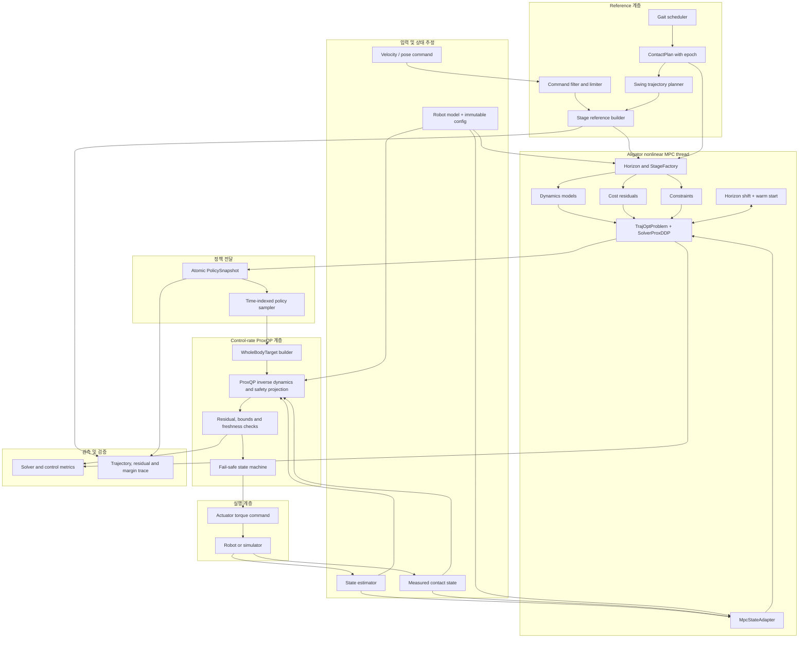

# Aligator + ProxSuite 기반 Humanoid MPC 구현 가이드

> 목적: 이 문서와 [ALGORITHM_ANALYSIS.md](ALGORITHM_ANALYSIS.md)를 입력으로 사용해, 사람 또는 AI coding assistant가 현재 workspace의 humanoid MPC를 다른 framework에 재구현할 수 있게 한다.  
> 기준 구현: `wb_humanoid_mpc` commit `d6a0be7799b06ad06d47c34e2f99d389d80591d7`  
> 대상 최적화 stack: Aligator 0.19 계열의 stage-wise trajectory optimization + ProxSuite/ProxQP 기반 저수준 QP  
> API 확인 기준: Aligator 0.19.1 및 Simple-Robotics 공식 예제의 2026-10-02 시점 source. 실제 framework에서는 의존성 commit을 먼저 고정해야 한다.

## 1. 이 문서의 사용법

이 문서는 수학 설명서가 아니라 구현 명세서다. 원본 알고리즘의 상세 수식과 실제 구현상 결함은 [ALGORITHM_ANALYSIS.md](ALGORITHM_ANALYSIS.md)를 먼저 읽고, 여기서는 다음 순서로 작업한다.

1. [어느 formulation을 먼저 구현할지](#23-formulation-순서-결정) 정한다. 이 문서의 기본값은 Track A(WB acceleration 먼저)다.
2. [상태·입력·frame 계약](#4-보존해야-하는-데이터-계약)을 framework의 타입으로 고정한다.
3. [전체 블록 다이어그램](#3-권장-전체-블록-다이어그램)에 맞춰 module과 thread 소유권을 만든다.
4. 첫 formulation의 vertical slice를 구현하고 독립 oracle test를 통과시킨다.
5. Aligator horizon shift와 warm start를 붙인다.
6. ProxQP 기반 whole-body inverse-dynamics/safety projection을 붙인다.
7. 그 뒤에만 두 번째 formulation을 추가한다.

AI coding assistant에는 한 번에 전체 구현을 맡기지 말고, [14. 구현 단계](#14-구현-단계와-완료-조건)의 한 단계와 acceptance criteria만 제공한다. 각 단계에서 source reference, 차원, frame, sign convention을 test로 닫은 뒤 다음 단계로 넘어간다.

## 2. 가장 중요한 solver 구성 결정

### 2.1 권장 구성

권장 구조는 다음 두 최적화 계층을 분리하는 것이다.

- **Aligator / `SolverProxDDP`**: nonlinear finite-horizon MPC. Contact schedule, dynamics, tracking cost, nonlinear equality/inequality를 stage별로 처리한다.
- **ProxSuite / ProxQP**: 매 control tick의 whole-body inverse dynamics와 safety projection. MPC target을 rigid-body dynamics, contact, torque/joint bound 안으로 투영해 actuator torque를 만든다.

이 분리는 Aligator를 사용하는 공식 locomotion 구현인 Simple-MPC와도 일치한다. Simple-MPC는 Aligator로 receding-horizon 문제를 풀고([mpc.cpp:189-217](https://github.com/Simple-Robotics/simple-mpc/blob/c9fd044a56605f671ac3ad1cc68a91a0ccd2ae07/src/mpc.cpp#L189-L217)), 별도 inverse-dynamics 계층은 TSID formulation 위에 ProxQP solver를 얹어 구성한다([kinodynamics-id.cpp:7-14](https://github.com/Simple-Robotics/simple-mpc/blob/c9fd044a56605f671ac3ad1cc68a91a0ccd2ae07/src/inverse-dynamics/kinodynamics-id.cpp#L7-L14)).

### 2.2 피해야 할 오해

`SolverProxDDP`의 “Prox”와 ProxQP는 같은 API 계층이 아니다. Aligator의 ProxDDP는 구조화된 constrained trajectory optimizer이고, ProxQP는

$$
\min_z \frac{1}{2}z^\top H z + g^\top z
\quad\text{s.t.}\quad
A z=b,\qquad l\le Cz\le u
$$

형태의 QP solver다. 따라서 ProxQP를 `SolverProxDDP`의 내부 backend로 단순 지정할 수 있다고 가정하면 안 된다. Aligator의 공식 `StageModel`은 state/control manifold, dynamics, cost, constraint를 소유하고 자체 linear-quadratic solver 경로를 사용한다([StageModel API](https://github.com/Simple-Robotics/aligator/blob/1396c9c6187f7e78085c77da4dfaf5089da5fddb/include/aligator/core/stage-model.hpp#L16-L49)).

원본 OCS2의 “multiple-shooting SQP 1회 + HPIPM QP”를 solver 수준까지 그대로 재현해야 한다면 별도 SQP transcription을 작성해 ProxQP에 전달해야 한다. 이 경우 Aligator는 dynamics/cost derivative frontend로 제한되거나 아예 중복 계층이 된다. 본 문서는 **Aligator-native NMPC + ProxQP low-level QP**를 기본 경로로 한다.

### 2.3 formulation 순서 결정

원본의 두 formulation은 Aligator에서 구현 비용이 크게 다르다. 원본에서는 CppAD가 두 경우 모두 Jacobian을 자동으로 만들어 주지만, Aligator에는 그 계층이 없어 내장 모델이 없는 쪽은 미분까지 직접 작성해야 한다.

| 원본 formulation | Aligator 대응물 | 직접 작성해야 하는 것 |
|---|---|---|
| WB acceleration: $x=[q,\nu]$, $u=[W_L,W_R,\ddot q_j]$ | `KinodynamicsFwdDynamics`. 상태 $(q,v)$, 입력 [접촉력, joint 가속도], base 가속도는 centroidal momentum 법칙으로 계산하며 `dForward`로 해석적 미분을 제공한다([kinodynamics-fwd.hpp:17-67](https://github.com/Simple-Robotics/aligator/blob/1396c9c6187f7e78085c77da4dfaf5089da5fddb/include/aligator/modelling/dynamics/kinodynamics-fwd.hpp#L17-L67)) | 원본 고유의 residual: acceleration-level stance stabilizer, swing vertical tracking, 18D foot cost, epsilon이 들어간 friction 식 |
| Centroidal: $x=[\bar h,q]\in\mathbb{R}^{35}$, $u=[W_L,W_R,\dot q_j]$ | 없음. 내장 `CentroidalFwdDynamics`는 9D 상태다 | dynamics 전체와 그 Jacobian. 특히 $\nu_b=A_b(q)^{-1}(m\bar h-A_j(q)\dot q_j)$의 $q$ 미분. 발 속도가 입력에 의존하므로 kinematic residual도 모두 $(x,u)$ 함수로 새로 작성 |

Simple-MPC의 kinodynamics OCP가 첫 번째 행의 사용 예다. `MultibodyPhaseSpace`, `KinodynamicsFwdDynamics`, `IntegratorSemiImplEuler`로 stage를 만들고 wrench cone은 `NegativeOrthant`, stance 발 속도는 `EqualityConstraint`로 연결한다([kinodynamics.cpp:46-89](https://github.com/Simple-Robotics/simple-mpc/blob/c9fd044a56605f671ac3ad1cc68a91a0ccd2ae07/src/kinodynamics.cpp#L46-L89), [kinodynamics.cpp:106-121](https://github.com/Simple-Robotics/simple-mpc/blob/c9fd044a56605f671ac3ad1cc68a91a0ccd2ae07/src/kinodynamics.cpp#L106-L121)).

Centroidal momentum 법칙으로 base 가속도를 구하는 것은 floating-base EOM의 unactuated 6개 행을 푸는 것과 같은 방정식이다. 따라서 `KinodynamicsFwdDynamics`를 쓰면 원본 WB의 base coupling 결함을 따로 고칠 필요가 없다. 이 동등성은 가정하지 말고 Phase 2에서 full $M_{bb}$ solve와 비교하는 test로 확인한다.

두 track 중 하나를 고른다.

- **Track A (기본값): WB acceleration을 먼저 구현한다.** `KinodynamicsFwdDynamics`를 사용한다. 목표가 Aligator 위에서 동작하는 humanoid MPC라면 이 경로가 가장 짧다. 35D centroidal은 필요할 때 Phase 7에서 추가한다.
- **Track B: 35D centroidal을 먼저 구현한다.** 원본 centroidal의 상태·입력 layout과 weight를 그대로 유지한 비교가 목적일 때만 선택한다. Phase 2에서 dynamics와 Jacobian을 직접 작성하는 비용을 먼저 치른다.

Track A에서 원본과 달라지는 점은 `CompatibilityDeviation`으로 기록한다.

- Base 표현이 ZYX Euler가 아니라 free-flyer quaternion이다. $n_q=30$, $n_v=29$이고 tangent 차원은 원본과 같은 58이다.
- Pinocchio free-flyer의 base velocity는 body frame의 선속도와 각속도다. 원본은 world frame 선속도와 Euler angle derivative이므로 $Q$의 base velocity weight와 velocity reference를 변환해야 한다.
- 적분기는 semi-implicit Euler 또는 RK2다([6.2](#62-dynamics-interface와-적분기)).

입력 layout은 달라지지 않는다. `KinodynamicsFwdDynamics`의 입력은 [contact별 힘, joint 가속도] 순서이고 차원은 $(n_v-6)+n_c\cdot$`force_size`이므로, contact frame id를 `{left, right}`로 넘기고 `force_size=6`을 쓰면 원본의 $[W_L,W_R,\ddot q_j]\in\mathbb{R}^{35}$와 같다([kinodynamics-fwd.hxx:19-29](https://github.com/Simple-Robotics/aligator/blob/1396c9c6187f7e78085c77da4dfaf5089da5fddb/include/aligator/modelling/dynamics/kinodynamics-fwd.hxx#L19-L29), [kinodynamics-fwd.hxx:45-65](https://github.com/Simple-Robotics/aligator/blob/1396c9c6187f7e78085c77da4dfaf5089da5fddb/include/aligator/modelling/dynamics/kinodynamics-fwd.hxx#L45-L65)).

원본과 같은 ZYX Euler base를 유지하려면 Translation + SphericalZYX composite joint로 만든 Pinocchio model을 `MultibodyPhaseSpace`에 넘기는 방법이 있다. 이 조합에서 `KinodynamicsFwdDynamics`가 올바르게 동작하는지는 확인하지 않았으므로 선택한다면 Phase 2의 test로 먼저 검증한다.

## 3. 권장 전체 블록 다이어그램



### 3.1 thread와 주기

| 실행 주체 | 권장 주기 | 책임 | deadline 초과 시 |
|---|---:|---|---|
| Estimator | sensor/control rate | timestamped robot state 생성 | invalid observation 발행 |
| Reference manager | 50–200 Hz | command, gait, swing, stage reference | 마지막 유효 reference 유지 또는 stop gait |
| Aligator MPC | Centroidal 80 Hz / WB 60 Hz부터 시작 | horizon shift, bounded solve, policy publish | 새 policy publish 금지 |
| ProxQP WBC | actuator/control rate | inverse dynamics, bounds, torque 출력 | 즉시 fail-safe |
| Simulator | physics rate | plant integration | controller와 독립 시간축 유지 |

원본 설정은 centroidal 80 Hz, WB 60 Hz MPC이며 각각 horizon 1.2 s/1.1 s다([centroidal task.info:79-120](https://github.com/manumerous/wb_humanoid_mpc/blob/d6a0be7799b06ad06d47c34e2f99d389d80591d7/robot_models/unitree_g1/g1_centroidal_mpc/config/mpc/task.info#L79-L120), [WB task.info:76-117](https://github.com/manumerous/wb_humanoid_mpc/blob/d6a0be7799b06ad06d47c34e2f99d389d80591d7/robot_models/unitree_g1/g1_wb_mpc/config/mpc/task.info#L76-L117)). 이 값은 시작점이지 새 framework의 실시간 성능을 증명하지 않는다.

## 4. 보존해야 하는 데이터 계약

### 4.1 공통 frame과 wrench 계약

- Contact 순서는 항상 `{left, right}`로 고정하고 이름→index mapping을 시작 시 검증한다.
- Wrench 순서는 `[Fx,Fy,Fz,Mx,My,Mz]`다([Types.h:84-102](https://github.com/manumerous/wb_humanoid_mpc/blob/d6a0be7799b06ad06d47c34e2f99d389d80591d7/humanoid_nmpc/humanoid_common_mpc/include/humanoid_common_mpc/common/Types.h#L84-L102)).
- 원본의 base translation은 world frame, orientation은 ZYX Euler angle이다. Track B는 이를 그대로 쓰고, Track A는 free-flyer quaternion으로 바꾸되 변환 함수를 한곳에 둔다.
- 원본의 base linear velocity는 world frame이고, angular velocity는 local 측정값을 ZYX Euler derivative로 변환한 값이다. Track A에서는 Pinocchio free-flyer 규약(body frame 선속도·각속도)을 쓴다.
- End-effector Jacobian과 wrench가 같은 `LOCAL_WORLD_ALIGNED` convention인지 test로 확인한다.
- `ContactPlan`의 contact pose, surface normal, friction frame은 하나의 provenance를 가져야 한다. Frame을 묵시적으로 identity로 두지 않는다.

### 4.2 framework용 최소 타입

아래 이름은 예시지만 필드는 생략하지 않는 편이 좋다.

```cpp
struct MeasuredRobotState {
  TimePoint stamp;
  uint64_t sequence;
  uint64_t model_epoch;
  Vector q_full;
  Vector v_full;
  std::array<bool, 2> contacts;
  bool valid;
};

struct ContactPlan {
  uint64_t plan_id;
  uint64_t epoch;
  std::vector<StageContactMode> stages;
  std::vector<ContactPose> contact_poses;
  std::vector<SurfaceFrame> surfaces;
};

struct PolicySnapshot {
  TimePoint observation_stamp;
  TimePoint publish_stamp;
  uint64_t observation_sequence;
  uint64_t plan_id;
  uint64_t model_epoch;
  std::vector<Vector> xs;
  std::vector<Vector> us;
  std::vector<Matrix> feedback_gains;
  SolverStatus status;
  ResidualSummary residuals;
};
```

`PolicySnapshot`은 payload와 provenance를 하나의 immutable object로 publish한다. `xs`, `us`, sequence, contact plan을 서로 다른 atomic/mailbox에서 읽어 조합하지 않는다.

### 4.3 상태와 입력 layout

Centroidal parity model:

$$
x_c=[\bar h_l,\bar h_a,p_B,\theta_{ZYX},q_j]\in\mathbb{R}^{35},
\qquad
u_c=[W_L,W_R,\dot q_j]\in\mathbb{R}^{35}.
$$

WB parity model:

$$
x_w=[q,\nu]\in\mathbb{R}^{58},
\qquad
u_w=[W_L,W_R,\ddot q_j]\in\mathbb{R}^{35}.
$$

원본 accessor는 [CentroidalMpcRobotModel.h:51-147](https://github.com/manumerous/wb_humanoid_mpc/blob/d6a0be7799b06ad06d47c34e2f99d389d80591d7/humanoid_nmpc/humanoid_centroidal_mpc/include/humanoid_centroidal_mpc/common/CentroidalMpcRobotModel.h#L51-L147)와 [WBAccelMpcRobotModel.h:47-159](https://github.com/manumerous/wb_humanoid_mpc/blob/d6a0be7799b06ad06d47c34e2f99d389d80591d7/humanoid_nmpc/humanoid_wb_mpc/include/humanoid_wb_mpc/common/WBAccelMpcRobotModel.h#L47-L159)에 있다. 새 구현에서는 raw `segment()` 호출을 퍼뜨리지 말고 `CentroidalLayout`, `WbLayout` 하나에 모든 offset과 dimension을 모은다.

Track A의 WB 상태는 `MultibodyPhaseSpace` 위의 $(q,v)$이며 $q\in\mathbb{R}^{30}$(quaternion 포함), $v\in\mathbb{R}^{29}$이다. 원본 58D 벡터와 원소 단위로 대응하지 않으므로, 원본 $Q$, $Q_f$의 base 항은 `WbLayout`의 변환을 거쳐 옮기고 one-hot weight test로 확인한다.

## 5. 추천 package와 file 구조

framework의 기존 naming에 맞게 바꾸되 의존 방향은 유지한다.

```text
humanoid_mpc/
├── model/
│   ├── robot_model.{hpp,cpp}
│   ├── joint_index_map.{hpp,cpp}
│   ├── centroidal_layout.hpp
│   ├── wb_layout.hpp
│   └── frame_conventions.hpp
├── reference/
│   ├── command_filter.{hpp,cpp}
│   ├── gait_scheduler.{hpp,cpp}
│   ├── swing_trajectory.{hpp,cpp}
│   ├── contact_plan.hpp
│   └── stage_reference_builder.{hpp,cpp}
├── ocp/
│   ├── centroidal_dynamics.{hpp,cpp}
│   ├── wb_accel_dynamics.{hpp,cpp}
│   ├── residuals/
│   ├── constraints/
│   ├── stage_factory.{hpp,cpp}
│   └── horizon_manager.{hpp,cpp}
├── solver/
│   ├── aligator_mpc.{hpp,cpp}
│   ├── policy_snapshot.hpp
│   └── solver_metrics.hpp
├── whole_body_control/
│   ├── inverse_dynamics_qp.{hpp,cpp}
│   ├── proxqp_adapter.{hpp,cpp}
│   ├── task_builder.{hpp,cpp}
│   └── safety_checker.{hpp,cpp}
├── runtime/
│   ├── mpc_worker.{hpp,cpp}
│   ├── controller.{hpp,cpp}
│   └── fail_safe.{hpp,cpp}
├── config/
└── test/
    ├── unit/
    ├── golden/
    ├── integration/
    └── realtime/
```

## 6. Aligator OCP 구성

### 6.1 stage 구성

각 grid point `k`에서 다음 구조를 만든다.

```cpp
// 구조를 설명하기 위한 pseudocode. 설치된 Aligator 버전에 맞춰 API를 조정한다.
CostStack cost(state_space, nu);
cost.addCost("state", state_tracking_cost);
cost.addCost("input", input_tracking_cost);
cost.addCost("foot", swing_or_stance_foot_cost);

DiscreteDynamics dynamics = makeDynamics(mode[k], dt);
StageModel stage(cost, dynamics);
addModeDependentConstraints(stage, mode[k], reference[k]);
```

Aligator 0.19의 `StageModel`은 cost, explicit dynamics, constraint stack을 함께 소유하며 `addConstraint(function, constraint_set)`을 제공한다([stage-model.hpp:23-49](https://github.com/Simple-Robotics/aligator/blob/1396c9c6187f7e78085c77da4dfaf5089da5fddb/include/aligator/core/stage-model.hpp#L23-L49), [stage-model.hpp:104-118](https://github.com/Simple-Robotics/aligator/blob/1396c9c6187f7e78085c77da4dfaf5089da5fddb/include/aligator/core/stage-model.hpp#L104-L118)). `StageConstraint` wrapper는 0.9.0에서 deprecated 되었고([changelog 0.9.0](https://github.com/Simple-Robotics/aligator/blob/1396c9c6187f7e78085c77da4dfaf5089da5fddb/CHANGELOG.md#090---2024-10-11)) 0.17.0에서 제거되었으므로([changelog 0.17.0](https://github.com/Simple-Robotics/aligator/blob/1396c9c6187f7e78085c77da4dfaf5089da5fddb/CHANGELOG.md#0170---2025-11-21)), 이를 쓰는 오래된 예제 코드는 0.19에서 컴파일되지 않는다.

### 6.2 dynamics interface와 적분기

**Track A (WB acceleration).** `KinodynamicsFwdDynamics`를 그대로 사용한다. 생성자는 state space, Pinocchio model, gravity, stage별 contact state, contact frame id, force size(6)를 받는다. Stage마다 contact state가 다른 dynamics 객체를 만들면 inactive contact의 힘은 동역학에 들어가지 않는다([kinodynamics-fwd.hxx:61-65](https://github.com/Simple-Robotics/aligator/blob/1396c9c6187f7e78085c77da4dfaf5089da5fddb/include/aligator/modelling/dynamics/kinodynamics-fwd.hxx#L61-L65)). 원본 계산식을 직접 옮겨야 하는 경우의 주의점은 [12](#12-wb-acceleration-mpc)에 있다.

**Track B (35D centroidal).** Continuous dynamics를 원본과 동일하게 직접 구현한다.

$$
\nu_b=A_b^{-1}(m\bar h-A_j\dot q_j),
$$

$$
\dot{\bar h}_l=g+\frac{1}{m}\sum_i f_i,
\qquad
\dot{\bar h}_a=\frac{1}{m}\sum_i\left((p_i-p_{COM})\times f_i+\tau_i\right),
$$

$$
\dot x_c=[\dot{\bar h}_l,\dot{\bar h}_a,\nu_b,\dot q_j].
$$

원본 wrapper와 pinned OCS2 수식은 [CentroidalDynamicsAD.cpp:38-64](https://github.com/manumerous/wb_humanoid_mpc/blob/d6a0be7799b06ad06d47c34e2f99d389d80591d7/humanoid_nmpc/humanoid_centroidal_mpc/src/dynamics/CentroidalDynamicsAD.cpp#L38-L64)와 [PinocchioCentroidalDynamicsAD.cpp:75-115](https://github.com/manumerous/ocs2_ros2/blob/34e12ef568791780c212253f97b95c4f90b20c4a/ocs2_pinocchio/ocs2_centroidal_model/src/PinocchioCentroidalDynamicsAD.cpp#L75-L115)에 있다.

이 dynamics의 Jacobian에는 $\partial\nu_b/\partial q=-A_b^{-1}\,\partial(A\nu)/\partial q$가 필요하다. Pinocchio의 centroidal dynamics derivative가 $\partial h/\partial q$를 제공하므로 이를 출발점으로 삼을 수 있지만, composite Euler base에서의 결과는 finite difference oracle로 반드시 확인한다.

**적분기 (두 track 공통).** Aligator 0.19.1 기본 continuous integrator 목록에는 Euler, midpoint, semi-implicit Euler, RK2가 있으며 RK4는 없다. 따라서 두 선택을 명시적으로 기록한다.

- **Parity 선택**: custom RK4 `ExplicitDynamicsModel`을 작성하고 value/Jacobian test를 만든다.
- **초기 vertical slice 선택**: RK2(Track A에서는 Simple-MPC와 같은 semi-implicit Euler도 가능)로 시작하되 원본 RK4와 rollout 오차를 수치 비교하고 이 변경을 승인된 deviation으로 기록한다.

Simple-MPC의 centroidal 예시는 `CostStack + CentroidalFwdDynamics + IntegratorEuler + StageModel` 패턴을 보여 준다([centroidal-dynamics.cpp:39-105](https://github.com/Simple-Robotics/simple-mpc/blob/c9fd044a56605f671ac3ad1cc68a91a0ccd2ae07/src/centroidal-dynamics.cpp#L39-L105)). 그러나 그 예시의 state는 9D이고 이 workspace는 joint configuration까지 포함한 35D이므로 그대로 복사하면 안 된다.

### 6.3 derivative 정책

구현 순서는 다음을 권장한다.

1. value-only dynamics/residual을 작성한다.
2. central finite difference로 독립 Jacobian oracle을 만든다.
3. Pinocchio analytical derivative 또는 framework AD로 production Jacobian을 작성한다.
4. random valid state 100개 이상에서 absolute/relative tolerance를 검사한다.
5. allocation과 계산시간을 측정한 뒤 production 경로에서 finite difference를 제거한다.

CppAD code-generation을 그대로 이식할 필요는 없다. 보존해야 하는 것은 derivative의 수학적 의미와 frame convention이다. 원본 CppAD 사용 경로는 [PinocchioEndEffectorDynamicsCppAd.cpp:54-201](https://github.com/manumerous/wb_humanoid_mpc/blob/d6a0be7799b06ad06d47c34e2f99d389d80591d7/humanoid_nmpc/humanoid_wb_mpc/src/end_effector/PinocchioEndEffectorDynamicsCppAd.cpp#L54-L201)을 참고한다.

## 7. 비용함수 mapping

| 원본 항 | 새 Aligator 구성 | 초기 구현 방침 | 원본 reference |
|---|---|---|---|
| State tracking | `QuadraticStateCost` 또는 custom state residual | 원본 Q와 layout 그대로 | [StateInputQuadraticCost.cpp:67-77](https://github.com/manumerous/wb_humanoid_mpc/blob/d6a0be7799b06ad06d47c34e2f99d389d80591d7/humanoid_nmpc/humanoid_common_mpc/src/cost/StateInputQuadraticCost.cpp#L67-L77) |
| Input tracking | `QuadraticControlCost` | stance 발에 `mg/n_contact` wrench reference | [DynamicsHelperFunctions.h:60-75](https://github.com/manumerous/wb_humanoid_mpc/blob/d6a0be7799b06ad06d47c34e2f99d389d80591d7/humanoid_nmpc/humanoid_common_mpc/include/humanoid_common_mpc/pinocchio_model/DynamicsHelperFunctions.h#L60-L75) |
| Swing foot | custom `StageFunction` + `QuadraticResidualCost` | reference/frame/impact scaling을 명시 | [CentroidalMpcEndEffectorFootCost.cpp:90-144](https://github.com/manumerous/wb_humanoid_mpc/blob/d6a0be7799b06ad06d47c34e2f99d389d80591d7/humanoid_nmpc/humanoid_centroidal_mpc/src/cost/CentroidalMpcEndEffectorFootCost.cpp#L90-L144) |
| Torso task | Pinocchio frame residual | `mid360` pose/twist 추종 | [CentroidalMpcInterface.cpp:318-348](https://github.com/manumerous/wb_humanoid_mpc/blob/d6a0be7799b06ad06d47c34e2f99d389d80591d7/humanoid_nmpc/humanoid_centroidal_mpc/src/CentroidalMpcInterface.cpp#L318-L348) |
| External torque | custom residual `select(J^T W)` | 반대 발 contact proximity 포함 | [ExternalTorqueQuadraticCostAD.cpp:87-134](https://github.com/manumerous/wb_humanoid_mpc/blob/d6a0be7799b06ad06d47c34e2f99d389d80591d7/humanoid_nmpc/humanoid_common_mpc/src/cost/ExternalTorqueQuadraticCostAD.cpp#L87-L134) |
| WB swing dynamics | 18D custom residual | field 대입은 올바르게 하되 baseline weight는 원본의 실효값 사용(아래 참조) | [EndEffectorDynamicsFootCost.cpp:91-151](https://github.com/manumerous/wb_humanoid_mpc/blob/d6a0be7799b06ad06d47c34e2f99d389d80591d7/humanoid_nmpc/humanoid_wb_mpc/src/cost/EndEffectorDynamicsFootCost.cpp#L91-L151) |

Aligator `QuadraticResidualCost`는 residual에 대한 quadratic cost를 구성한다. 원본도 Gauss-Newton residual을 사용하므로 mapping은 자연스럽지만 다음 scaling을 test해야 한다.

- weight matrix를 넣는지 square-root weight residual을 넣는지 중복 적용하지 않는다.
- 원본 cost의 `1/2` convention과 Aligator convention을 단일 scalar fixture로 비교한다.
- WB impact proximity는 residual 전체에 곱해져 cost에 제곱으로 반영된다.
- Terminal cost는 running reference manager의 arm-swing offset과 다른 raw target semantics를 갖는다. 동일하게 보존할지 수정할지 결정한다.

WB foot cost의 baseline weight는 설정 파일 값이 아니라 원본이 실제로 사용하던 값으로 둔다. 원본 loader가 acceleration weight를 velocity field에 덮어쓰기 때문에, 지금까지 동작이 확인된 조합은 아래의 실효값이다([ALGORITHM_ANALYSIS.md 5.4](ALGORITHM_ANALYSIS.md#54-비용함수와-실제-swing-foot-weight)).

| residual | 설정 파일 값 | baseline으로 쓸 실효값 |
|---|---:|---:|
| linear velocity | `[50,50,0]` | `[5,5,0]` |
| angular velocity | `[100,100,100]` | `[2,2,2]` |
| linear acceleration | `[5,5,0]` | `[0.01,0.01,0.01]` |
| angular acceleration | `[2,2,2]` | `[0.01,0.01,0.01]` |

새 구현의 loader는 각 field에 올바르게 대입하고, config에는 실효값을 명시적으로 적는다. 설정 파일에 적혀 있던 값은 한 번도 실행된 적 없는 조합이므로 baseline이 안정된 뒤 별도 튜닝 실험으로 다룬다.

`ICP` 항은 현재 weight 0이고 표준 capture point가 아니므로 첫 구현에서는 제외하고 config validation에서 0임을 assert한다([ICPCost.cpp:88-117](https://github.com/manumerous/wb_humanoid_mpc/blob/d6a0be7799b06ad06d47c34e2f99d389d80591d7/humanoid_nmpc/humanoid_centroidal_mpc/src/cost/ICPCost.cpp#L88-L117), [centroidal task.info:308-311](https://github.com/manumerous/wb_humanoid_mpc/blob/d6a0be7799b06ad06d47c34e2f99d389d80591d7/robot_models/unitree_g1/g1_centroidal_mpc/config/mpc/task.info#L308-L311)).

## 8. constraint mapping

Aligator `NegativeOrthant`는 residual `c(x,u) <= 0`을 뜻한다([negative-orthant.hpp:7-17](https://github.com/Simple-Robotics/aligator/blob/1396c9c6187f7e78085c77da4dfaf5089da5fddb/include/aligator/modelling/constraints/negative-orthant.hpp#L7-L17)). 따라서 원본의 `h(x,u) >= 0` constraint는 반드시 `c=-h`로 넘긴다. 이 부호는 friction/CoP fixture에서 경계 안·밖을 각각 검사한다.

| phase | 원본 constraint | Aligator 표현 | 비고 |
|---|---|---|---|
| Swing | `W_i = 0` | Equality set, 또는 dynamics의 contact masking(아래 참조) | 6D |
| Swing centroidal | vertical velocity stabilizer = 0 | Equality set | z trajectory parameter 필요 |
| Stance centroidal | stabilized 6D foot twist = 0 | Equality set | x/y position hold 없음 |
| Swing WB | stabilized vertical acceleration = 0 | Equality set | z, zdot, zddot 필요 |
| Stance WB | stabilized 6D acceleration = 0 | Equality set | pose/twist/acceleration residual |
| Stance | friction cone | custom inequality 또는 built-in cone | 원본 epsilon/grip까지 맞추려면 custom |
| Stance | contact moment rectangle | custom inequality | torsional moment bound 없음 |
| All | joint position limit | hard box 또는 relaxed barrier | actuator 안전상 low-level QP에도 hard bound |
| Non-double-stance | foot/knee collision | nonlinear inequality | 원본은 double stance에서 비활성 |

Stage dimension checklist는 다음과 같다.

- Centroidal/WB 모두 swing 발 하나당 equality 7개: zero wrench 6 + vertical tracking 1. Zero wrench를 contact masking으로 대체하면 1개다.
- Centroidal/WB 모두 stance 발 하나당 kinematic equality 6개.
- Stance 발 하나당 원본 contact inequality는 friction 1 + contact moment 4개다.
- Joint-position bound는 23개 joint의 lower/upper bound를 표현한다.
- 원본 collision residual은 16개 pair다.

Joint/collision을 relaxed cost로 옮기면 Aligator constraint dimension에는 포함되지 않는다. `StageFactory` unit test는 mode별 **hard constraint dimension**과 **soft residual dimension**을 따로 검사해야 한다.

원본 centroidal stance/swing equality는 [CentroidalMpcInterface.cpp:243-264](https://github.com/manumerous/wb_humanoid_mpc/blob/d6a0be7799b06ad06d47c34e2f99d389d80591d7/humanoid_nmpc/humanoid_centroidal_mpc/src/CentroidalMpcInterface.cpp#L243-L264), WB equality는 [WBMpcInterface.cpp:205-229](https://github.com/manumerous/wb_humanoid_mpc/blob/d6a0be7799b06ad06d47c34e2f99d389d80591d7/humanoid_nmpc/humanoid_wb_mpc/src/WBMpcInterface.cpp#L205-L229)에 등록된다.

Equality의 처리 방식은 원본과 다르다. OCS2는 `projectStateInputEqualityConstraints`로 state-input equality를 QP 단계에서 정확히 소거하므로 SQP 1회 뒤에도 선형화된 equality가 만족된다. ProxDDP는 equality를 augmented Lagrangian으로 다루므로 online에서 쓰는 2–5 iteration으로는 잔차가 남는다. 따라서 다음을 지킨다.

- Swing 발의 `W_i = 0`은 equality 6개로 넣는 대신 dynamics에서 마스킹하는 쪽을 우선한다. `KinodynamicsFwdDynamics`는 stage별 contact state로 inactive contact의 힘을 무시하고, Simple-MPC도 이 방식을 쓴다. 마스킹된 입력 성분은 control cost로 0 근처에 묶는다. 이 경우 swing 발 equality는 vertical tracking 1개만 남는다.
- 남은 equality의 잔차를 iteration 수별로 계측하고 허용 기준을 정한다. Solver의 수렴 여부만으로 판단하지 않는다.
- Stance 발 구속은 ProxQP 계층의 hard equality([11.2](#112-hard-equality))가 최종적으로 보장한다.

Friction 식을 그대로 보존하려면

$$
h_f=\mu_f(F_z+F_{grip})-\sqrt{F_x^2+F_y^2+\varepsilon}\ge0
$$

를 custom residual로 만든다([FrictionForceConeConstraint.cpp:70-84](https://github.com/manumerous/wb_humanoid_mpc/blob/d6a0be7799b06ad06d47c34e2f99d389d80591d7/humanoid_nmpc/humanoid_common_mpc/src/constraint/FrictionForceConeConstraint.cpp#L70-L84)). Aligator built-in centroidal wrench cone을 쓰면 구현량은 줄지만 epsilon, grip, sign, foot rectangle convention이 같은지 먼저 확인해야 한다. 공식 예시는 contact stage에 wrench/friction residual과 `NegativeOrthant`를 연결한다([centroidal-dynamics.cpp:85-103](https://github.com/Simple-Robotics/simple-mpc/blob/c9fd044a56605f671ac3ad1cc68a91a0ccd2ae07/src/centroidal-dynamics.cpp#L85-L103)).

원본 barrier와 똑같은 soft constraint가 필요하면 relaxed log-barrier cost를 사용한다. 안전에 직접 관련된 normal force, friction pyramid, torque/joint bound는 NMPC에서 soft이더라도 ProxQP 계층에서는 hard constraint로 다시 적용한다.

## 9. contact schedule, reference, swing trajectory

### 9.1 stage parameter의 단일 source

각 stage는 다음 immutable parameter bundle 하나를 참조해야 한다.

```cpp
struct StageReference {
  double time;
  ContactMode mode;
  std::array<SE3, 2> foot_pose;
  std::array<Motion, 2> foot_twist;
  std::array<Motion, 2> foot_acceleration;
  std::array<Wrench, 2> wrench_reference;
  Vector state_reference;
  SurfaceFrame terrain;
  double impact_proximity;
  uint64_t plan_id;
};
```

Dynamics, cost, equality, friction이 서로 다른 contact state나 terrain frame을 읽지 않게 한다. Reference update 중 solver가 half-updated stage를 보지 않도록 새 horizon을 완성한 뒤 pointer swap한다.

### 9.2 원본 동작

- Velocity command를 현재 yaw로 world frame에 회전한다.
- horizon 70% intermediate와 terminal pose를 평균속도로 적분한다.
- gait schedule에서 contact mode를 생성한다.
- swing z는 두 개의 cubic Hermite 구간으로 만든다.
- running state에 phase 기반 arm swing을 추가한다.

관련 구현은 [TargetTrajectoriesCalculatorBase.cpp:114-145](https://github.com/manumerous/wb_humanoid_mpc/blob/d6a0be7799b06ad06d47c34e2f99d389d80591d7/humanoid_nmpc/humanoid_common_mpc/src/command/TargetTrajectoriesCalculatorBase.cpp#L114-L145), [ProceduralMpcMotionManager.cpp:119-159](https://github.com/manumerous/wb_humanoid_mpc/blob/d6a0be7799b06ad06d47c34e2f99d389d80591d7/humanoid_nmpc/humanoid_common_mpc/src/reference_manager/ProceduralMpcMotionManager.cpp#L119-L159), [SwingTrajectoryPlanner.cpp:87-190](https://github.com/manumerous/wb_humanoid_mpc/blob/d6a0be7799b06ad06d47c34e2f99d389d80591d7/humanoid_nmpc/humanoid_common_mpc/src/swing_foot_planner/SwingTrajectoryPlanner.cpp#L87-L190)에 있다.

원본은 terrain height를 최종적으로 0으로 덮어쓴다([SwitchedModelReferenceManager.cpp:83-103](https://github.com/manumerous/wb_humanoid_mpc/blob/d6a0be7799b06ad06d47c34e2f99d389d80591d7/humanoid_nmpc/humanoid_common_mpc/src/reference_manager/SwitchedModelReferenceManager.cpp#L83-L103)). 첫 parity test에서는 flat ground를 사용하되 새 설계에서는 `SurfaceFrame`을 버리지 말고 이후 terrain-aware 확장이 가능하게 둔다.

## 10. receding horizon과 warm start

초기화 시에는 충분한 iteration으로 standing problem을 풀어 feasible warm start를 만든다. 온라인 tick은 다음 순서를 유지한다.

1. observation validity와 model/contact-plan epoch를 검사한다.
2. horizon의 첫 stage를 제거하고 마지막 stage를 새 schedule로 교체한다.
3. 이전 `xs`, `us`와 가능하면 dual을 한 칸 shift한다.
4. `x0`를 최신 measured state로 강제한다.
5. stage references와 terminal cost를 현재 plan에 맞게 갱신한다.
6. iteration 상한을 둔 채 solve하고 소요 시간을 측정한다.
7. residual과 freshness를 통과한 결과만 atomic publish한다.

Aligator 공식 MPC test는 `replaceStageCircular`, `cycleProblem`, terminal data 갱신, `setInitState`, 재실행의 순서를 보여 준다([mpc-cycle.cpp:183-200](https://github.com/Simple-Robotics/aligator/blob/1396c9c6187f7e78085c77da4dfaf5089da5fddb/tests/mpc-cycle.cpp#L183-L200)). Simple-MPC도 같은 방식으로 stage와 solver workspace를 함께 cycle한다([mpc.cpp:220-230](https://github.com/Simple-Robotics/simple-mpc/blob/c9fd044a56605f671ac3ad1cc68a91a0ccd2ae07/src/mpc.cpp#L220-L230)).

원본의 update당 SQP 1회와 Aligator iteration 1회는 같은 알고리즘적 의미가 아니다. 다음처럼 운영한다.

- 초기 standing solve: convergence 또는 넉넉한 offline iteration cap.
- 온라인 bring-up: 2–5 iteration으로 제한하고 residual/runtime을 수집.
- 안정화 후: 필요한 최소 iteration 수를 실측해 축소.
- deadline 초과: 현재 계산 중인 partial result가 아니라 직전의 **아직 fresh한** policy만 사용.

`SolverProxDDP`에는 wall-clock 시간 제한 옵션이 없고 반복 횟수 상한 `max_iters`만 있다([solver-proxddp.hpp:171-191](https://github.com/Simple-Robotics/aligator/blob/1396c9c6187f7e78085c77da4dfaf5089da5fddb/include/aligator/solvers/proxddp/solver-proxddp.hpp#L171-L191)). 따라서 solve 시간은 `max_iters`로 간접 제한하고, deadline은 MPC worker가 solve 종료 시각을 측정해 결과를 publish할지 버릴지 판정하는 방식으로 구현한다. Solve 도중에 중단시키는 것을 전제로 설계하지 않는다.

Online solve에 영향을 주는 solver 설정은 config로 노출하고 기록한다. Simple-MPC가 실제로 지정하는 항목은 다음과 같다([mpc.cpp:43-53](https://github.com/Simple-Robotics/simple-mpc/blob/c9fd044a56605f671ac3ad1cc68a91a0ccd2ae07/src/mpc.cpp#L43-L53), [mpc.cpp:91](https://github.com/Simple-Robotics/simple-mpc/blob/c9fd044a56605f671ac3ad1cc68a91a0ccd2ae07/src/mpc.cpp#L91)).

| 설정 | Simple-MPC의 값 | 의미 |
|---|---|---|
| 생성자 `tol`, `mu_init` | 설정 파일에서 주입 | 수렴 tolerance, augmented Lagrangian penalty 초기값 |
| `rollout_type_` | `RolloutType::LINEAR` | step 적용 시 linear rollout 사용 |
| `linear_solver_choice` | thread 수가 1보다 크면 `PARALLEL`, 아니면 `SERIAL` | LQ subproblem solver 선택 |
| `setNumThreads(n)` | 설정 파일에서 주입 | 병렬 thread 수 |
| `force_initial_condition_` | `true` | $x_0$를 측정 상태로 강제 |
| `max_iters` | 초기 solve 뒤 online 값으로 재설정 | Newton iteration 상한 |

Step acceptance 전략과 Hessian 근사도 생성자 인자로 정해지므로(기본값은 nonmonotone linesearch와 Gauss-Newton) 선택한 값을 함께 기록한다.

## 11. ProxQP whole-body inverse dynamics

### 11.1 QP 변수와 목적함수

Centroidal MPC 출력을 torque로 바꾸는 권장 QP 변수는

$$
z=[\ddot q,\tau_j,\lambda_L,\lambda_R,s]
$$

이다. 여기서 `s`는 명시적으로 허용한 task slack만 포함한다. 대표 목적함수는

$$
\frac12\|J_{task}\ddot q+\dot J_{task}\nu-a^*\|_{W_a}^2
+\frac12\|\lambda-\lambda^*\|_{W_\lambda}^2
+\frac12\|\tau-\tau_{ff}\|_{W_\tau}^2
+\frac12\|s\|_{W_s}^2.
$$

MPC에서 joint velocity만 제공하는 centroidal 경로는 control period로부터 bounded acceleration reference를 만들거나 posture PD task로 변환한다. WB MPC는 `q*`, `v*`, `qdd_j*`, `W*`를 직접 target으로 전달할 수 있다.

이 QP를 직접 조립하는 대신 TSID로 task와 contact를 정의하고 solver만 ProxQP로 두는 방법도 있다. Simple-MPC의 inverse-dynamics 계층이 이 구성이다([kinodynamics-id.cpp:7-14](https://github.com/Simple-Robotics/simple-mpc/blob/c9fd044a56605f671ac3ad1cc68a91a0ccd2ae07/src/inverse-dynamics/kinodynamics-id.cpp#L7-L14)). TSID 의존성을 받아들일 수 있으면 행렬 조립과 contact 처리 코드를 줄일 수 있고, 그렇지 않으면 아래 명세대로 직접 조립한다. 어느 쪽이든 [11.4](#114-proxqp-adapter-설계)의 interface 뒤에 둔다.

### 11.2 hard equality

Rigid-body dynamics:

$$
M(q)\ddot q+h(q,\nu)-S^\top\tau_j-J_c(q)^\top\lambda=0.
$$

Active contact acceleration:

$$
J_c\ddot q+\dot J_c\nu=a_c^*,
$$

여기서 `a_c*`에는 원본과 같은 Baumgarte/stabilization target을 줄 수 있다. Matrix를 직접 조립할 때 Pinocchio `crba()` 후 대칭 행렬을 완성하거나, 가능하면 RNEA/검증된 dynamics API를 사용한다. C++의 `crba()`는 upper triangle만 채우므로 joint 행의 base 열은 0으로 남는다. 원본 torque 복원이 이 상태의 행렬을 그대로 써서 $M_{jb}\ddot q_b$ 항을 잃었다([ALGORITHM_ANALYSIS.md 5.3](ALGORITHM_ANALYSIS.md#53-torque-복원)). Python 바인딩은 반환 전에 대칭화하므로 Python prototype에서는 이 문제가 드러나지 않는다는 점에 주의한다.

원본 centroidal controller는 inverse dynamics에 joint velocity 0과 joint acceleration 0을 넣는다([ALGORITHM_ANALYSIS.md 9](ALGORITHM_ANALYSIS.md#9-정책-평가-inverse-dynamics-actuator-출력)). 새 QP에는 측정 $\nu$ 전체를 넣고 acceleration은 QP 변수로 푼다.

### 11.3 hard inequality와 bounds

- `tau_min <= tau <= tau_max`
- one-step predicted joint position/velocity bound
- acceleration bound
- stance normal force `Fz_min <= Fz <= Fz_max`
- friction pyramid 또는 cone approximation
- CoP rectangle과 torsional moment bound
- 필요하면 torque-rate bound

원본 OCP에는 torque와 velocity/acceleration hard bound가 없으므로 새 ProxQP 계층이 실제 actuator feasibility의 마지막 방어선이다.

### 11.4 ProxQP adapter 설계

직접 ProxSuite type을 runtime 전역에 노출하지 말고 다음 interface 뒤에 둔다.

```cpp
class QpSolver {
 public:
  virtual void initialize(const QpStructure&) = 0;
  virtual QpResult solve(const QpNumerics&, const QpWarmStart&) = 0;
};

class ProxQpSolver final : public QpSolver {
  // installed ProxSuite version-specific dense/sparse QP object
};
```

ProxQP는 equality `Az=b`와 two-sided inequality `l<=Cz<=u`를 직접 지원한다. 공식 C++ API와 warm-start 설명은 [ProxSuite documentation](https://simple-robotics.github.io/proxsuite/md_doc_22-ProxQP__api.html), QP 형식은 [official repository](https://github.com/Simple-Robotics/proxsuite#proxqp)를 참조한다.

Contact mode마다 matrix sparsity와 dimension이 바뀌는 재할당을 control thread에서 하지 않는다. 두 가지 방법 중 하나를 선택한다.

- 4개 mode별 solver instance를 미리 만들고 mode별 warm-start cache를 둔다.
- 최대 contact dimension을 고정하고 inactive contact의 wrench를 equality zero로 묶는다.

매 solve마다 status뿐 아니라 primal residual, dual residual, dynamics residual, 최소 friction/CoP/torque margin, solve time을 반환한다. `OPTIMAL` assert로 process를 종료하지 말고 fail-safe state machine으로 전달한다.

## 12. WB acceleration MPC

Track A에서는 첫 formulation이고, Track B에서는 centroidal + ProxQP vertical slice가 닫힌 뒤 추가한다. 상태와 입력은 다음과 같다.

$$
x=[q,\nu],\qquad u=[W_L,W_R,\ddot q_j].
$$

구현해야 하는 동역학은

$$
\ddot q_b=M_{bb}^{-1}
\left(-h_b-M_{bj}\ddot q_j+\sum_iJ_{i,b}^\top W_i\right),
\qquad
\dot x=[\nu,\ddot q_b,\ddot q_j].
$$

이다. `KinodynamicsFwdDynamics`는 같은 base 가속도를 centroidal momentum 법칙으로 구하며, centroidal momentum matrix의 base 6×6 블록 전체를 분해해 푼다([kinodynamics-fwd.hxx:49-56](https://github.com/Simple-Robotics/aligator/blob/1396c9c6187f7e78085c77da4dfaf5089da5fddb/include/aligator/modelling/dynamics/kinodynamics-fwd.hxx#L49-L56)). 이 모델을 쓰면 아래 원본 결함은 구조적으로 생기지 않는다.

원본 코드는 translation 3×3과 angular 3×3을 따로 역행렬화해 두 블록 사이의 coupling을 버린다. 이것이 원본 WB OCP 동역학의 유일한 질량행렬 결함이다. 합성 상태 실험에서 base 가속도 오차의 중앙값이 0.7 m/s², 1.1 rad/s²였으므로([ALGORITHM_ANALYSIS.md 12.1](ALGORITHM_ANALYSIS.md#121-수치로-확인한-것)) 원본 rollout을 WB golden data로 쓸 수 없다. WB dynamics의 oracle은 원본이 아니라 Pinocchio RNEA로 계산한 full EOM 잔차다.

`KinodynamicsFwdDynamics`를 쓰지 않고 위 식을 직접 구현한다면 다음을 지킨다.

1. translation/angular 3×3을 따로 풀지 않고 full 6×6 $M_{bb}$를 분해해 푼다.
2. $M_{bj}$와 $M_{bb}$는 CRBA의 upper triangle에 있으므로 이 solve 자체는 대칭 복원 없이도 맞지만, 같은 행렬을 torque 복원 등 다른 계산에 재사용할 수 있도록 CRBA 직후 대칭 행렬로 완성해 둔다.

원본 계산 경로는 [WB DynamicsHelperFunctions.cpp:56-81](https://github.com/manumerous/wb_humanoid_mpc/blob/d6a0be7799b06ad06d47c34e2f99d389d80591d7/humanoid_nmpc/humanoid_wb_mpc/src/dynamics/DynamicsHelperFunctions.cpp#L56-L81), base block solve는 [common DynamicsHelperFunctions.cpp:196-217](https://github.com/manumerous/wb_humanoid_mpc/blob/d6a0be7799b06ad06d47c34e2f99d389d80591d7/humanoid_nmpc/humanoid_common_mpc/src/pinocchio_model/DynamicsHelperFunctions.cpp#L196-L217)에 있다.

원본의 stance 구속은 acceleration level이고 Simple-MPC의 kinodynamics OCP는 velocity level(`FrameVelocityResidual` equality)이다. Acceleration-level stabilizer를 유지하려면 frame acceleration을 $(x,u)$의 함수로 계산하는 residual과 그 Jacobian을 직접 작성해야 한다. 첫 vertical slice에서는 velocity-level 구속으로 시작하고 원본과 같은 stabilizer는 deviation으로 기록한 뒤 나중에 추가하는 순서를 권장한다.

Aligator의 `MultibodyConstraintFwdDynamics`로 torque-input full dynamics를 구성하는 방법도 있지만 이것은 상태·입력과 contact treatment가 달라지는 **새 알고리즘**이다. 원본 재현 단계와 섞지 말고 별도 design decision으로 다룬다. 공식 Aligator MPC test의 constrained multibody stage 예시는 [mpc-cycle.cpp:80-134](https://github.com/Simple-Robotics/aligator/blob/1396c9c6187f7e78085c77da4dfaf5089da5fddb/tests/mpc-cycle.cpp#L80-L134)에 있다.

WB foot cost는 각 weight를 올바른 field에 넣되 baseline 값은 [7](#7-비용함수-mapping)의 실효값을 쓴다. 원본 loader의 overwrite bug([EndEffectorDynamicsCostHelpers.cpp:101-110](https://github.com/manumerous/wb_humanoid_mpc/blob/d6a0be7799b06ad06d47c34e2f99d389d80591d7/humanoid_nmpc/humanoid_wb_mpc/src/cost/EndEffectorDynamicsCostHelpers.cpp#L101-L110)) 자체는 복제하지 않는다.

## 13. 복제할 것과 복제하지 않을 것

| 항목 | 방침 | 이유 |
|---|---|---|
| 상태/입력 ordering과 차원 | 먼저 복제 | reference와 weight mapping의 기준 |
| Contact mode와 phase별 활성화 | 복제 | switched OCP의 핵심 |
| G1 Q/R, horizon, gain | 초기값으로 복제 | baseline 비교 가능 |
| ZYX Euler convention | Track B에서 복제, Track A에서는 quaternion으로 대체 | 원본 state와의 비교는 변환 함수를 거친다 |
| Flat terrain | 첫 test에서만 복제 | baseline 단순화, production limitation |
| WB foot cost의 실효 weight | baseline으로 복제 | 원본에서 실제로 동작이 확인된 조합 |
| WB foot weight loader의 덮어쓰기 | 복제 금지 | config와 실제 목적함수가 어긋나는 원인 |
| WB base 3×3 분리 solve | 복제 금지 | OCP 동역학이 full EOM과 불일치 |
| Torque 복원의 CRBA 하삼각 미복원 | 복제 금지 | 관성 항이 빠진 feed-forward torque |
| Centroidal inverse dynamics의 $\dot q_j=0$, $\ddot q_j=0$ 입력 | 복제 금지 | feed-forward torque가 policy를 반영하지 못함 |
| Centroidal target의 질량 계수 누락과 yaw index 오류 | 복제 금지 | 중간 target이 의도와 다름 |
| Joint-index `reserve` UB | 복제 금지 | memory safety 결함 (원본에서는 시각화 경로에만 영향) |
| Centroidal reset index 오류 | 복제 금지 | target state 의미 파괴 |
| 항상 double-stance contact | 복제 금지 | measured state 불일치 |
| 종료 불가능한 solver loop | 복제 금지 | lifecycle 결함 |
| ICP weight 0 | 비활성 유지 | 현재 baseline에 효과 없음 |

수정한 항목은 `CompatibilityDeviation` 목록으로 남기고, 원본과 결과가 다른 이유를 test report에 출력한다.

원본의 $Q$, $R$, gain은 위 결함이 있는 상태에서 튜닝된 값이다. 결함을 고친 새 구현에 그대로 넣으면 출발점으로는 쓸 수 있지만 같은 거동을 보장하지 않으므로, baseline 비교 뒤 재튜닝 단계를 계획에 포함한다.

## 14. 구현 단계와 완료 조건

### Phase 0 — 의존성 및 계약 고정

구현:

- Aligator, ProxSuite, Pinocchio commit/version pin
- [formulation track](#23-formulation-순서-결정) 결정과 기록
- model joint/frame name 검증
- state/input/wrench layout type
- config parser와 dimension validation
- 원본 fixture exporter: 원본 workspace를 빌드해 정해진 $(x,u,t)$ 집합에서 dynamics, cost 항별 값, constraint 값을 파일로 덤프하는 도구

완료 조건:

- G1 active joint 23개와 양발 frame을 정확히 찾는다.
- full→MPC→full joint round-trip test가 통과한다.
- 모든 weight vector dimension과 finite value를 시작 시 검증한다.
- 원본 fixture 파일이 생성되어 version과 함께 보관된다. 원본을 빌드할 수 없으면 이후 phase의 “원본과 비교” 조건은 독립 oracle(RNEA, finite difference, 손계산 scalar fixture)로 대체하고 그 사실을 기록한다.

Fixture로 쓸 수 있는 원본 값과 쓸 수 없는 값을 구분한다. Centroidal dynamics, 비용 항, friction/CoP, kinematic equality는 원본 값이 유효한 기준이다. WB dynamics와 그에 의존하는 acceleration 항은 원본에 결함이 있으므로([12](#12-wb-acceleration-mpc)) 기준으로 쓰지 않는다.

### Phase 1 — Reference와 contact plan

구현:

- command filter/limit
- gait scheduler
- cubic swing trajectory
- stage reference 생성

완료 조건:

- gait event time이 단조 증가한다.
- lift-off/touch-down에서 z, zdot continuity가 맞는다.
- 같은 `plan_id`의 모든 stage consumer가 동일 mode/pose/surface를 본다.

### Phase 2 — 첫 formulation의 open-loop model

Track A 구현:

- `MultibodyPhaseSpace` 상태와 35D input
- contact mode별 `KinodynamicsFwdDynamics` 인스턴스
- semi-implicit Euler 또는 RK2 적분기
- 원본 58D 상태와의 변환 함수

Track A 완료 조건:

- 무작위 유효 상태에서 dynamics가 주는 $\ddot q$와 접촉 wrench를 Pinocchio RNEA에 넣었을 때 base 6개 행의 잔차가 tolerance 이하이다.
- 같은 상태에서 base 가속도가 full 6×6 $M_{bb}$ solve 결과와 일치한다.
- 정지 double stance에서 weight-compensating wrench가 base 가속도 0을 만든다.
- swing 발의 wrench 성분을 바꿔도 dynamics 출력이 변하지 않는다.
- `dForward` 결과가 finite-difference Jacobian과 tolerance 안에서 일치한다.

Track B 구현:

- 35D state와 35D input
- centroidal dynamics value/Jacobian
- 선택한 RK2 또는 custom RK4

Track B 완료 조건:

- 정지 double stance에서 weight compensation이 normalized linear momentum을 유지한다.
- finite-difference Jacobian과 production Jacobian이 tolerance 안에서 일치한다.
- 원본 dynamics fixture와 one-step/rollout 결과를 비교한다.

### Phase 3 — Aligator stage OCP

구현:

- state/input/terminal cost
- stance/swing equality
- friction/CoP/joint/collision constraint
- terminal cost

완료 조건:

- 각 mode의 constraint 개수와 residual dimension이 예상값과 같다.
- 경계 안/위/밖 fixture로 inequality sign을 검증한다.
- cost component별 scalar 값을 독립 계산과 비교한다.

### Phase 4 — Receding-horizon MPC

구현:

- initial standing solve
- `replaceStageCircular`/`cycleProblem`
- primal/dual warm start
- deadline과 policy snapshot

완료 조건:

- horizon shift 전후 첫 action과 terminal stage가 올바르게 이동한다.
- contact 전환 시 stage data가 이전 mode에서 누출되지 않는다.
- solver 실패/timeout은 새 policy로 publish되지 않는다.

### Phase 5 — ProxQP inverse dynamics

구현:

- EOM/contact equality
- task objective
- torque/joint/contact hard bounds
- mode별 preallocated solver와 warm start

완료 조건:

- EOM residual, contact acceleration residual이 설정 tolerance 이하이다.
- torque/friction/CoP bound 위반이 없다.
- infeasible fixture에서 actuator 명령 대신 fail-safe가 선택된다.

### Phase 6 — Runtime integration

구현:

- estimator→MPC→policy→WBC thread 연결
- timestamp/sequence/epoch 검사
- safe shutdown/reset
- metrics와 trace

완료 조건:

- stale policy와 epoch mismatch가 reject된다.
- shutdown이 bounded time 안에 완료된다.
- reset 중 torque가 명시된 safe 상태로 전환된다.

### Phase 7 — 두 번째 formulation

Track A에서는 35D centroidal MPC를, Track B에서는 WB acceleration MPC를 추가한다. Track A에서 centroidal parity가 필요 없으면 이 phase는 생략하고 대신 원본과 같은 acceleration-level stance stabilizer와 18D foot residual을 추가하는 데 쓴다.

WB acceleration MPC 구현 (Track B):

- `KinodynamicsFwdDynamics` 또는 full $M_{bb}$ solve를 쓰는 dynamics
- stance/swing acceleration equality
- 올바른 field 대입과 실효 weight를 쓰는 18D foot residual
- ProxQP target adapter

WB acceleration MPC 완료 조건:

- full rigid-body EOM residual 검증
- recovered torque와 Pinocchio RNEA/ProxQP 결과 비교
- Centroidal baseline 대비 tracking, solve time, margin regression report

35D centroidal MPC 구현 (Track A):

- centroidal dynamics value/Jacobian과 선택한 적분기
- $(x,u)$에 의존하는 foot kinematics residual과 stance/swing equality
- joint velocity 출력을 받는 ProxQP target adapter

35D centroidal MPC 완료 조건:

- finite-difference Jacobian과 production Jacobian이 tolerance 안에서 일치한다.
- 원본 dynamics fixture와 one-step/rollout 결과를 비교한다.
- WB baseline 대비 tracking, solve time, margin regression report

## 15. 필수 test matrix

| 계층 | test | 핵심 assertion |
|---|---|---|
| Layout | joint/frame mapping | permutation, dimension, no duplicate |
| Dynamics | centroidal equilibrium | gravity/contact balance |
| Dynamics | Jacobian | analytical/AD vs finite difference |
| Dynamics | WB EOM | full residual near zero |
| Dynamics | kinodynamics 동등성 | base 가속도가 full $M_{bb}$ solve와 일치 |
| Dynamics | contact masking | swing 발 wrench가 출력에 영향 없음 |
| Cost | one-hot Q/R | 정확한 index와 `1/2` scaling |
| Cost | WB foot weights | config 값이 올바른 field에 도달 |
| Constraint | friction/CoP | sign과 boundary |
| Constraint | phase activation | FLY/RF/LF/STANCE별 개수 |
| Constraint | equality 잔차 | online iteration 수에서 잔차가 허용 기준 이하 |
| QP | torque 복원 | 대칭 $M$ 사용, RNEA 대비 오차 assert |
| Horizon | cycle | state/control/dual shift와 terminal 갱신 |
| QP | feasibility | EOM, torque, contact bounds |
| Runtime | freshness | stale/epoch mismatch reject |
| Lifecycle | stop/reset | join, mutex, torque safe state |
| Integration | standing | bounded drift와 wrench balance |
| Integration | walking | event 전후 residual/margin 연속성 |

원본 저장소의 inverse-dynamics 비교 executable은 결과를 출력할 뿐 assert하지 않으므로 그대로 test oracle로 쓰지 않는다([testPinocchioModel.cpp:137-193](https://github.com/manumerous/wb_humanoid_mpc/blob/d6a0be7799b06ad06d47c34e2f99d389d80591d7/robot_models/unitree_g1/g1_centroidal_mpc/test/testPinocchioModel.cpp#L137-L193)).

## 16. AI coding assistant용 작업 규칙

각 구현 prompt에는 다음을 포함한다.

```text
1. 현재 phase와 수정 허용 경로
2. authoritative state/input/frame contract
3. 원본 source link와 새 design decision
4. 구현할 수식과 residual sign
5. 금지 사항: API 추측, 차원 hard-code 분산, 기존 defect 복제
6. 필요한 unit/golden tests
7. build/test command와 완료 기준
8. 아직 구현하지 않을 후속 scope
```

Assistant는 다음 순서를 지켜야 한다.

- 설치된 Aligator/ProxSuite version과 header를 먼저 확인한다.
- 해당 version의 API로 compile되는 최소 test를 만든다.
- value implementation을 만든 뒤 derivative를 추가한다.
- 한 cost/constraint씩 독립 fixture를 추가한다.
- solver convergence만으로 완료 판정하지 않고 dynamics/constraint/bound residual을 보고한다.
- hardware가 없어도 production code path, fake state source, recorded trajectory seam은 구현한다. Hardware-dependent evidence만 별도로 남긴다.

## 17. 최소 configuration manifest

새 framework config에는 적어도 다음 key가 있어야 한다.

```yaml
model:
  urdf: ...
  active_joints: [...]
  fixed_joints: [...]
  left_contact_frame: foot_l_contact
  right_contact_frame: foot_r_contact

mpc:
  formulation: wb_acceleration   # wb_acceleration (Track A 기본값) | centroidal
  horizon: 1.1                   # 원본: WB 1.1, centroidal 1.2
  dt: 0.035                      # 원본: WB 0.035, centroidal 0.02
  integrator: semi_implicit_euler
  state_weights: [...]
  input_weights: [...]
  terminal_weights: [...]
  foot_cost_weights: [...]       # WB는 원본의 실효값을 명시적으로 적는다

solver:
  tol: ...
  mu_init: ...
  max_initial_iterations: ...
  max_online_iterations: 3       # solve 시간은 이 값으로만 제한된다
  rollout_type: linear
  linear_solver: parallel
  num_threads: 4
  force_initial_condition: true
  publish_deadline_ms: ...       # 초과한 결과는 publish하지 않는다

contact:
  mu: 0.4
  foot_half_length: 0.09
  foot_half_width: 0.03
  min_normal_force: ...
  max_normal_force: ...

whole_body_qp:
  control_dt: ...
  torque_limits_source: urdf
  velocity_limits_source: urdf
  acceleration_limits: [...]
  primal_tolerance: ...
  dual_tolerance: ...
  max_solve_time_us: ...

runtime:
  max_observation_age_ms: ...
  max_policy_age_ms: ...
  fail_safe_mode: damping
```

Config loader는 unknown key, 잘못된 vector 길이, non-finite 값, 음수 horizon/dt, invalid frame을 fail-fast 처리한다.

## 18. 최종 구현 완료의 정의

다음을 모두 충족해야 “workspace 알고리즘을 framework에 구현했다”고 볼 수 있다.

- Centroidal 또는 WB의 상태·입력·contact schedule semantics가 문서화되고 test된다.
- Aligator stage별 dynamics/cost/constraint가 source mapping 표와 일치한다.
- Horizon shift, warm start, terminal update가 MPC test로 검증된다.
- ProxQP가 full EOM과 actuator/contact hard bound를 만족하는 torque를 반환한다.
- Observation, policy, contact plan의 timestamp/sequence/epoch가 원자적으로 추적된다.
- Solver failure, infeasibility, stale policy, reset, shutdown에 fail-safe가 있다.
- 모든 derivative와 핵심 residual에 독립 numerical oracle이 있다.
- Static/synthetic 통과와 simulator/hardware 검증 상태가 구분되어 보고된다.

## 19. 외부 reference

1. Aligator official documentation, [Aligator 0.19.1](https://simple-robotics.github.io/aligator/).
2. Aligator pinned source used for API inspection, [Simple-Robotics/aligator@1396c9c](https://github.com/Simple-Robotics/aligator/tree/1396c9c6187f7e78085c77da4dfaf5089da5fddb).
3. Simple-MPC, 공식 Aligator 기반 locomotion MPC 구현, [Simple-Robotics/simple-mpc@c9fd044](https://github.com/Simple-Robotics/simple-mpc/tree/c9fd044a56605f671ac3ad1cc68a91a0ccd2ae07).
4. ProxSuite official documentation, [ProxSuite / ProxQP](https://simple-robotics.github.io/proxsuite/).
5. ProxSuite official repository, [Simple-Robotics/proxsuite](https://github.com/Simple-Robotics/proxsuite).
6. Jallet et al., “PROXDDP: Proximal Constrained Trajectory Optimization,” IEEE Transactions on Robotics, 2025, [DOI](https://doi.org/10.1109/TRO.2025.3554437).
7. Bambade et al., “PROX-QP: Yet another Quadratic Programming Solver for Robotics and beyond,” RSS 2022, [DOI](https://doi.org/10.15607/RSS.2022.XVIII.040).
